# Download Entries

Within Epicollect5, users have the capability to download remote entries for each form onto their device.

This functionality enables the addition of entries from one device and later retrieval on another.

When downloading entries, users obtain a snapshot of the current data collection status, encompassing form entries exclusively, but **excluding branch entries, and media files.**


**Please note that when utilizing the mobile native apps, it's intentionally not feasible to directly edit downloaded remote entries and subsequently re-upload them.**


By design, direct editing of downloaded remote entries on the device is not possible. However, users can augment these entries by adding **child entries or branches.** This restriction ensures that server-side entries consistently supersede local modifications, **upholding the server as the definitive data source**.


**This approach maintains data synchronisation and integrity across devices, with the server acting as the singular source of truth.**


Entries can be edited on the server by CREATOR, MANAGER and CURATOR roles via the web application. ([**See how**](../web-application/adding-data.md))

The responsive nature of the web application facilitates seamless access from mobile devices and tablets, contingent upon an internet connection.


**For editing entries on mobile devices, utilising the web application stands as the sole viable option instead of the mobile app.**


### How entries are updated on the device

* **New remote entries** — Entries on the server that have no match on the device are added as remote entries. These entries are read-only and cannot be edited on the device.
* **Matching synced entries** — Entries that exist on the device, are synced, and match a remote entry are replaced with their remote version. After replacement, the entry becomes read-only, and editability on the device is lost.
* **Unsynced local entries** — Entries that have not yet been synced to the server are left untouched. The download will not overwrite unsynced changes.

#### Before you download

Project versions must match between the device and the server. Before downloading entries, the app will force a **project update** to ensure you have the latest project form definitions.

When a project is updated, any remote entries previously downloaded for that project are cleared, as they may be outdated with the new form structure.

## Add child entries to downloaded entries

Let's use our [EC5 Hierarchy project ](https://five.epicollect.net/project/ec5-hierarchy-project)to show how everything works. Load that project and select it from the project list.

<figure><figcaption></figcaption></figure>

On the entries page, open the menu and tap "**Download Entries".**

<figure>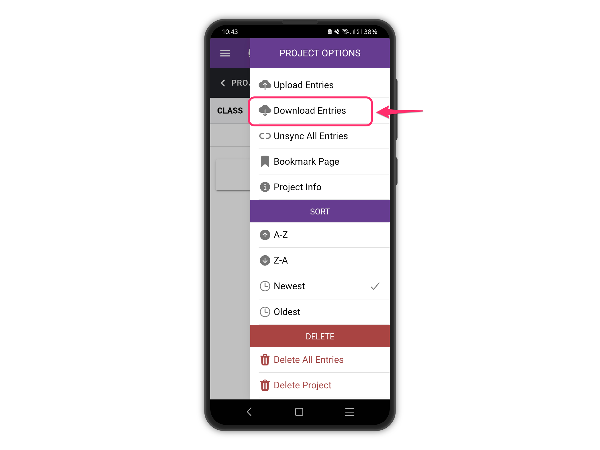<figcaption></figcaption></figure>

On the next screen, you see the list of your form buttons, from top to bottom following your hierarchy structure ([More on linking forms](../formbuilder/multiple-forms.md)). Only the form at the top is enabled, as you need to download entries following the project hierarchy structure, in this case, it is CLASS > PUPIL >TEST. Tap the "**CLASS**" button to download **ALL** the class entries from the server.

<figure>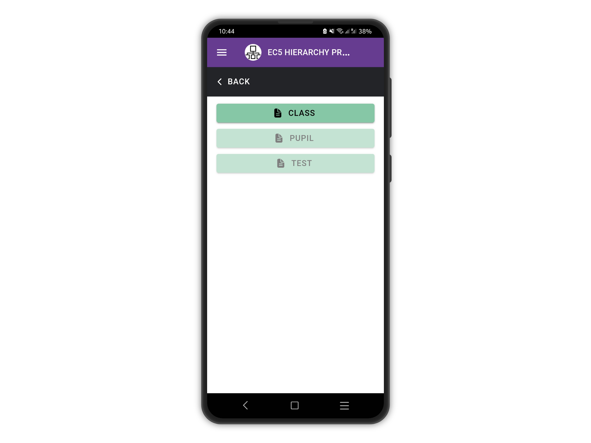<figcaption></figcaption></figure>

You will be prompted to confirm the download. This is to remove any remote entries you already have on the device, as you always get the latest entries snapshot from the server. Press "**OK**" to proceed.

<figure>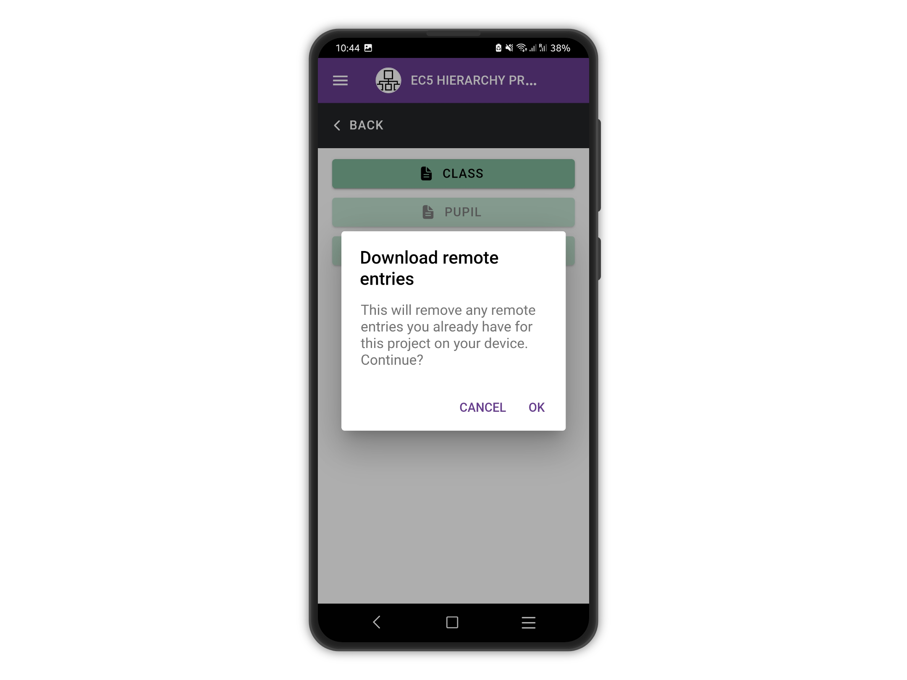<figcaption></figcaption></figure>

After all the CLASS entries are downloaded, the PUPIL button is then enabled.

Tap PUPIL to download all the entries for the PUPIL form.

<figure>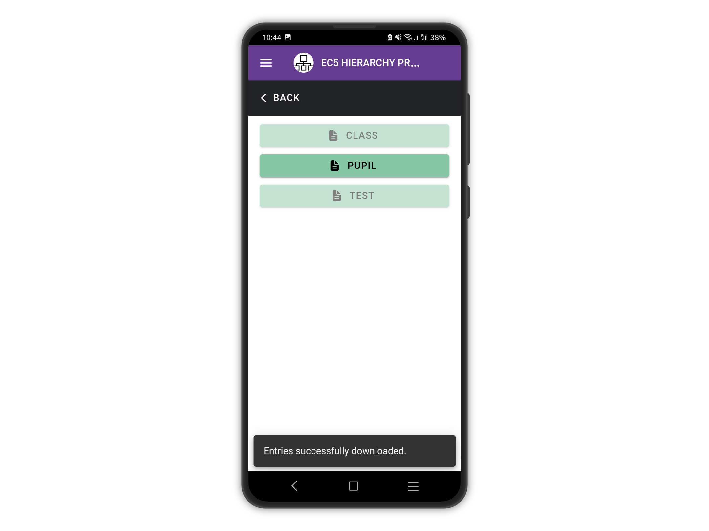<figcaption></figcaption></figure>

Finally, tap TEST to download all the TEST entries.

<figure><figcaption></figcaption></figure>

When all the entries for all the forms are downloaded, the forms buttons are all disabled and you can go back to the entries list.

<figure>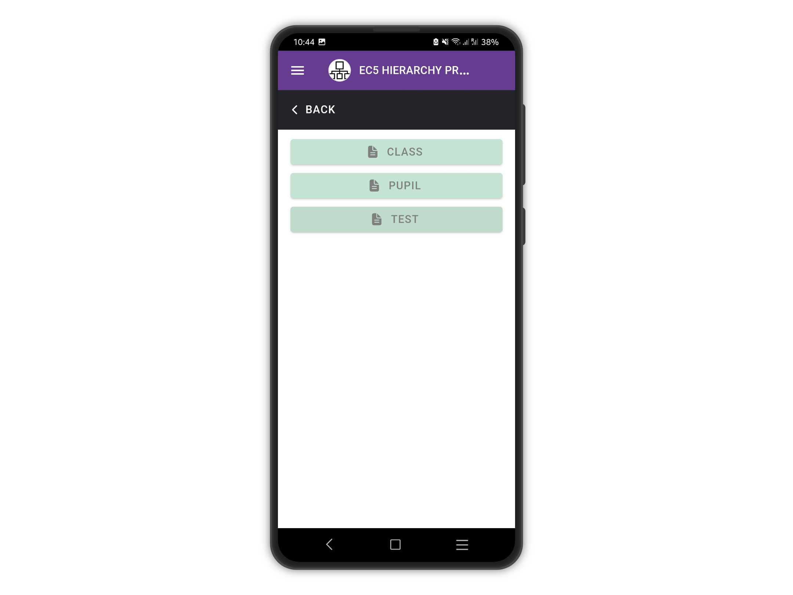<figcaption></figcaption></figure>

The remote entries are now all listed, with a desktop icon next to each of them to indicate they are "**remote**" i.e. **not directly editable**. Now you can add child entries or branches to existing entries (See [Add an entry](add-an-entry.md) and [Add a child entry](add-child-entries.md)).

<figure>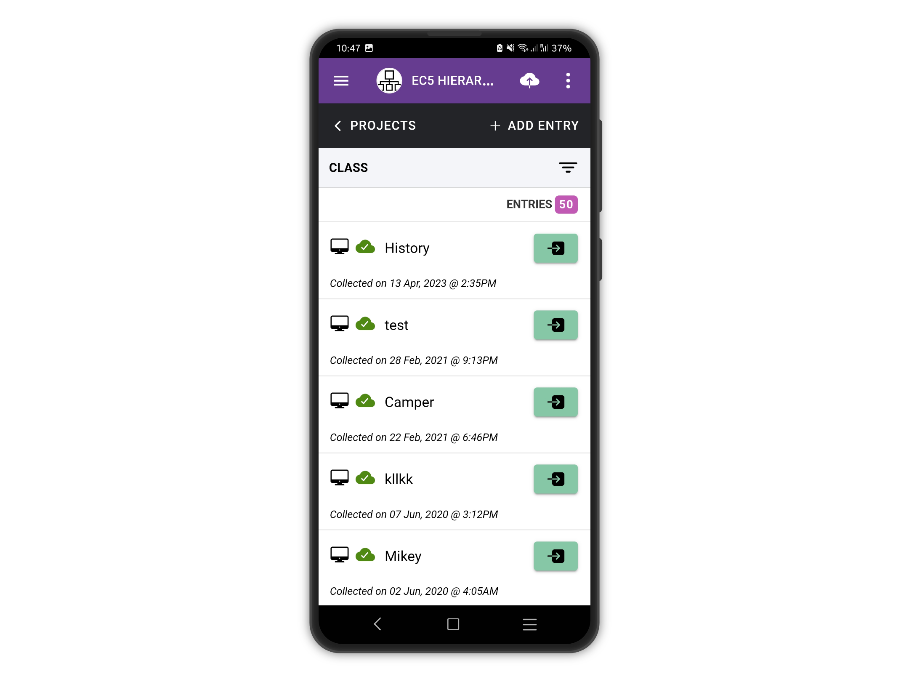<figcaption></figcaption></figure>

## Add branch entries to downloaded entries

Let's download some entries and add brach entries to them. For this example, we will use the [EC5 Branches Project.](https://five.epicollect.net/project/ec5-branches-project)

<figure>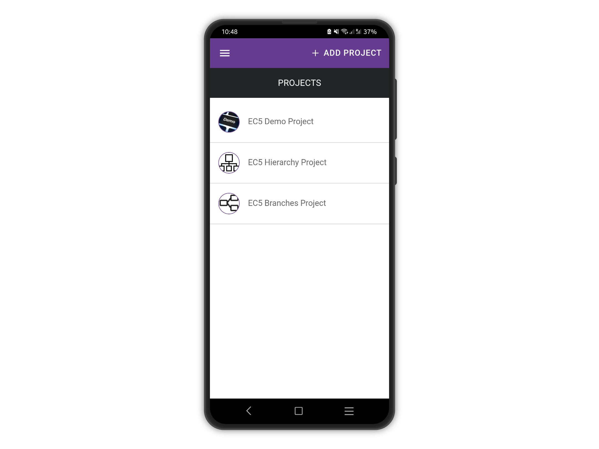<figcaption></figcaption></figure>

Select one of the entries downloaded, in this case "Mirko"

<figure>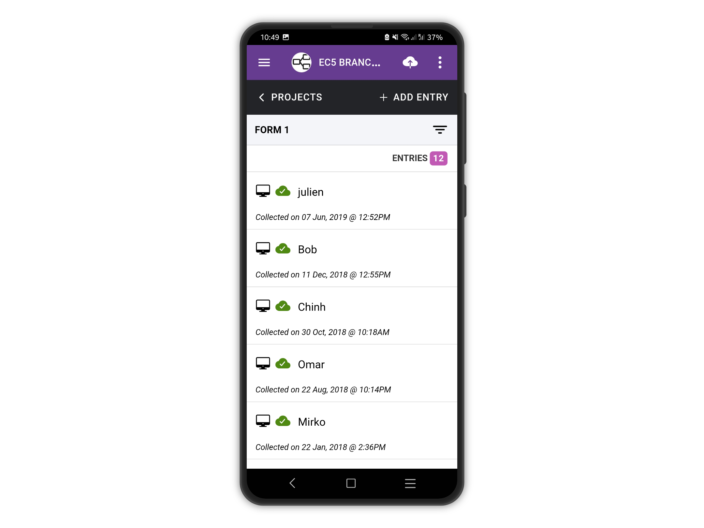<figcaption></figcaption></figure>

As you can see there are not edit buttons, but next to the branch question the view button is enabled. Tap it once to go to the add branch screen.

<figure>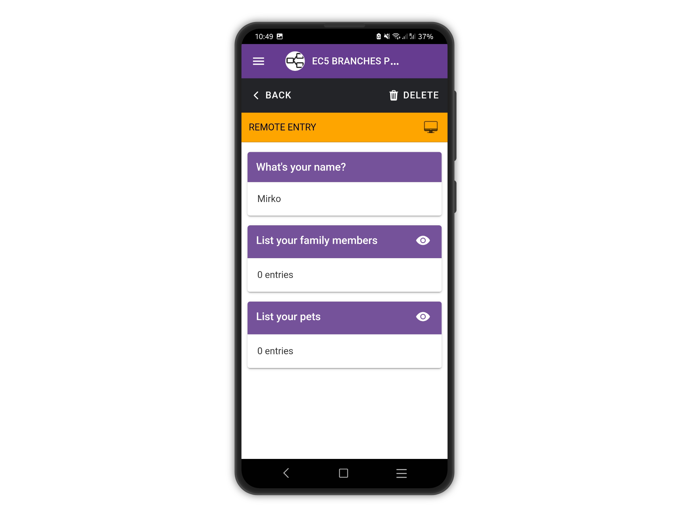<figcaption></figcaption></figure>

Tap the add branch button to add a branch entry.

<figure>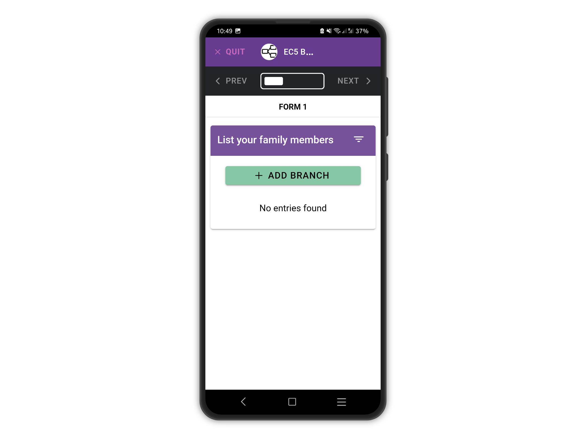<figcaption></figcaption></figure>

After you add a branch entry, you need to SAVE it before you can upload it. Obviously, you might add more branch entries and then save all of them at once.

<figure>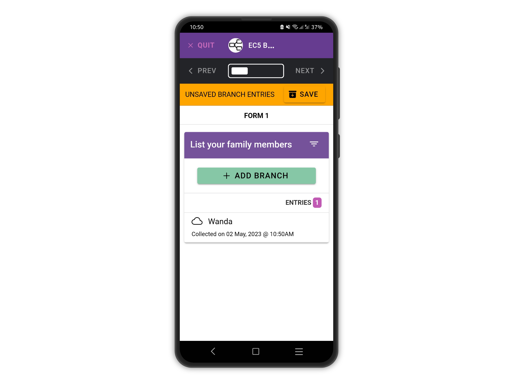<figcaption></figcaption></figure>

After you save the branch entry, you can upload it.

Notice the total of branch entries changed to "1 Entry"

<figure>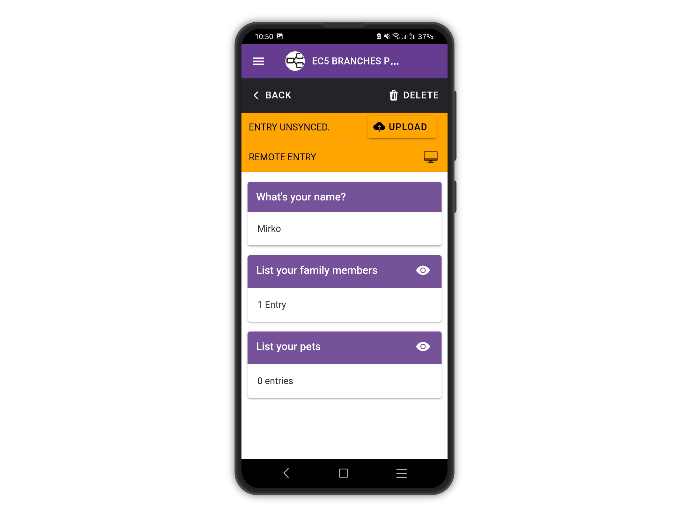<figcaption></figcaption></figure>

### Why downloaded entries are read-only

This design eliminates an entire class of synchronization and conflict-resolution problems by making the **server the single source of truth**.&#x20;

#### Examples of issues avoided by this approach

* **Conflicting edits from multiple devices**
  * User A downloads an entry onto their tablet and goes offline.
  * Meanwhile, User B edits the same entry on the server.
  * If User A were allowed to edit the downloaded copy offline, reconnecting would create two different versions of the same entry. The system would need conflict detection, merging, or ask users which version to keep.
  * By keeping downloaded entries read-only, the device simply downloads the latest server version, avoiding conflicts entirely.
* **Outdated data overwriting newer information**
  * A field worker downloads project data before leaving for the day.
  * During the day, managers correct several entries through the web application.
  * If the field worker could later upload edits made from the stale copy, those outdated values could overwrite the more recent corrections made on the server.
  * With read-only downloaded entries, the latest server changes are always preserved.
* **Inconsistent data across team members**
  * Two users download the same entry.
  * Each edits their local copy while offline.
  * Since neither modification is propagated immediately, every device now displays different information for the same record.
  * Restricting edits to the server ensures every user eventually receives the same authoritative version.
* **Broken parent-child relationships**
  * A downloaded parent entry is modified locally while new child entries are being created by other users on the server.
  * When the local changes are eventually uploaded, they may no longer be consistent with the current hierarchy or related records.
  * Treating downloaded entries as immutable avoids introducing inconsistencies into the project structure while still allowing users to add new child entries and branches.
* **Complex conflict resolution logic**
  * Supporting editable downloaded entries would require detecting concurrent edits, comparing field-by-field changes, handling deleted entries, resolving media conflicts, and deciding which version should prevail.
  * The current approach avoids all of this complexity, making synchronization predictable and reliable.
* **Audit and data integrity issues**
  * Entries may be reviewed, corrected, or validated by project managers on the server.
  * Allowing older downloaded copies to be edited and later uploaded could unintentionally revert approved changes or invalidate audit trails.
  * By ensuring all edits occur through the server, every client always converges to the same verified dataset.

#### Summary

The read-only nature of downloaded entries is a deliberate design choice that:

* prevents conflicting edits across multiple devices;
* avoids stale data overwriting newer server changes;
* guarantees all users converge on the same dataset;
* preserves the integrity of entry hierarchies;
* eliminates the need for complex conflict resolution and merge algorithms;
* keeps the server as the single, authoritative source of project data.
