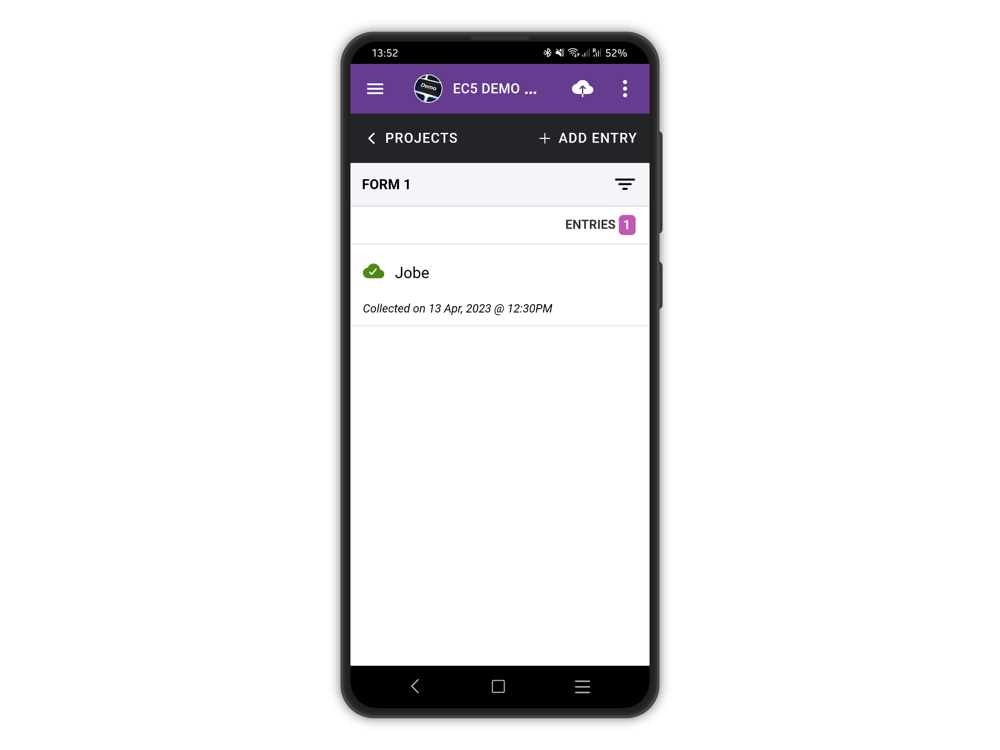
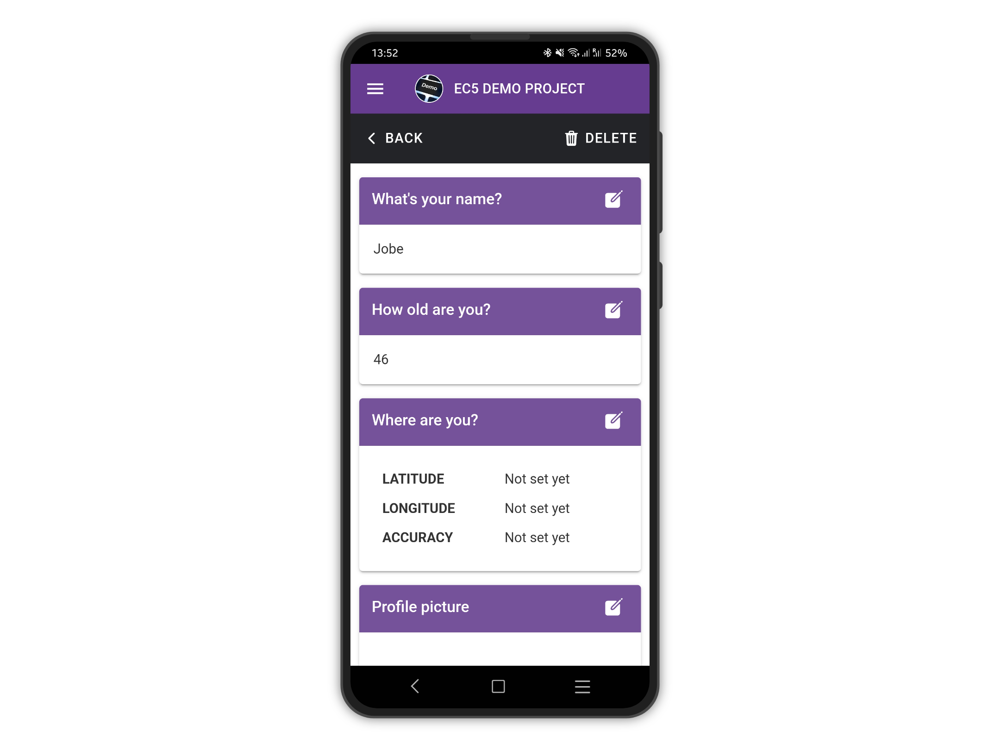
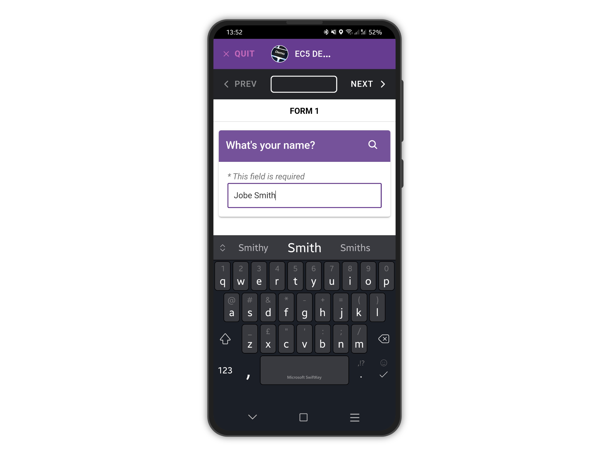
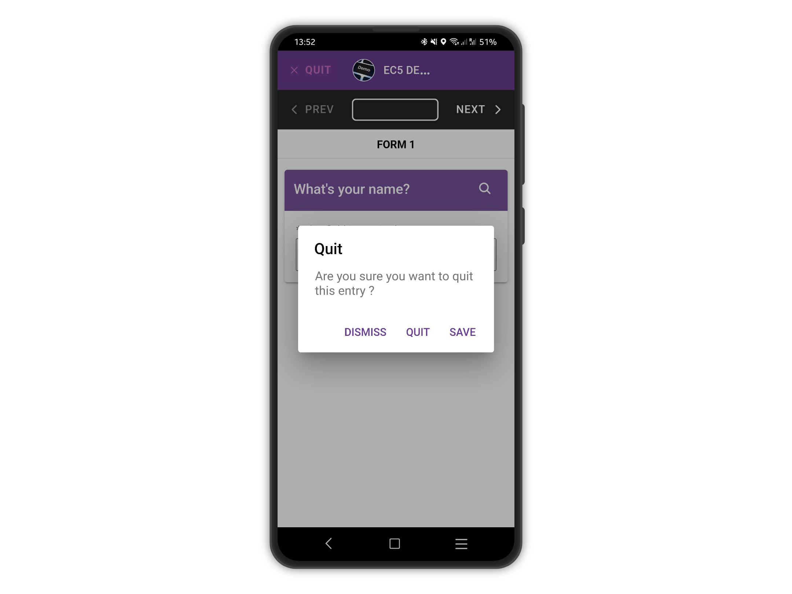
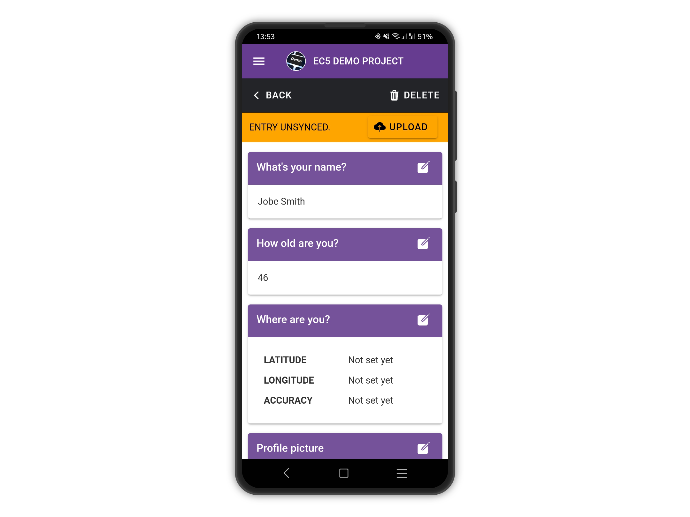

# Edit Entries

To edit an entry, tap the entry you wish to edit, from the list of project entries.

<figure><figcaption></figcaption></figure>

On the View Entry page, tap the edit button of a question you wish to edit the answer for.


You can also delete the whole entry by tapping **DELETE.**


<figure><figcaption></figcaption></figure>

Edit the existing answer, for example adding a family name

<figure><figcaption></figcaption></figure>

It is possible to quit and save at any time, or to reach the end of the form and then save.

<figure><figcaption></figcaption></figure>

Once saved, you will be taken back to the View Entry page.\
Please note the warning about the entry now unsynced, since the changes were applied only locally.

<figure><figcaption></figcaption></figure>
