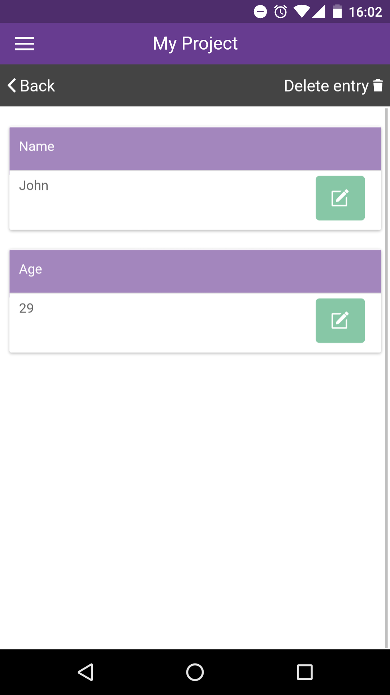
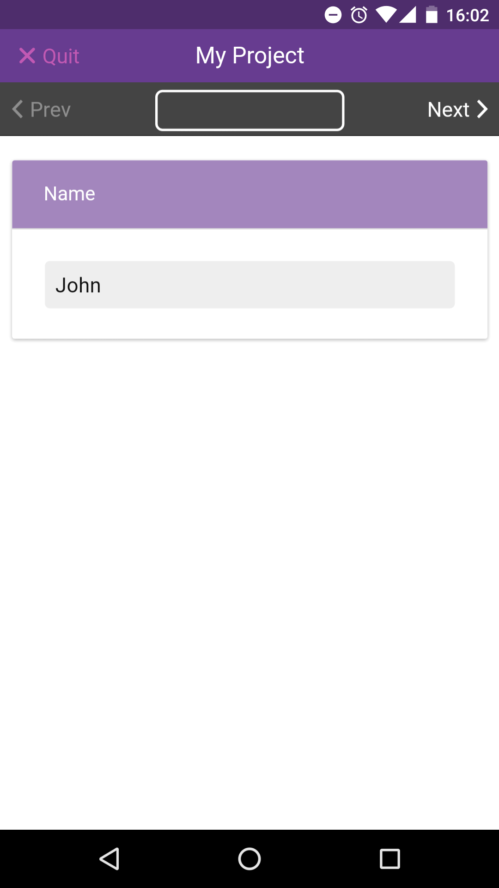
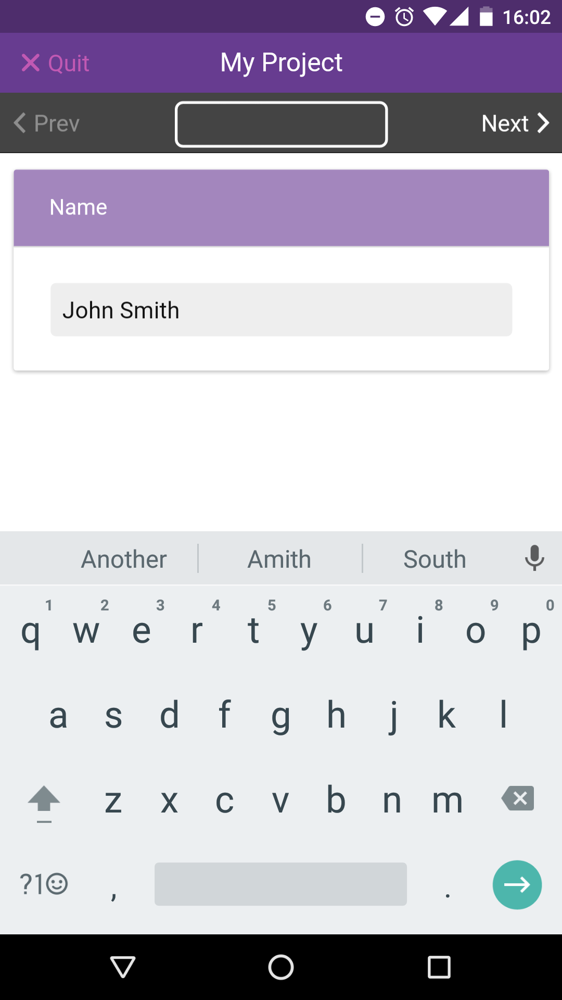
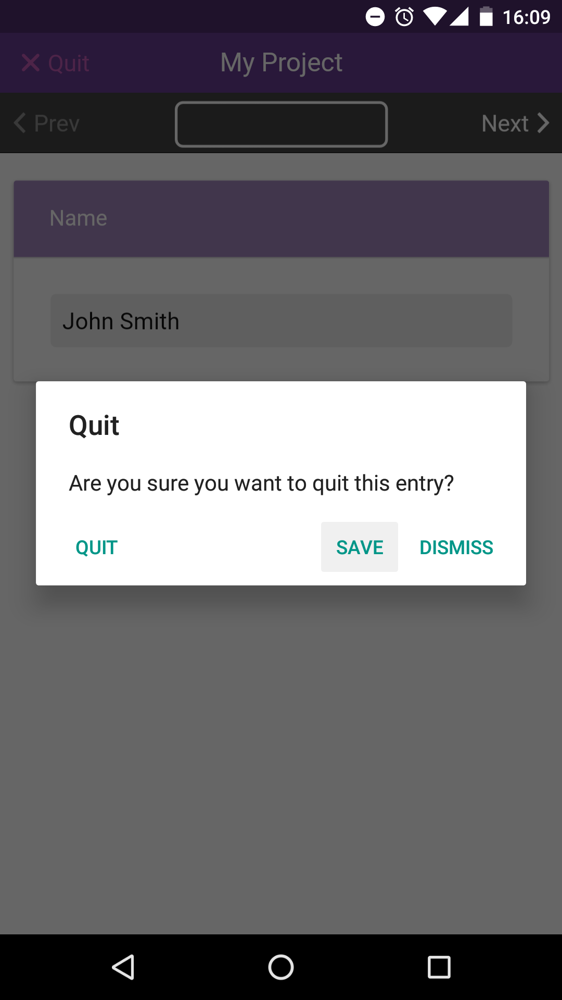
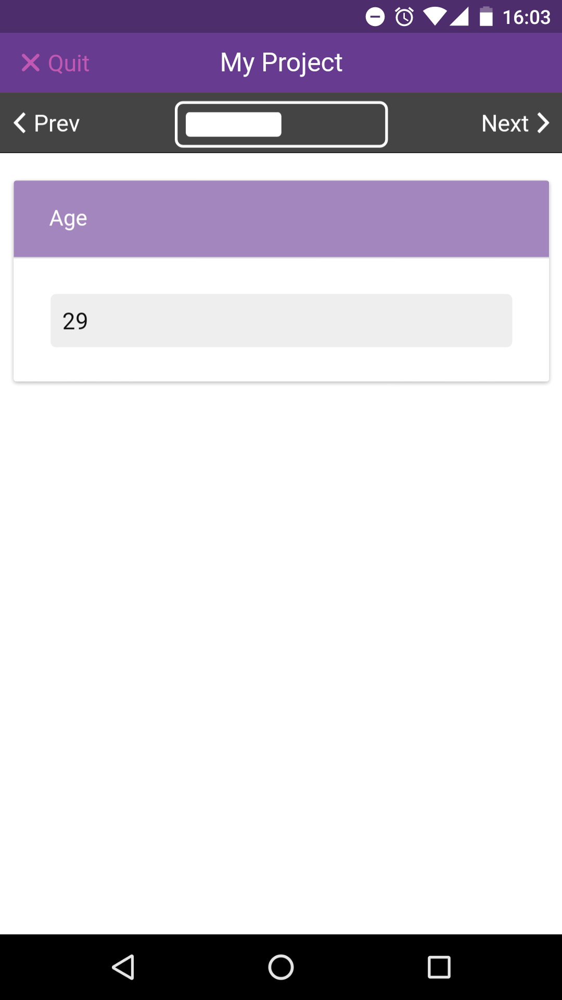
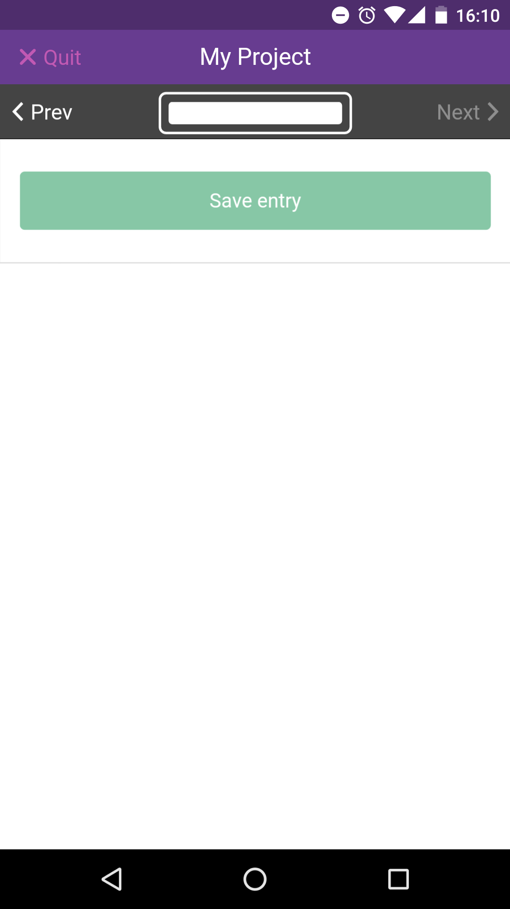
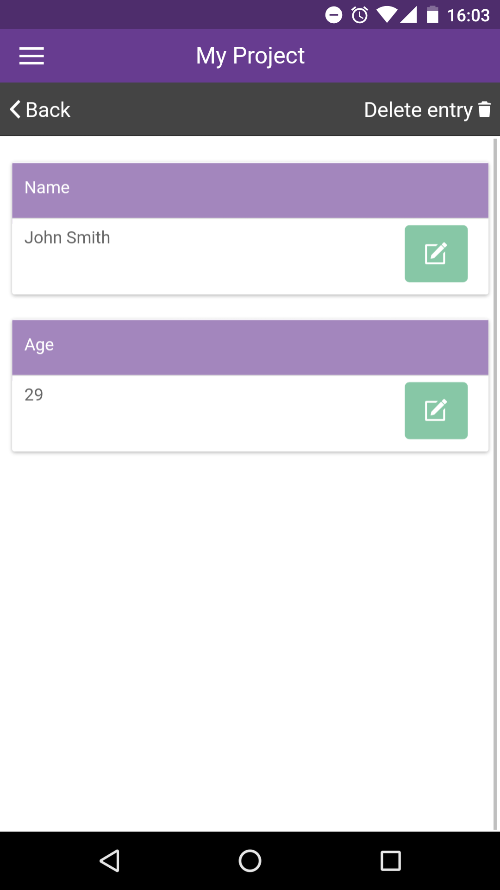

# Edit Entries

|                                                      |                                                                                                       |
| ---------------------------------------------------- | ----------------------------------------------------------------------------------------------------- |
| .png>) | To edit an entry, first select the entry you wish to edit, from the list of entries for your project. |

|                                               |                                                                                                                                                                  |
| --------------------------------------------- | ---------------------------------------------------------------------------------------------------------------------------------------------------------------- |
|  | You will be taken to the View Entry page and, from here, select a question you wish to edit the answer for, and you will be taken to this question in the entry. |

You can also delete an entry from this page. |

|                                                |                                  |
| ---------------------------------------------- | -------------------------------- |
|  | Edit this answer as you see fit. |

|                                               |                         |
| --------------------------------------------- | ----------------------- |
|  | Add surname for example |

|                                                  |                               |
| ------------------------------------------------ | ----------------------------- |
|  | You can then quit and save... |

|                                                      |                                                                                                                                                         |
| ---------------------------------------------------- | ------------------------------------------------------------------------------------------------------------------------------------------------------- |
|  | ...or continue through the entry to edit the answers for other questions (scrolling forwards or backwards, as when adding an entry for the first time). |

|                                             |                                 |
| ------------------------------------------- | ------------------------------- |
|  | Saving at the end of the entry. |

|                                              |                                                            |
| -------------------------------------------- | ---------------------------------------------------------- |
|  | Once saved, you will be taken back to the View Entry page. |
