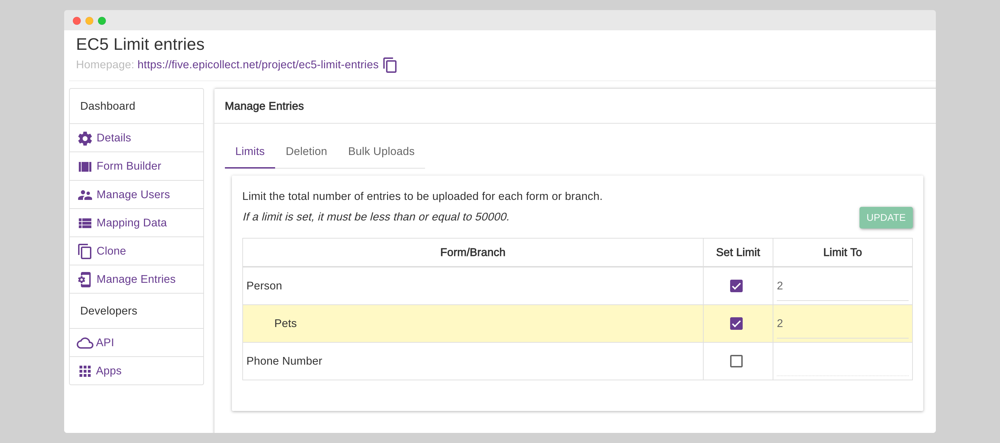
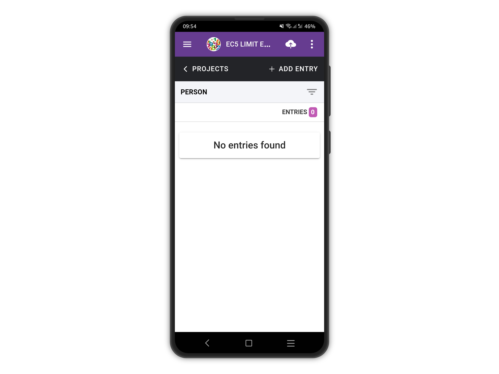
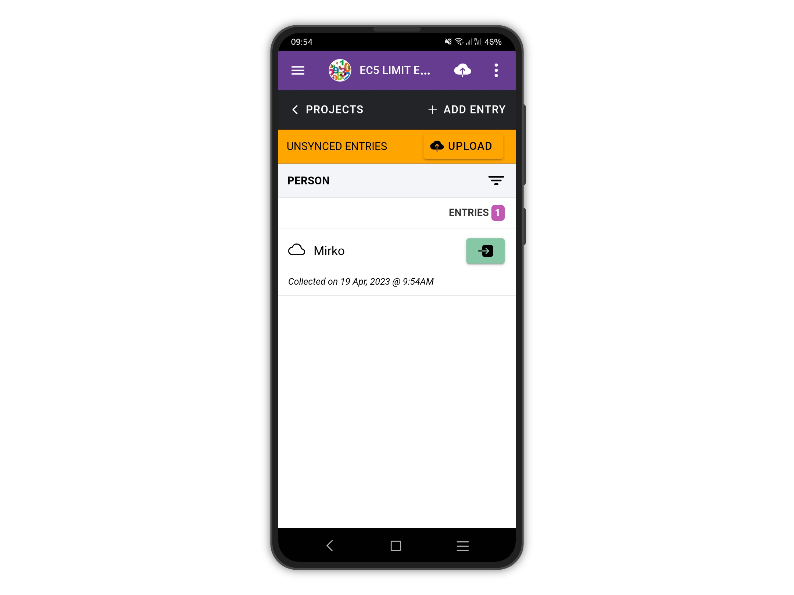
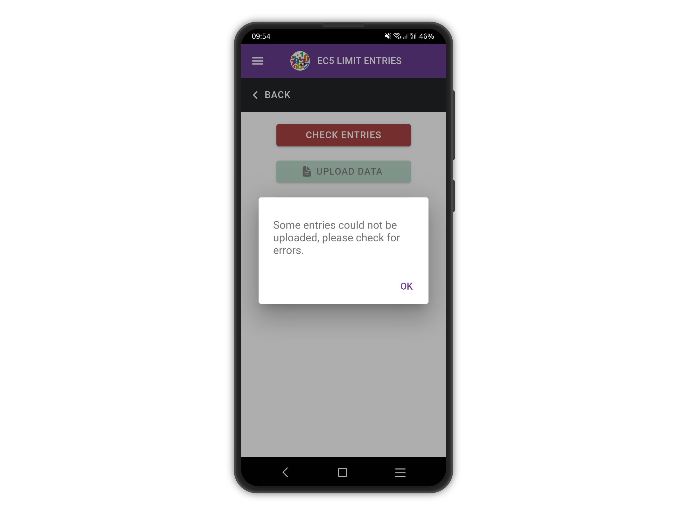
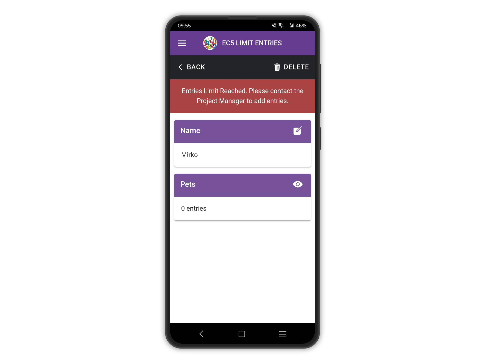
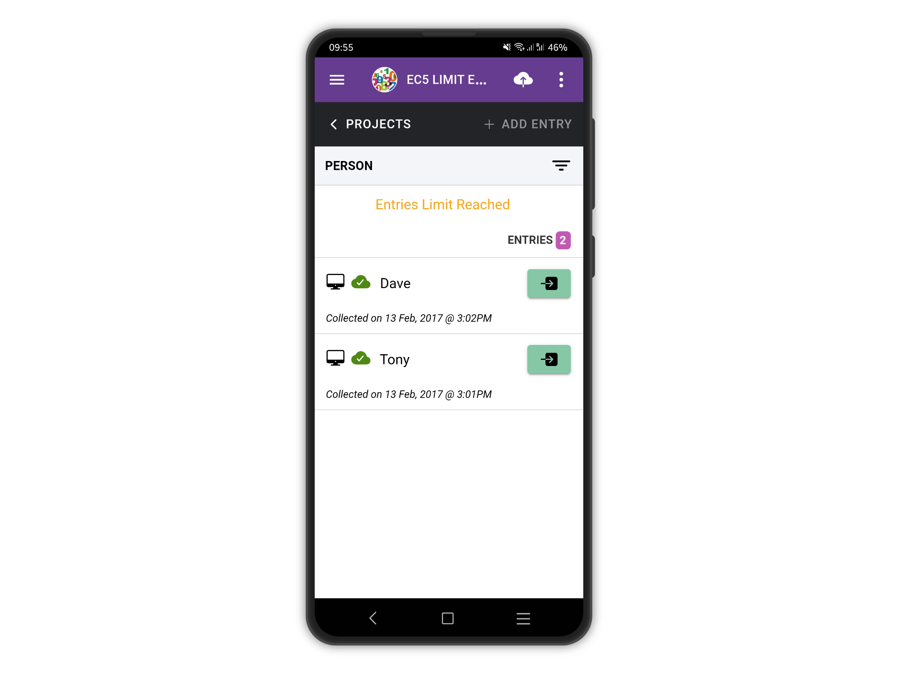

# Entries Limits

If you are collecting data for a project where the manager(s) set entry limits, you might get some errors when trying to upload entries. [More on setting entries limits](entries-limits.md)**.**

For example, let's have a look at our example project [EC5 Limit entries.](https://five.epicollect.net/project/ec5-limit-entries)

<figure><figcaption>
A limit of 2 entries is set on the PERSON form
</figcaption></figure>

On the [EC5 Limit entries](https://five.epicollect.net/project/ec5-limit-entries) project, we set the limits of the PERSON form to 2.&#x20;

We already uploaded 2 entries to the server for the PERSON form, so let's see what happens if you try to add an extra entry.

<figure><figcaption></figcaption></figure>

<figure><figcaption></figcaption></figure>

The upload attempt failed, as the entries limit on the server is reached.

<figure><figcaption></figcaption></figure>

<figure><figcaption></figcaption></figure>

If you download the entries from the server, they count towards the entries limit therefore the **+ADD ENTRY** button gets disabled.

<figure><figcaption></figcaption></figure>
