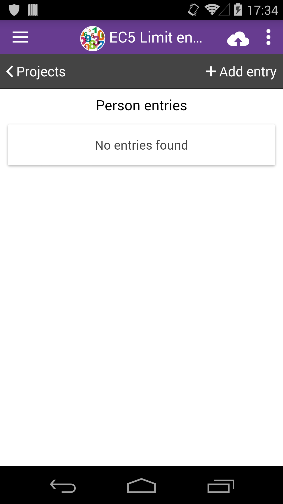
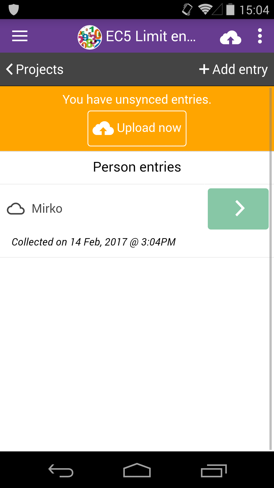
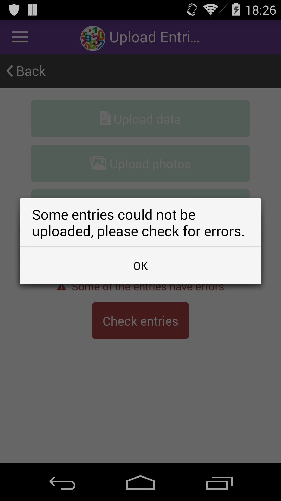
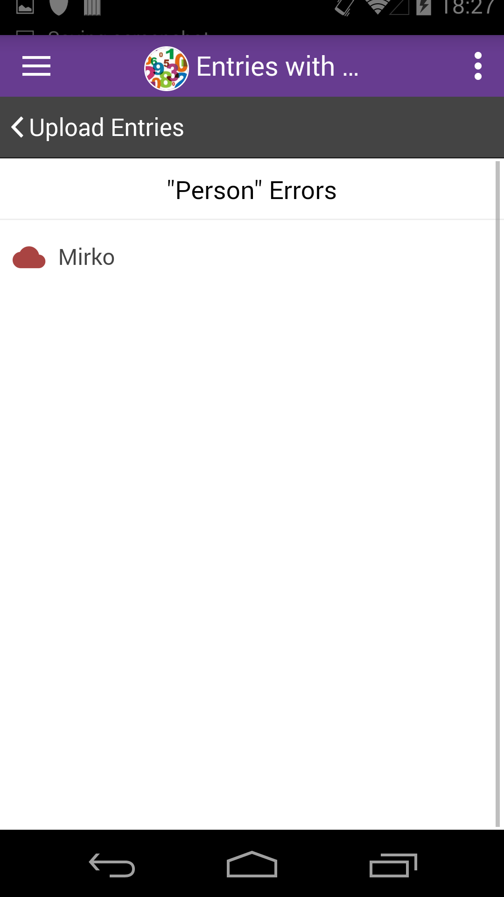
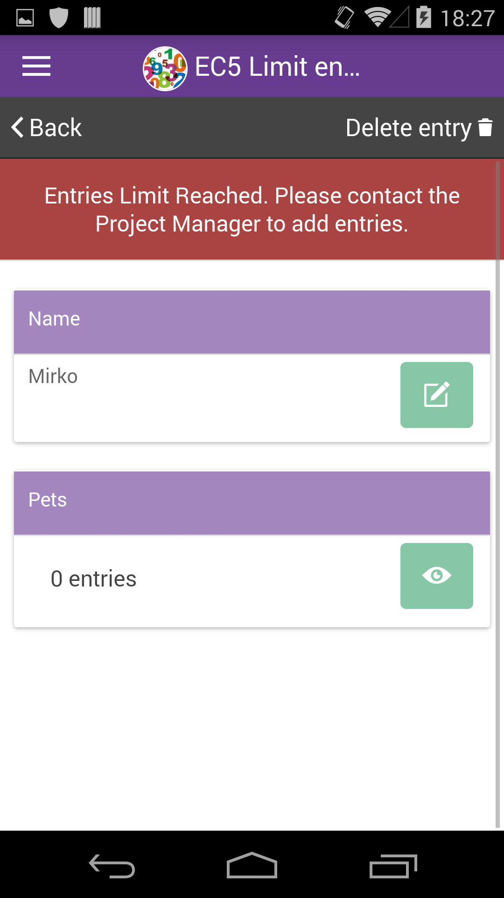
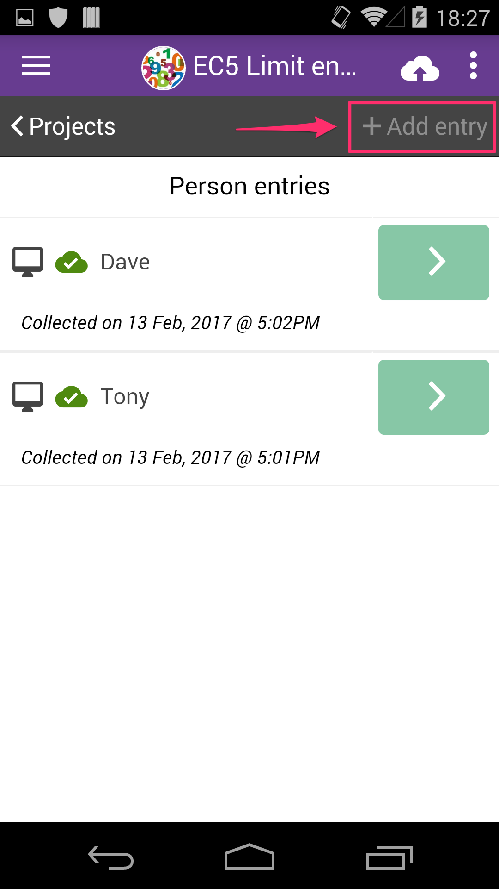

# Entries Limits

If you are collecting data for a project where the manager(s) set entries limits, you might get some errors when try to upload entries. [More on setting entries limits](entries-limits.md).

For example let's have a look at out example project [EC5 Limit entries.](https://five.epicollect.net/project/ec5-limit-entries)

|                                                  |                                                                                                                                                                                                                                                                    |
| ------------------------------------------------ | ------------------------------------------------------------------------------------------------------------------------------------------------------------------------------------------------------------------------------------------------------------------ |
|  | On the [EC5 Limit entries](https://five.epicollect.net/project/ec5-limit-entries) project, we set the limits of the PERSON form to 2. We already uploaded 2 entries to the server for the PERSON form, so let's see what happens if you try to add an extra entry. |

|                                                  |                                                             |
| ------------------------------------------------ | ----------------------------------------------------------- |
|  | We added an entry locally, "Mirko", and we tried to upload. |

|                                                  |                                                                           |
| ------------------------------------------------ | ------------------------------------------------------------------------- |
|  | The upload attempt failed, as the entries limit on the server is reached. |

|                                                  |                                                                      |
| ------------------------------------------------ | -------------------------------------------------------------------- |
|  | The "Mirko" entry is flagged as wrong. Tap on it to see the problem. |

|                                                  |                                                                                               |
| ------------------------------------------------ | --------------------------------------------------------------------------------------------- |
|  | There is an error message explaining why the entry was not uploaded: "Entries Limit Reached". |

|                                                  |                                                                                                                                   |
| ------------------------------------------------ | --------------------------------------------------------------------------------------------------------------------------------- |
|  | If you download the entries from the server, they count towards the entries limit therefore the "Add Entry" button gets disabled. |
