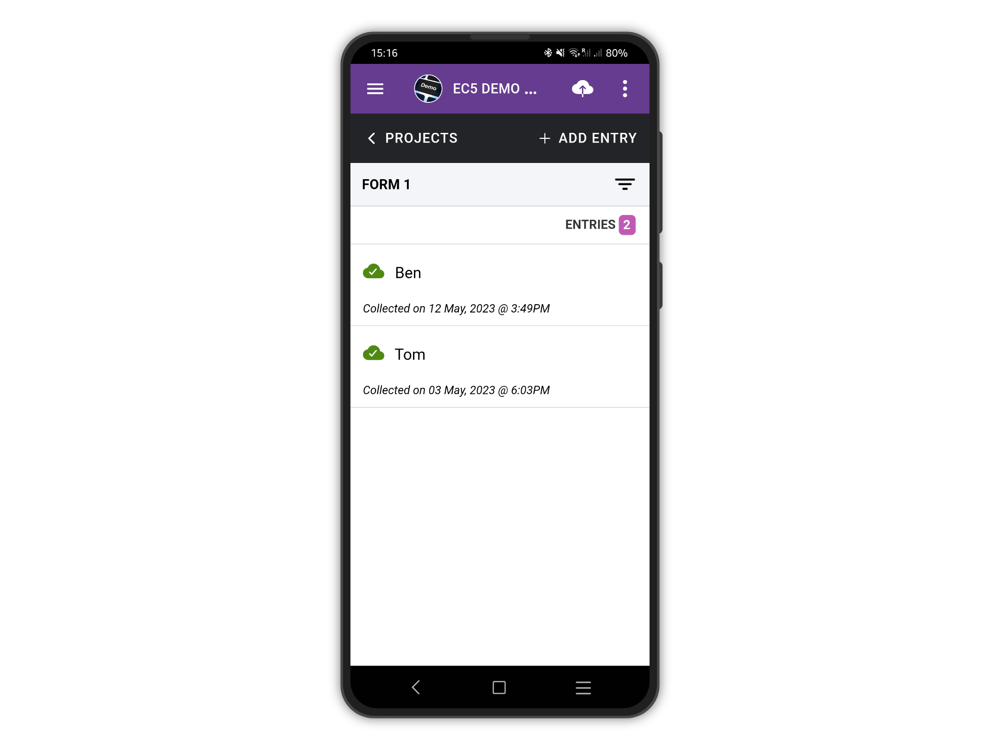
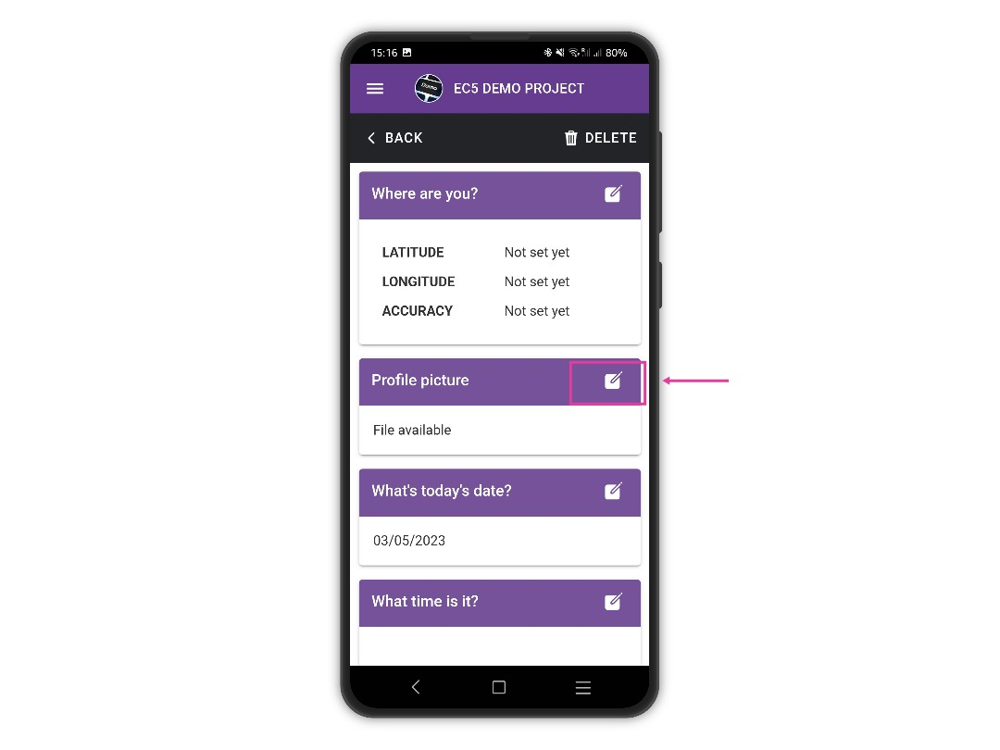
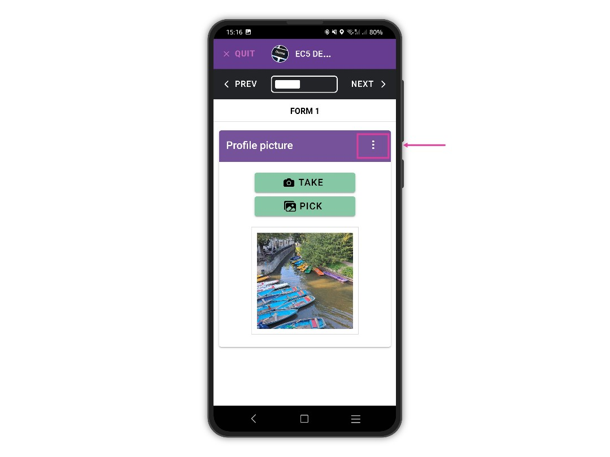

# Share Media Files

For security, privacy and consistency, third-party apps like your gallery or video player cannot access Epicollect5 data and media.

However, you can share a copy of the media files created using the Epicollect5 app with other apps on your device, if you wish to do so.

Select the entry from the list of your project entries.

<figure><figcaption></figcaption></figure>

On the view entry screen, find any media file question and tap on the "Edit" button next to it.

<figure><figcaption></figcaption></figure>

Tap on the context menu button (3 vertical dots).

<figure><figcaption></figcaption></figure>

Tap on the share button to share the image. Please be aware the interface will be different based on the device platform and version (Android or iOS). The image below is from a Samsung device running Android 13.

<figure><figcaption></figcaption></figure>

