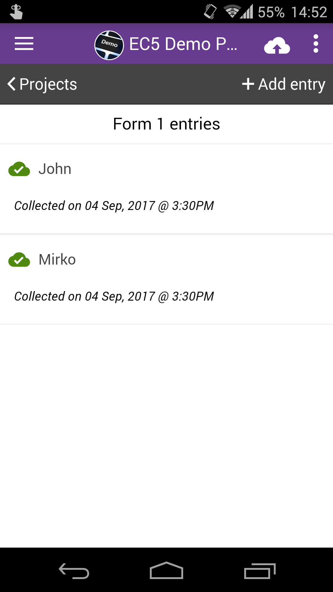
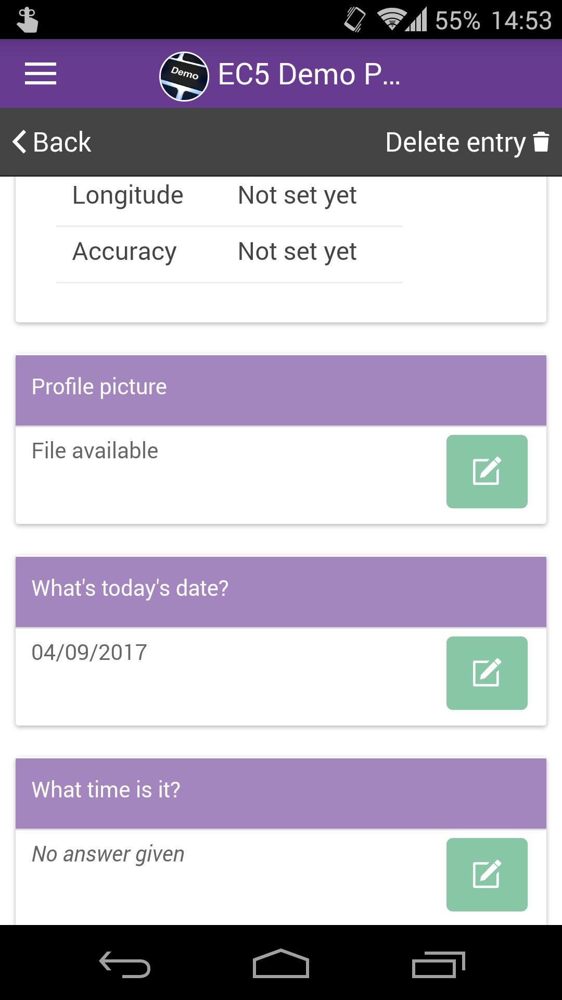
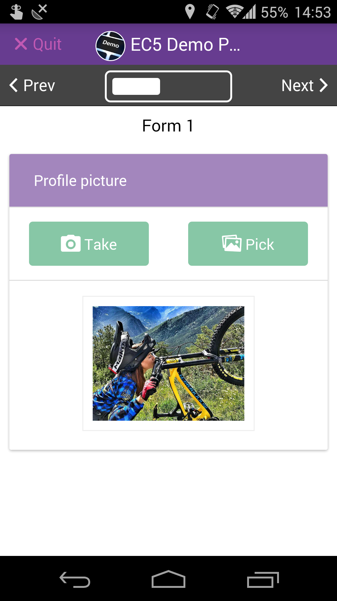
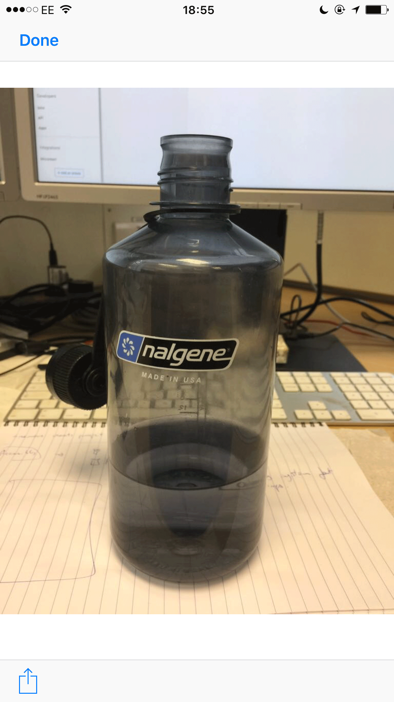

# Share Photos

You can share images you took using the Epicollect5 app with other apps on your device.

|                                           |                                                        |
| ----------------------------------------- | ------------------------------------------------------ |
|  | Select the entry from the list of your project entries |

|                                           |                                                                                              |
| ----------------------------------------- | -------------------------------------------------------------------------------------------- |
|  | On the view entry screen, find the "photo" question and tap on the "Edit" button next to it. |

|                                           |                  |
| ----------------------------------------- | ---------------- |
|  | Tap on the photo |

|                                           |                                                                                                                                                                                             |
| ----------------------------------------- | ------------------------------------------------------------------------------------------------------------------------------------------------------------------------------------------- |
|  | Tap on the share button to share the image. Please note the interface will be different based on the device platform (Android or iOS). The one on the left is the Android sharing interface |
|                                           |                                                                                                                                                                                             |

|                                           |                                   |
| ----------------------------------------- | --------------------------------- |
|  | This is the iOS sharing interface |
