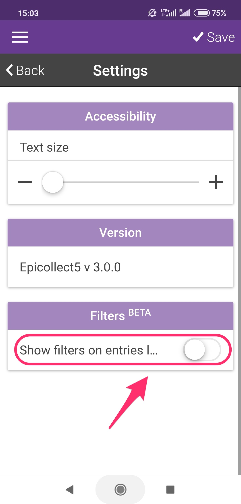
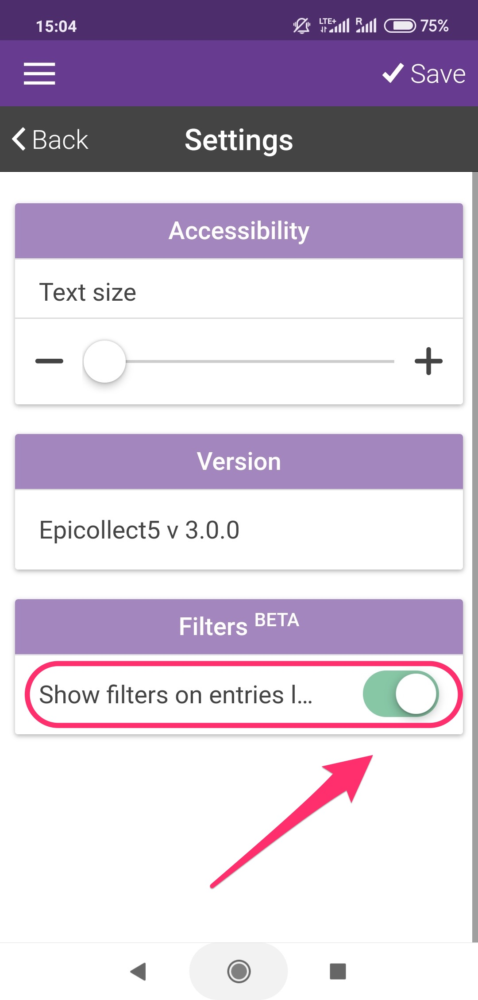
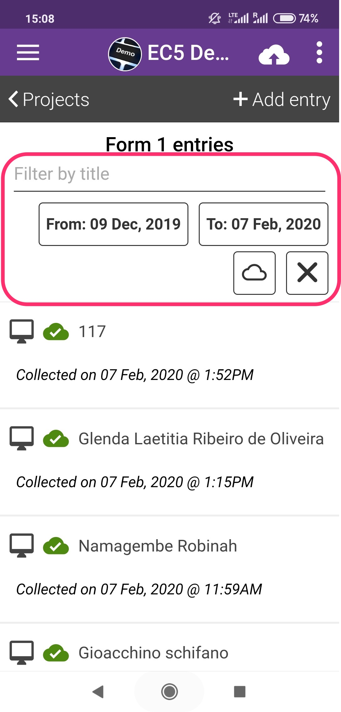
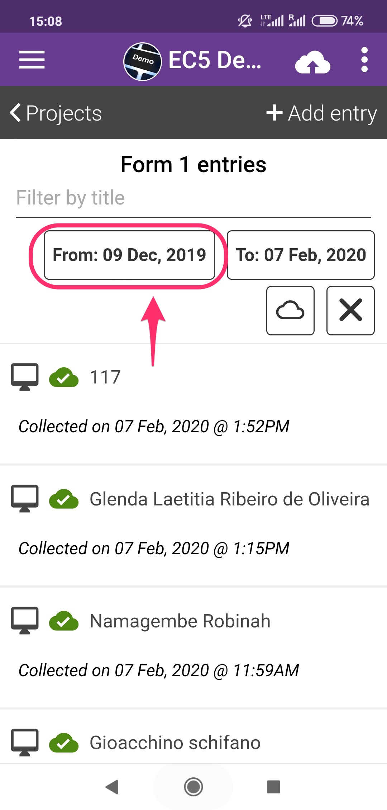
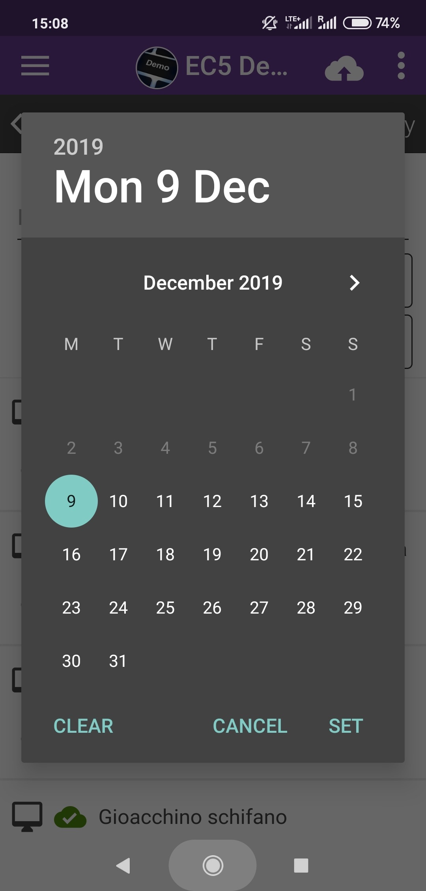
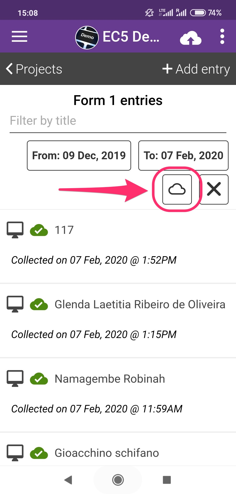
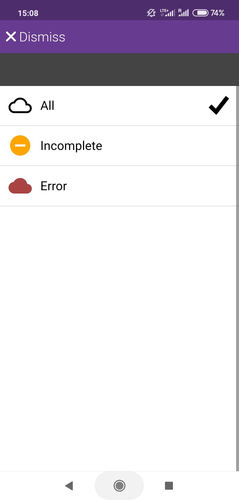
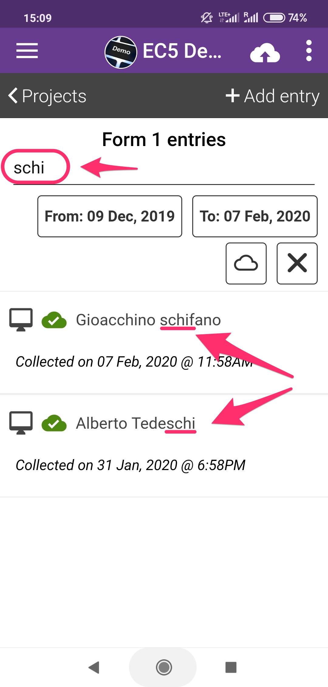

# Filter Entries


Currently Android only, from app version 3.0.0 onwards.


Entries can be filtered on the mobile app.

&#x20;The filter controls are disabled by default as they might clutter the interface on small devices or they might not be needed when collecting data.

### Enable filters

You can enable the filters from the settings page:

### Filter by dates

### Filter by entries status

### Filter by title

