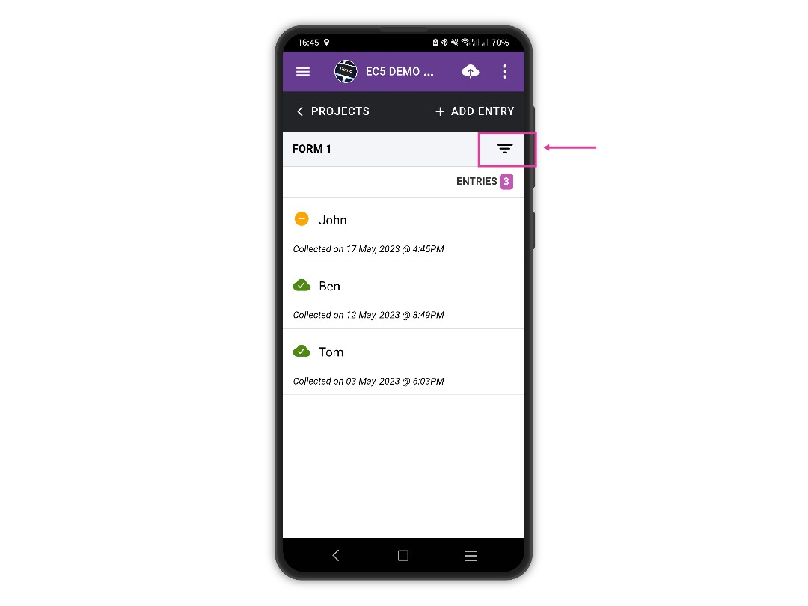
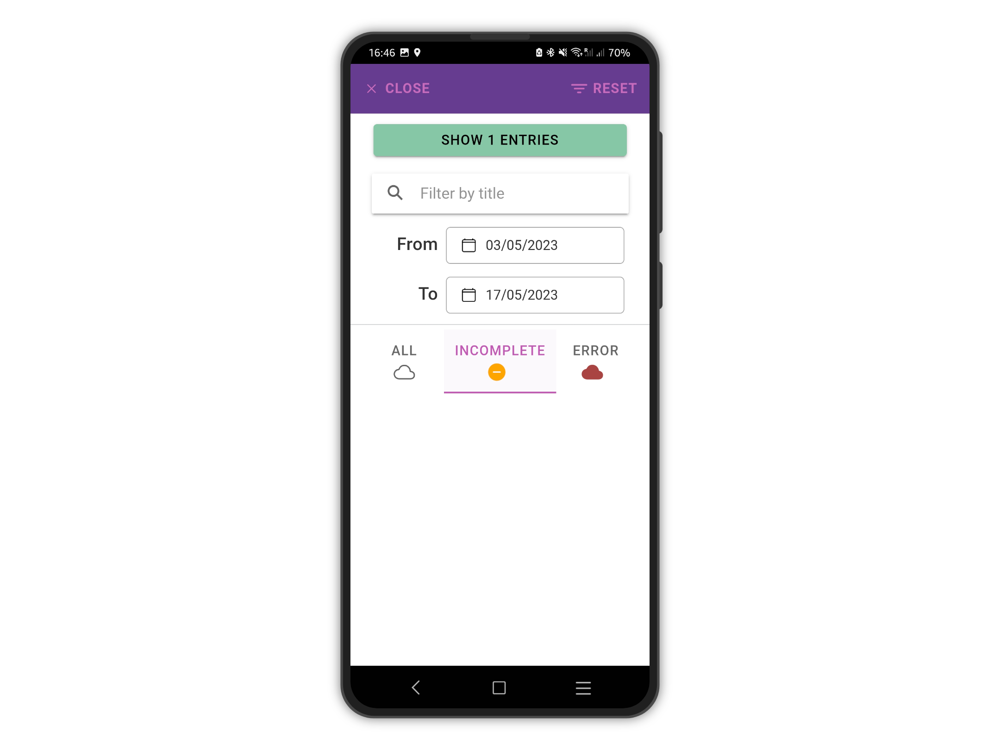
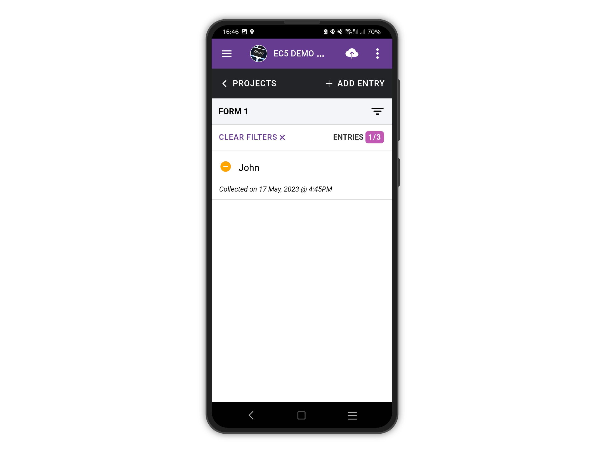

# Filter Entries

Entries saved to the device can be filtered: it is possible to search by title or filter by date or status.

On the entries list page, tap the filter icon to open the filter panel.

<figure><figcaption></figcaption></figure>

<figure><figcaption></figcaption></figure>

The **SHOW (N) ENTRIES** button at the top will update based on the parameters specified. For example, tapping **INCOMPLETE** will show only incomplete entries.

<figure><figcaption></figcaption></figure>

<figure><figcaption></figcaption></figure>

