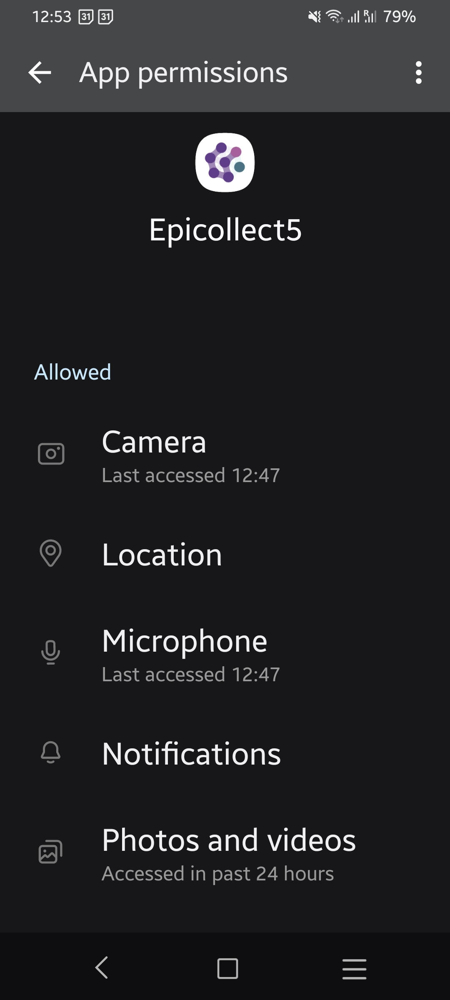

# Mobile App Permissions

1. **Camera Access**: Epicollect5 requires access to your device's camera to capture photos directly within the app. This is crucial for users who need to document their observations or collect visual data as part of their project.
2. **Location Access**: To accurately record the coordinates of your device, Epicollect5 requests location permissions. This ensures that the geographic data collected is precise, enabling users to map data points effectively in their research or fieldwork.
3. **Microphone Access**: The app uses the microphone to record audio, which is vital for capturing voice notes or other audio data as part of your project. This functionality is particularly useful in scenarios where verbal descriptions or interviews need to be documented.
4. **Storage and Media Access**: Epicollect5 needs access to your device's storage to save photos and videos or to allow you to select media files from your existing library. This ensures that your visual data is easily accessible and can be incorporated into your data collection efforts seamlessly.
5. **Notifications**: To enhance user experience and ensure smooth operation, Epicollect5 sends notifications when you take a photo or scan a barcode. This is particularly important on devices with aggressive Android ROMs or battery optimization settings that might otherwise kill the app. The notification acts as a safeguard, keeping the app running in the background while you continue your data collection tasks uninterrupted. [**Learn More**](mobile-app-permissions.md#notification-permission)

**Important Settings Recommendations**

To ensure that Epicollect5 operates smoothly and reliably, we recommend that you:

* **Disable Auto-Removal of Permissions**: Some devices have a setting that automatically removes permissions if an app hasn’t been used for a certain period. Please ensure this setting is turned off for Epicollect5. This will prevent the app from losing necessary permissions unexpectedly, ensuring that it remains fully functional whenever you need it.
* **Disable Battery Optimization**: Many devices have battery optimization settings that can restrict the background activity of apps. For Epicollect5 to function correctly, especially during tasks like photo-taking or barcode scanning, make sure to disable any battery optimization settings that could interfere with its operation. This will help maintain the app's performance and prevent it from being closed or restricted by the system.

More info:



These permissions and settings are crucial for Epicollect5 to function as a comprehensive data collection tool, offering you the flexibility and reliability needed for successful field research. Rest assured, each permission is used solely to enhance the app's performance and to support your data collection activities.

<figure><figcaption>
Epicollect5 app permissions on a Samsung Galaxy A33, Android 14.
</figcaption></figure>

## Notification permission

On Android, Epicollect5 may ask for permission to send notifications when you use features such as **taking photos, recording videos, or scanning barcodes**.

This permission is needed to allow Epicollect5 to keep an important background service running while you are collecting data.

### Why is this necessary?

Some Android devices may close apps that are running in the background to save battery or system resources. Epicollect5 uses an Android foreground service during certain data collection activities like photo capture, video recording, and barcode scanning to help prevent this from happening.

Android requires foreground services to display a notification while they are active. This notification is **not a message or alert from Epicollect5** — it simply tells you that Epicollect5 is currently using a foreground service.

If notification permission is denied, Android may prevent Epicollect5 from starting this service. As a result, Android may close Epicollect5 while you are taking photos, recording videos, or scanning barcodes, potentially interrupting your data collection and leading to data loss.

### What happens if I deny the permission?

Epicollect5 will still open, and you can continue using the app, but the foreground service cannot be started when notification permission is unavailable.

Epicollect5 will show a warning explaining the situation the first time this happens. The warning is shown only once.

You can enable notifications later from your Android device's app settings. Once notification permission is enabled, Epicollect5 can use the foreground service normally.

### What should I do?

We recommend **allowing notifications** when Android asks for permission.

The notification allows Epicollect5 to keep the app active during activities where Android requires a foreground service.

If you previously denied the permission, open **Settings → Apps → Epicollect5 → Notifications** and enable notifications.

#### Is Epicollect5 sending me notifications?

Not necessarily. The permission is required because Android uses notifications as part of its foreground-service system.

The foreground-service notification is primarily a system indicator that Epicollect5 is active and performing a task that needs to remain running.
