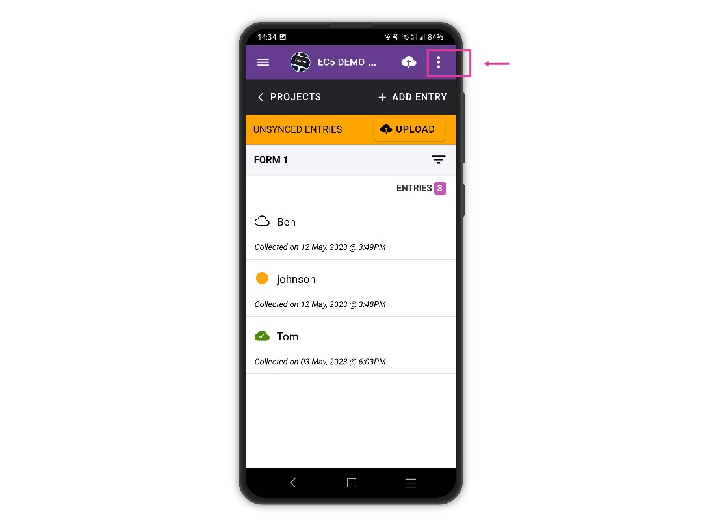
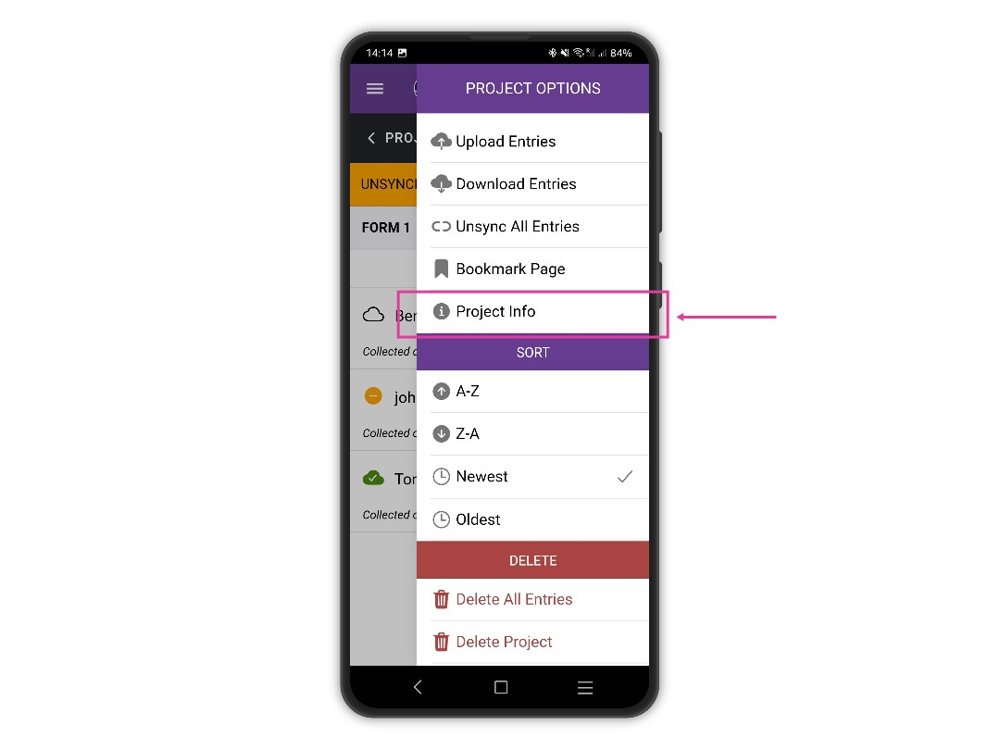
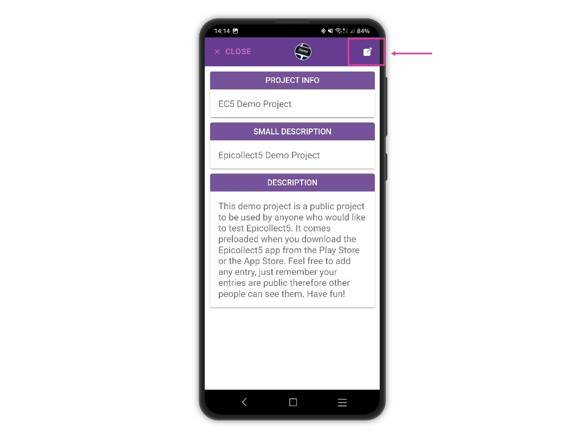
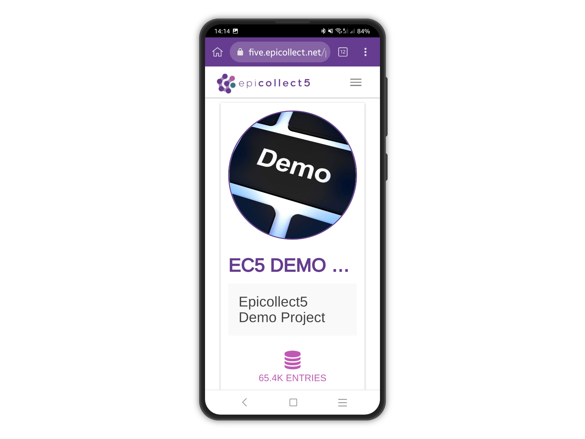
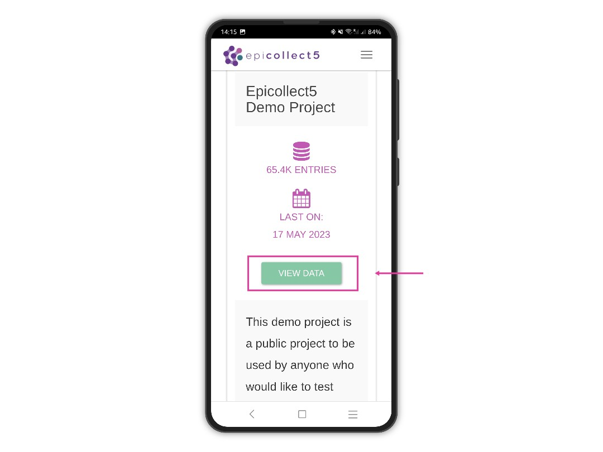
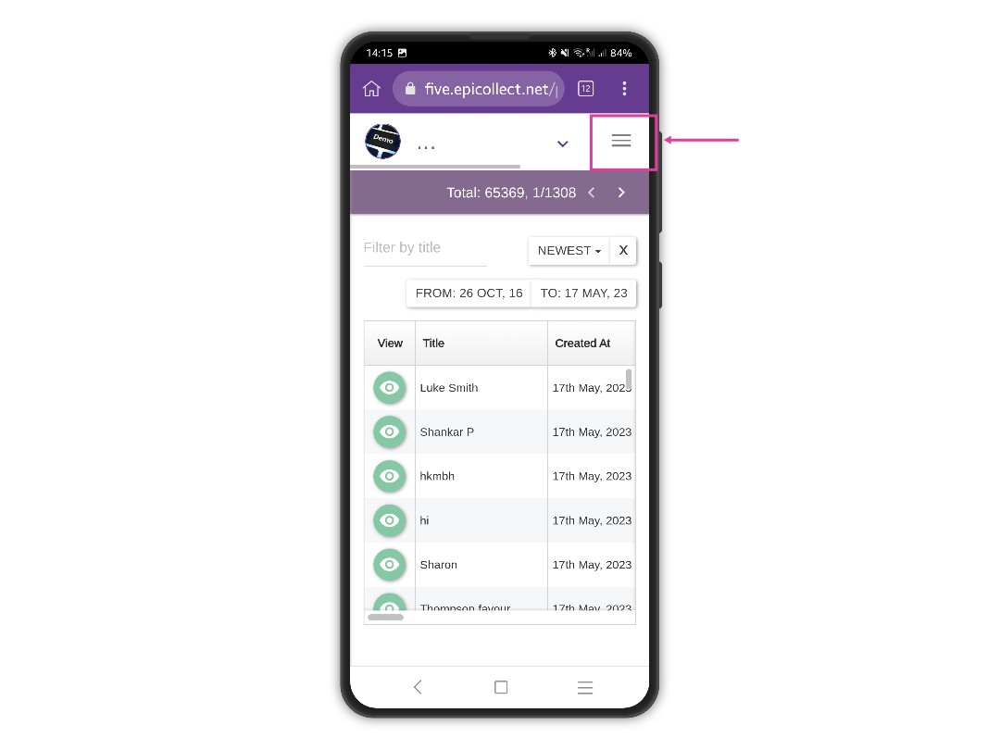
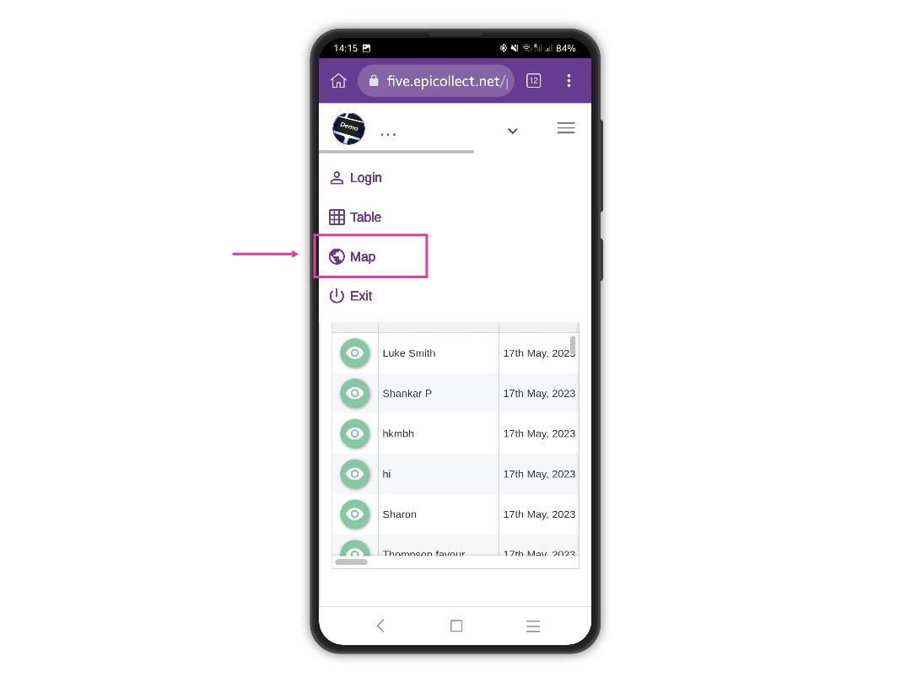
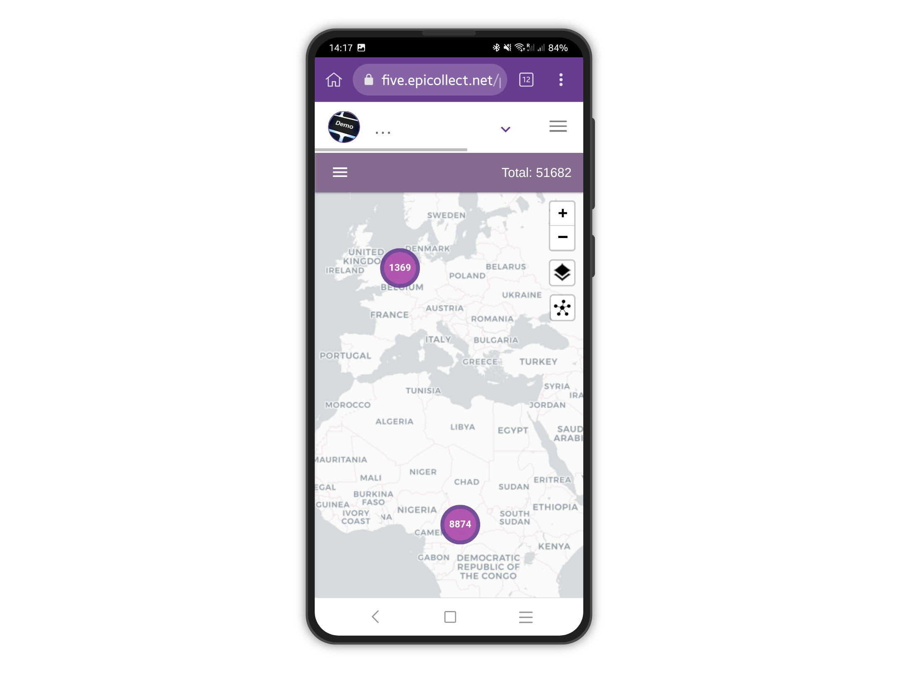

# Project Info

You can view more information about the project you are working on directly from the Epicollect5 mobile app.


This feature requires an internet connection.


Pick your project from the project list.

<figure><figcaption></figcaption></figure>

Tap on the three dots button at the top right to open the right sidebar menu.

<figure><figcaption></figcaption></figure>

Tap on "Project Info" from the list of options.

<figure><figcaption></figcaption></figure>

Project information is displayed.

&#x20;To go to the project home page, tap on the "arrow" icon at the top right

<figure><figcaption></figcaption></figure>

The default browser on your device will open and go to the project home page.

<figure><figcaption></figcaption></figure>

To view your project data, scroll down and tap on "View Data".

<figure><figcaption></figcaption></figure>

The table view is shown. To switch to the map (if any), tap on the menu button at the top right.

<figure><figcaption></figcaption></figure>

Tap on "Map" from the list of options.

<figure><figcaption></figcaption></figure>

The map view loads.

<figure><figcaption></figcaption></figure>
