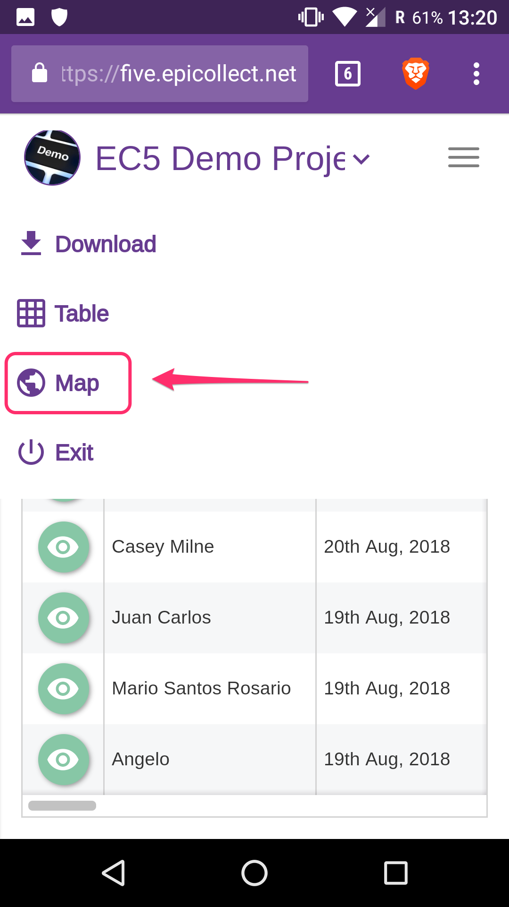

# Project Info

You can view more information about the project you are working on directly from the Epicollect5 mobile app:

|                                            |                                         |
| ------------------------------------------ | --------------------------------------- |
|  | Pick your project from the project list |

|                                            |                                                                               |
| ------------------------------------------ | ----------------------------------------------------------------------------- |
|  | Tap on the three dots button at the top tight to open the right sidebar menu. |

|                                            |                                                 |
| ------------------------------------------ | ----------------------------------------------- |
|  | Tap on "Project Info" from the list of options. |

|                                            |                                                                                                             |
| ------------------------------------------ | ----------------------------------------------------------------------------------------------------------- |
|  | Project information are displayed. To go to the project home page, tap on the "arrow" icon at the top right |

|                                            |                                                                              |
| ------------------------------------------ | ---------------------------------------------------------------------------- |
|  | The default browser on your device will open and go to the project home page |

|                                            |                                                               |
| ------------------------------------------ | ------------------------------------------------------------- |
|  | To view your project data, scroll down and tap on "View Data" |

|                                            |                                                                                                  |
| ------------------------------------------ | ------------------------------------------------------------------------------------------------ |
|  | The table view is shown. To switch to the map (if any), tap on the menu button at the top right. |

|                                            |                                        |
| ------------------------------------------ | -------------------------------------- |
|  | Tap on "Map" from the list of options. |

|                                             |                    |
| ------------------------------------------- | ------------------ |
|  | The map view loads |
