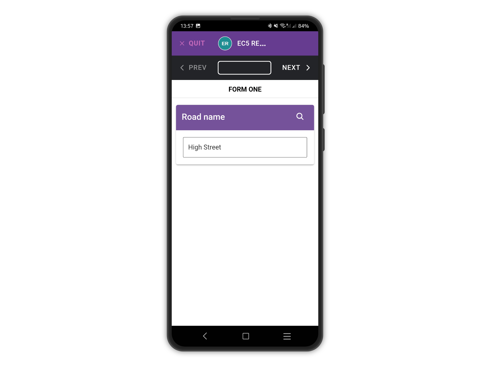

# Re-use answers

In the following example, we are collecting road names using a TEXT question. To avoid typing the same road names over and over, you can re-use the answers you saved already on the device.

<figure><figcaption></figcaption></figure>

When entering a new entry, tap the lens icon to open the search panel.\

<figure><figcaption></figcaption></figure>

Pick a saved answer from the list and tap CLOSE.

<figure><figcaption></figcaption></figure>

The selected answer will be used.

<figure><figcaption></figcaption></figure>
