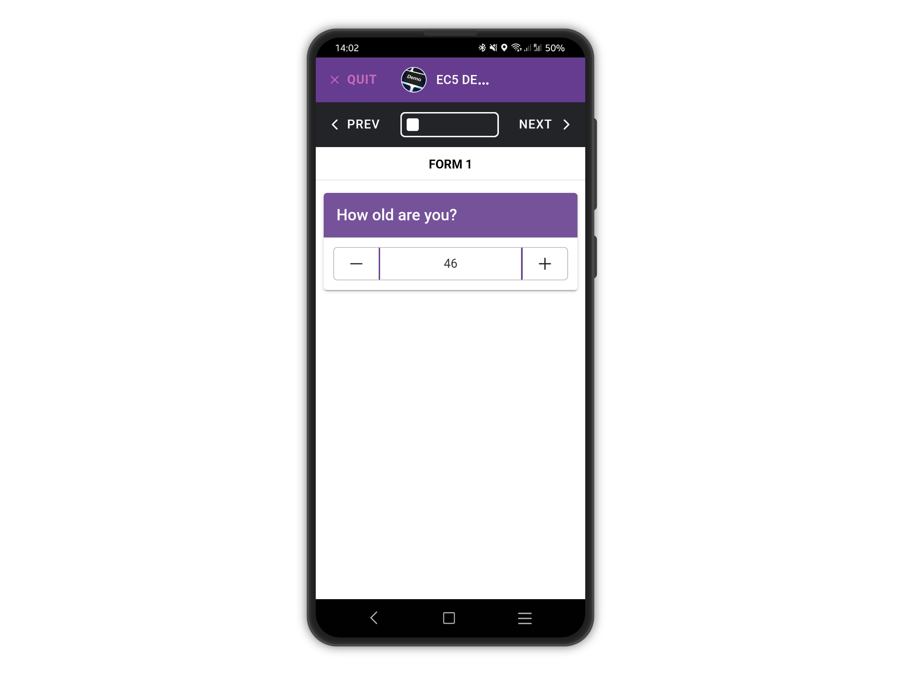
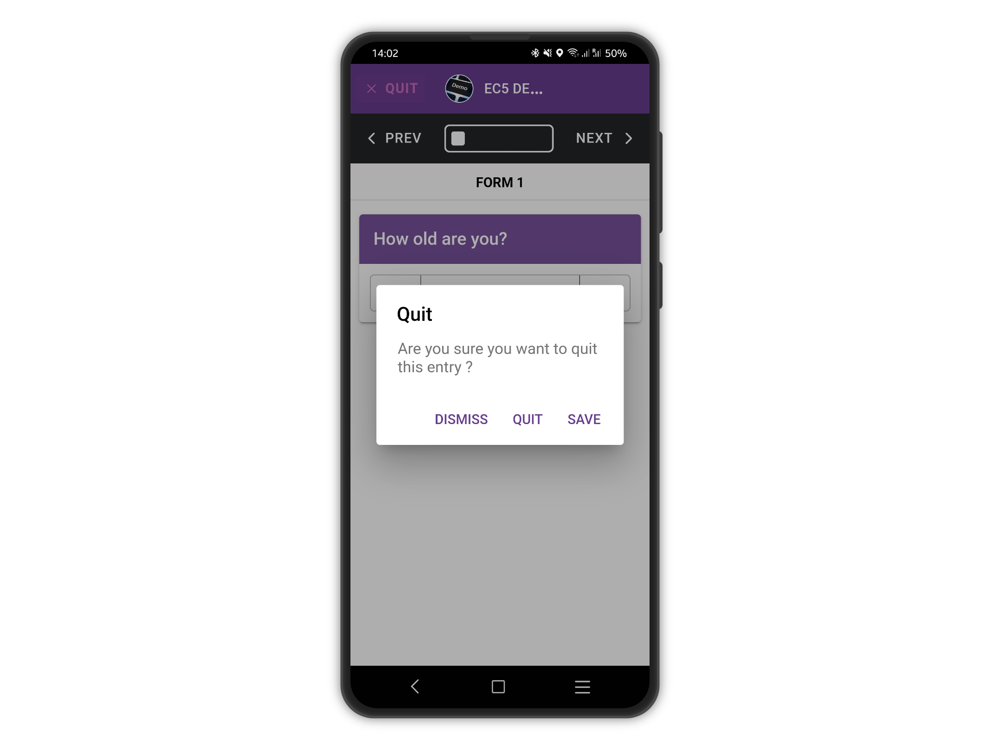
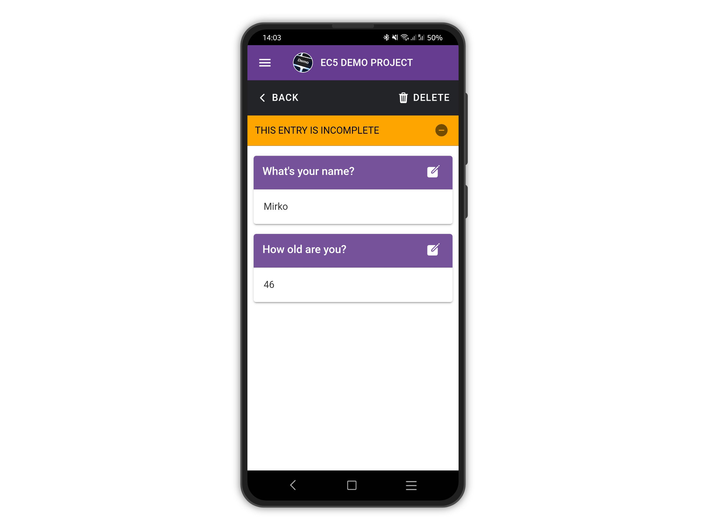

# Save & Resume Entries

When collecting data, you can save an entry as incomplete and resume it later.&#x20;

This is useful when certain information is not immediately available, the device is running out of battery or there is just not enough time to complete the questionnaire.

To save the entry, tap QUIT at the top right.

<figure><figcaption></figcaption></figure>

Tap SAVE on the confirmation dialog.

<figure><figcaption></figcaption></figure>

Please note the warning about the entry being incomplete, and only the answers up to the saving point are shown.&#x20;


**Incomplete entries cannot be uploaded**.&#x20;

To complete an entry, it must be saved at the end of the form.


<figure><figcaption></figcaption></figure>
