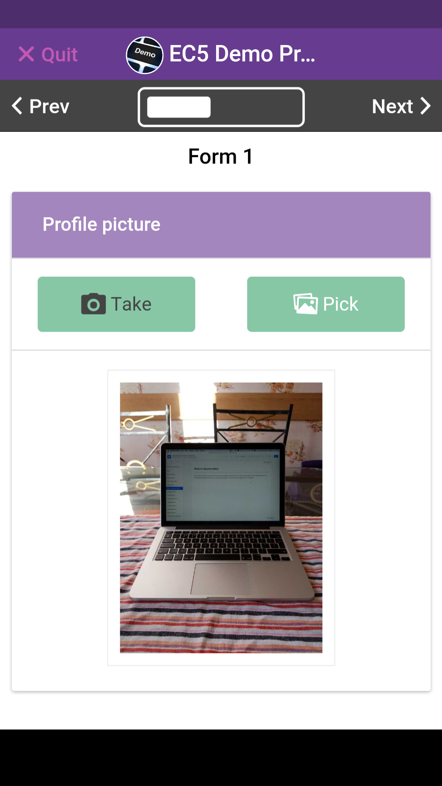
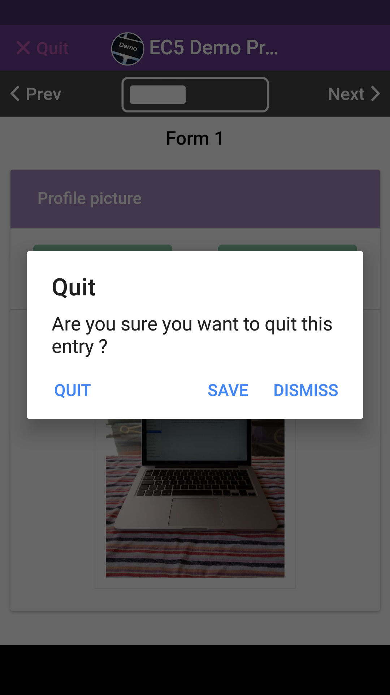
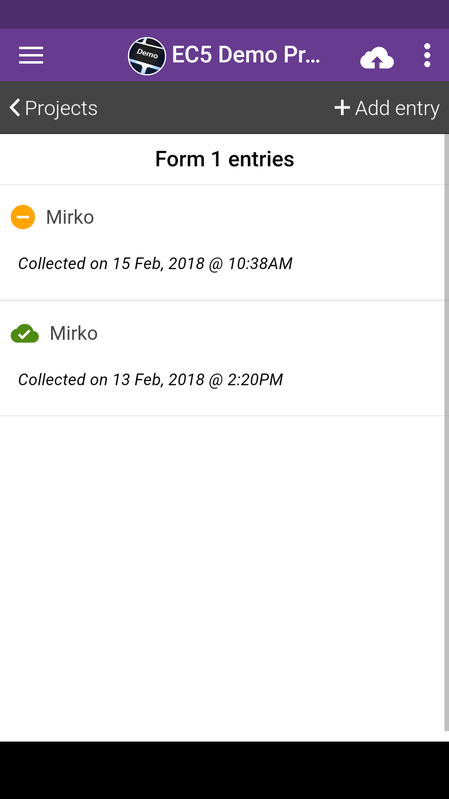
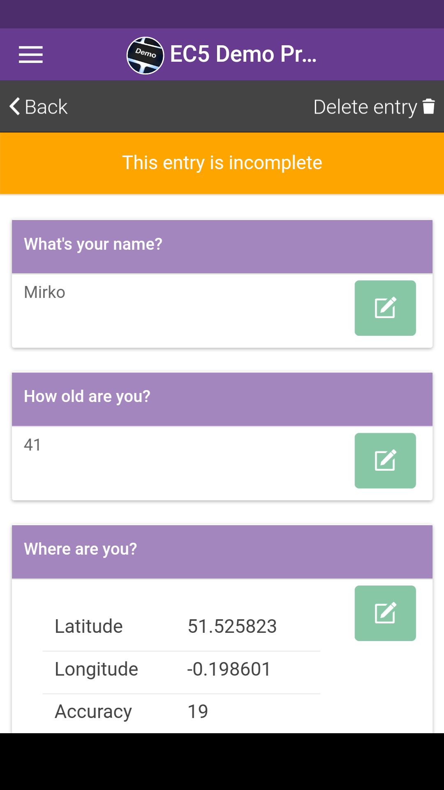

# Save & Resume Entries

When collecting data, you can save an entry as incomplete and resume it later. This is useful when certain information are not immediately available, the device is running out of battery or there is just not enough time to complete the questionnaire.

|                                           |                                                                             |
| ----------------------------------------- | --------------------------------------------------------------------------- |
|  | When you would to save the entry, tap on the "Quit" button at the top left. |

|                                           |                                                |
| ----------------------------------------- | ---------------------------------------------- |
|  | Tap on "Save" to save the entry as incomplete. |

|                                           |                                                                                                                                                                 |
| ----------------------------------------- | --------------------------------------------------------------------------------------------------------------------------------------------------------------- |
|  | The entry will be marked as "incomplete", please note the yellow icon next to it. **An incomplete entry cannot be uploaded!** To complete the entry, tap on it. |

|                                           |                                                                                                                                                                                         |
| ----------------------------------------- | --------------------------------------------------------------------------------------------------------------------------------------------------------------------------------------- |
|  | Please note the warning: the entry is incomplete. You have to complete the entry if you want to upload it. Scroll down to the bottom and tap on the "Edit" button of the last question. |

|                                           |                                            |
| ----------------------------------------- | ------------------------------------------ |
|  | Just tap on "Next" and complete the entry. |
