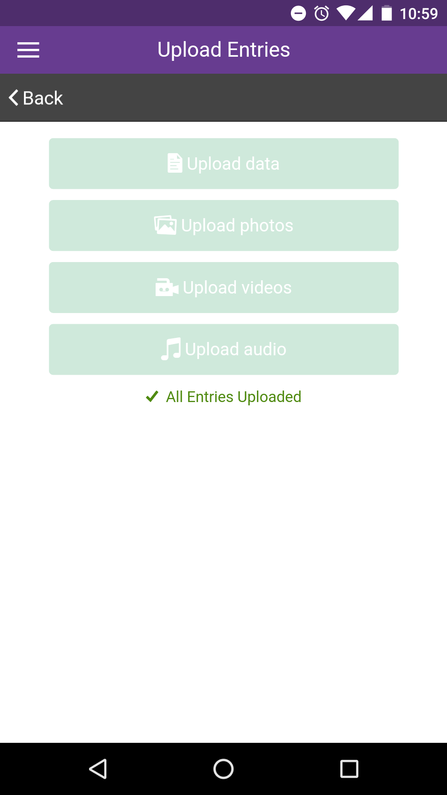
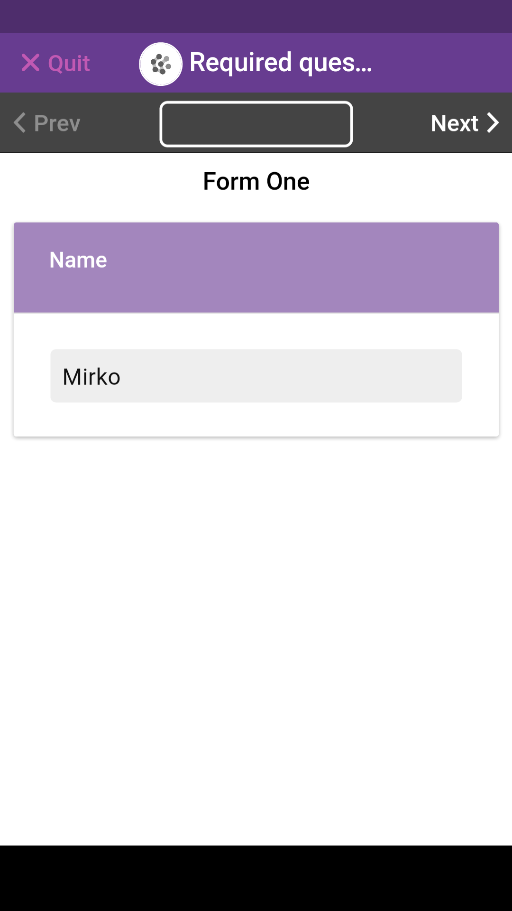
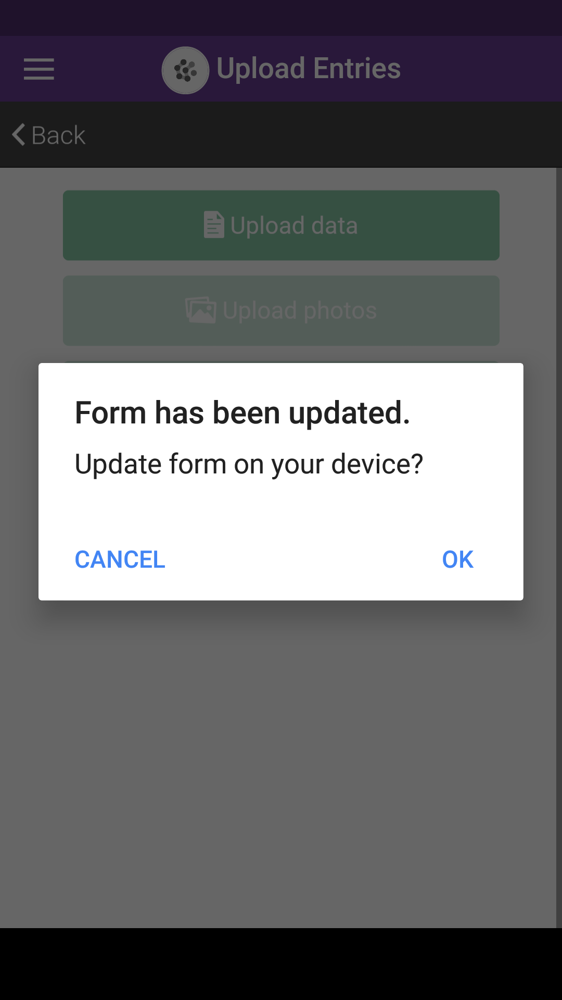
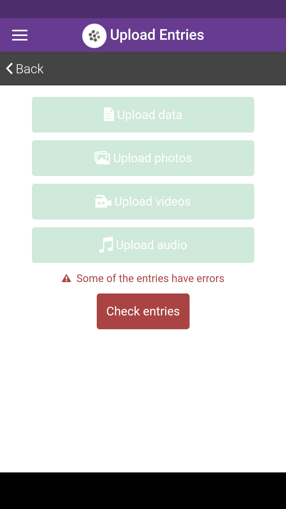

# Upload Entries

|                                           |                                                                                                                                                                            |
| ----------------------------------------- | -------------------------------------------------------------------------------------------------------------------------------------------------------------------------- |
|  | To begin uploading your entries, first click on your project from the 'Projects' list home page._NOTE: you must have an internet connection to be able to upload entries._ |

|                                                |                                                                                                           |
| ---------------------------------------------- | --------------------------------------------------------------------------------------------------------- |
|  | Next, click the cloud icon in the top right corner (or select 'Upload entries' from the right hand menu). |

|                                          |                                                                                                                                                                                                                               |
| ---------------------------------------- | ----------------------------------------------------------------------------------------------------------------------------------------------------------------------------------------------------------------------------- |
|  | From here, you can select the 'Upload data' button, if you have entries to upload._NOTE: if this is a private project, and you are not already logged in, you will be prompted to log in before you can upload your entries._ |

|                                            |                                                                                                                                                |
| ------------------------------------------ | ---------------------------------------------------------------------------------------------------------------------------------------------- |
|                                            |                                                                                                                                                |
|  | You will be shown a progress indicator when your data is being uploaded and once complete, you will be notified that all entries are uploaded. |

## Uploading media files


If you have media files (photo, audio, and video questions) they need to be uploaded separately! See below.


|                                                |                                                                                                                            |
| ---------------------------------------------- | -------------------------------------------------------------------------------------------------------------------------- |
|  | If you have media to upload (photos, videos, and audio), you will be able to do this once all your data has been uploaded. |

|                                                |                                                                   |
| ---------------------------------------------- | ----------------------------------------------------------------- |
|  | If for any reason, there has been an error, you will be notified. |

|                                                    |                                                                  |
| -------------------------------------------------- | ---------------------------------------------------------------- |
|  | You can then see on your project page which entries have errors. |

|                                              |                                                                                                                                           |
| -------------------------------------------- | ----------------------------------------------------------------------------------------------------------------------------------------- |
|  | Clicking on an entry will take you to the view entry page, where you can see a description of the error and to which question it applies. |

This particular error indicates that there is already an entry on the server with the answer 'John' to the question 'Name'. |

|                                              |                                                                                    |
| -------------------------------------------- | ---------------------------------------------------------------------------------- |
|  | You can then edit and correct your answer, save and try to upload the entry again. |

## Incomplete entries

Entries which are incomplete **cannot be uploaded**. When adding a new entry, you need to answer **ALL** its questions. If you exit the form halfway through and save (to complete the entry later) the entry is marked as "incomplete" and it will get a warning yellow icon (like a minus sign).

Example:

|                                          |                                                      |
| ---------------------------------------- | ---------------------------------------------------- |
|  | Start adding a new entry, the tap on "Quit" to exit. |

|                                          |                                                                    |
| ---------------------------------------- | ------------------------------------------------------------------ |
|  | Click on save to store your progress and complete the entry later. |

|                                          |                                                                                      |
| ---------------------------------------- | ------------------------------------------------------------------------------------ |
|  | The entry is listed with a yellow warning icon next to it, to mark it as incomplete. |

|                                          |                                                                                                                                                                          |
| ---------------------------------------- | ------------------------------------------------------------------------------------------------------------------------------------------------------------------------ |
|  | Tap on the entry to edit it. A warning message "The entry is incomplete" is shown at the top. Edit the entry to complete it and save it to make it available for upload. |

## Required questions not answered

Entries which have some required questions not answered cannot be uploaded.

This usually happens when a question gets set as required at a later stage. The form gets updated on the app correctly but the user already has some entries on the device he cannot upload anymore, as they are missing the answer to the now required question.

The user needs to amend the old entries and fix the errors. Let's see an example:

The project above is a simple two questions form asking for name and sex. As you notice, the "Sex?" question is not required. Let's add it to the device and add an entry:

|                                                  |                        |
| ------------------------------------------------ | ---------------------- |
|  | Let's fill in the name |

|                                                  |                                                        |
| ------------------------------------------------ | ------------------------------------------------------ |
|  | Now let's leave the "Sex?" question without any answer |

|                                                  |                               |
| ------------------------------------------------ | ----------------------------- |
|  | The entry is saved correctly. |

Before uploading the entry, we go back to our form, set the "Sex?" question as required and save the project.

|                                                   |                                                                                          |
| ------------------------------------------------- | ---------------------------------------------------------------------------------------- |
|  | If we try to upload, a message is shown asking us to update our form. Let's tap on "Ok". |

|                                                   |                                                                  |
| ------------------------------------------------- | ---------------------------------------------------------------- |
|  | The form gets updated and we can dismiss the confirmation popup. |

|                                                  |                                                                                                                                                                                                                                 |
| ------------------------------------------------ | ------------------------------------------------------------------------------------------------------------------------------------------------------------------------------------------------------------------------------- |
|  | If we try to upload after updating the form, we will get an error as some existing entries on the device do not meet the requirements anymore. In our case, the "Sex?" question is now required therefore it must be filled in. |

|                                                  |                                                      |
| ------------------------------------------------ | ---------------------------------------------------- |
|  | Tap on the "Check Entries" red button at the bottom. |

|                                                  |                                                                                    |
| ------------------------------------------------ | ---------------------------------------------------------------------------------- |
|  | Entries with errors are flagged with a red icon. Tap on it to open it for editing. |

|                                                  |                                                                                                                           |
| ------------------------------------------------ | ------------------------------------------------------------------------------------------------------------------------- |
|  | An error message is shown at the top, and the affected questions are flagged. Tap the edit button on the "Sex?" question. |

|                                                   |                                                                                                                                            |
| ------------------------------------------------- | ------------------------------------------------------------------------------------------------------------------------------------------ |
|  | The question is flagged. Pick and option and save the entry by tapping Quit > Save, or tap next until the end of the form and tap on Save. |

|                                                   |                                            |
| ------------------------------------------------- | ------------------------------------------ |
|  | Tapping on Save will save the entry edits. |

|                                                   |                                          |
| ------------------------------------------------- | ---------------------------------------- |
|  | The entry is ready to be uploaded again. |

|                                                   |                                           |
| ------------------------------------------------- | ----------------------------------------- |
|  | The entry gets uploaded successfully now! |
