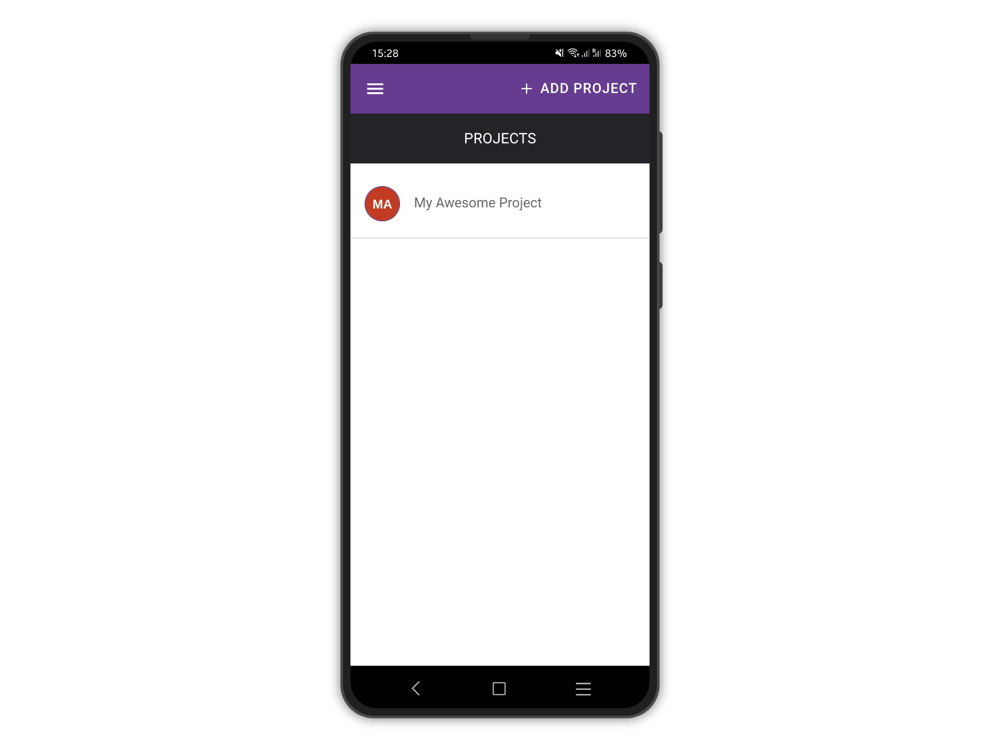
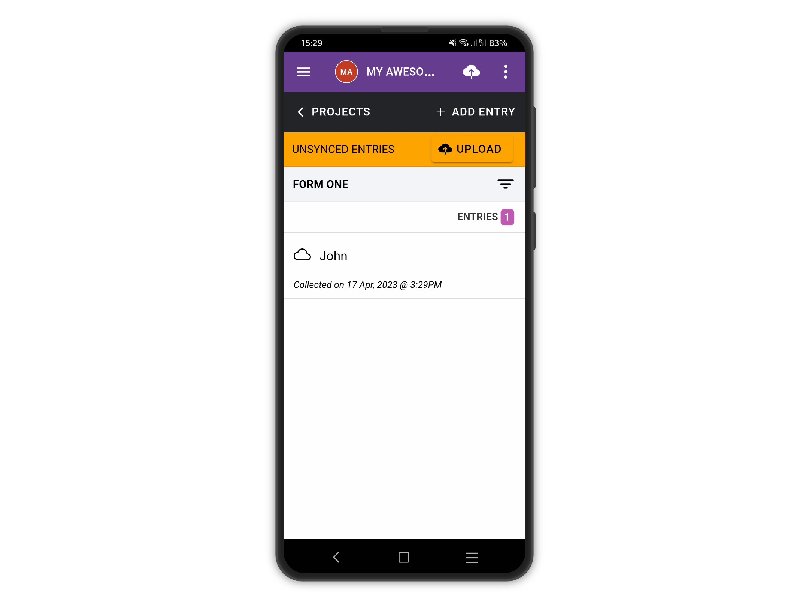
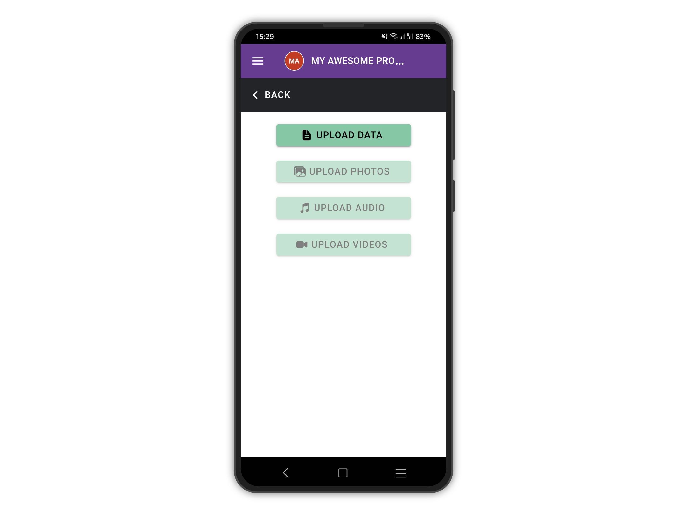
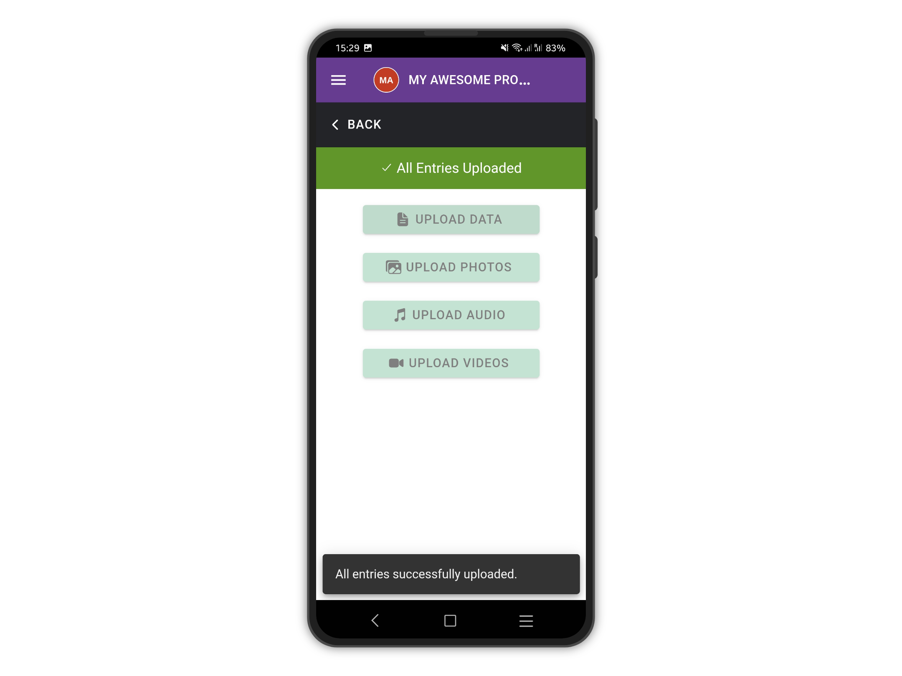
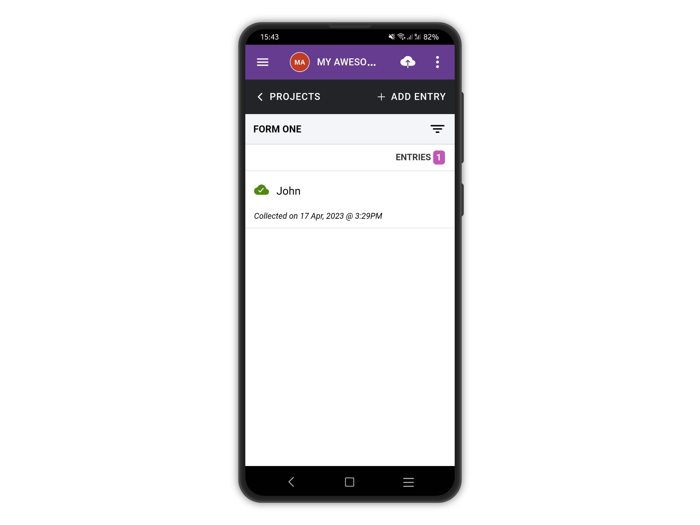
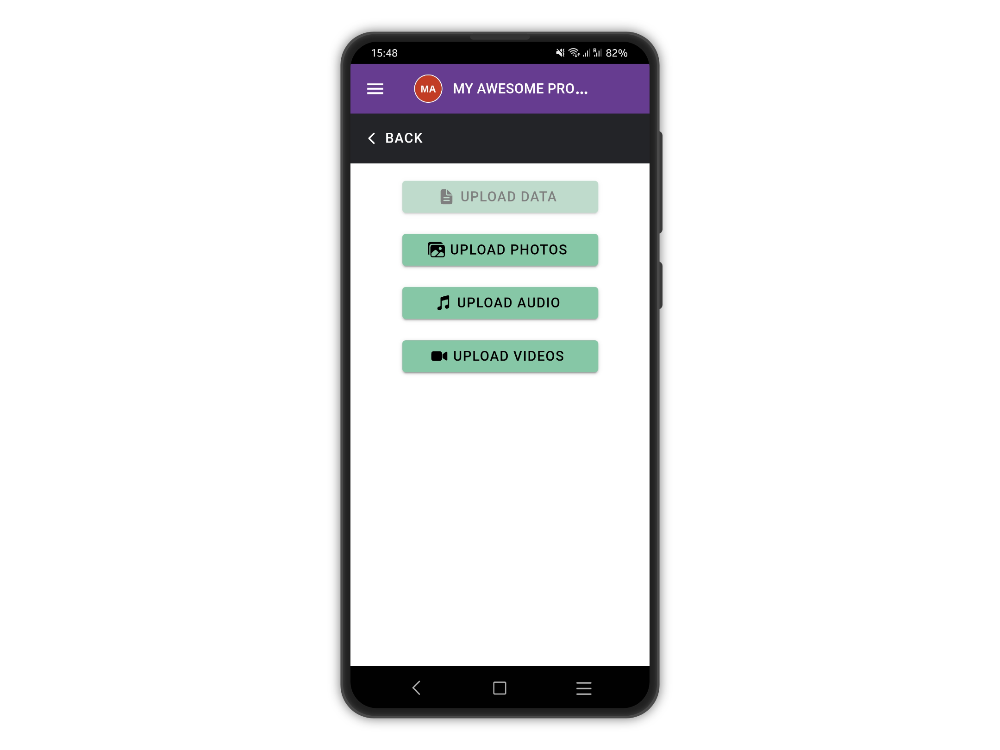

# Upload Entries

To upload your entries, tap on the project from the **PROJECTS** list.


An internet connection is required


<figure><figcaption></figcaption></figure>

Next, tap the cloud icon at the top right corner (or tap **UPLOAD** on the warning banner).

Please note your local entries have an empty cloud icon next to them, to flag them as not synced.

<figure><figcaption></figcaption></figure>

Tap UPLOAD DATA, if there are entries to upload the button will be enabled.


If this is a private project, and users are not already logged in, they will be prompted to authenticate before they can upload any entries.


<figure><figcaption></figcaption></figure>

A progress indicator is shown while the data is being uploaded and once the upload is completed, feedback is shown.

<figure><figcaption></figcaption></figure>

Synced entries get a green-checked cloud icon to flag them as synced

<figure><figcaption></figcaption></figure>

## Uploading media files


If there are media files (photo, audio, and video questions) they need to be uploaded separately.


If there are media files to upload (photos, videos, and audio), it is possible to do it only once all the data has been uploaded successfully.

<figure><figcaption></figcaption></figure>

