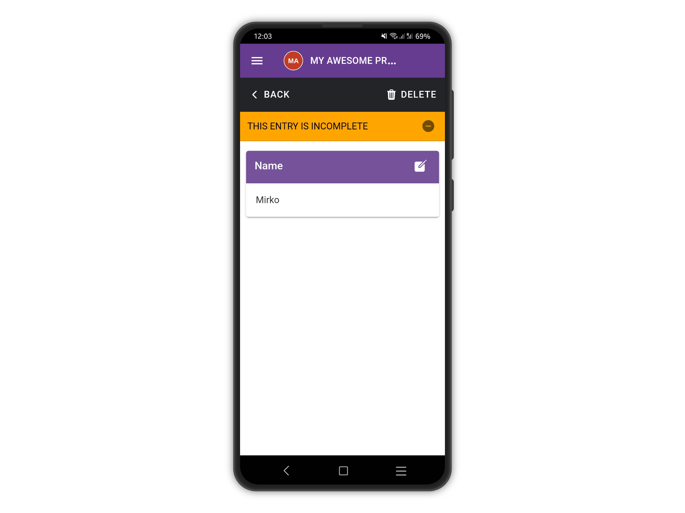

# Incomplete Entries

If an entry is saved halfway through the form  (to be completed later) the entry is marked as **INCOMPLETE** and flagged with a yellow minus sign icon. ([**See save & Resume Entries**](../saveresume-entry.md))

<figure><figcaption></figcaption></figure>

When the entry is viewed, it will only show the answers up to the saving point.

<figure><figcaption></figcaption></figure>
