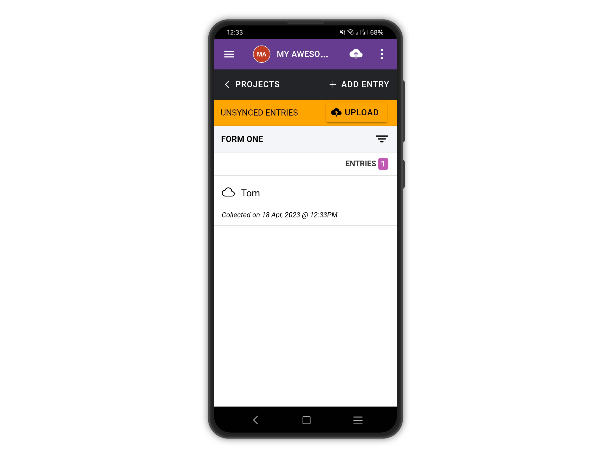

# Missing required aswers

Errors about missing required answers usually happen when a question gets set as required at a later stage. The form gets updated on the app correctly but the user already has some entries on the device he cannot upload anymore, as they are missing the answer to the now required question.

The user needs to amend the old entries and fix the errors. Let's see an example:

<figure><figcaption></figcaption></figure>

The project above is a simple two questions form asking for names and sex. As you notice, the "Sex?" question is not required. Let's add it to the device and add an entry:

<figure><figcaption>
We enter the name
</figcaption></figure>

<figure><figcaption>
We skip this question
</figcaption></figure>

<figure><figcaption></figcaption></figure>

Before uploading, we make a change to our form and set the "Sex?" question as required:

<figure><figcaption></figcaption></figure>

If we try to upload, a message is shown asking us to update our form. Let's tap **OK**.

<figure><figcaption></figcaption></figure>

<figure><figcaption></figcaption></figure>

If we try to upload after updating the form, we will get an error as some existing entries on the device do not meet the requirements anymore. In our case, the "Sex?" question is now required therefore it must be filled in.

<figure><figcaption></figcaption></figure>

We answer the question, save it and upload it again, this time successfully.

<figure><figcaption></figcaption></figure>

<figure><figcaption></figcaption></figure>

<figure><figcaption></figcaption></figure>
