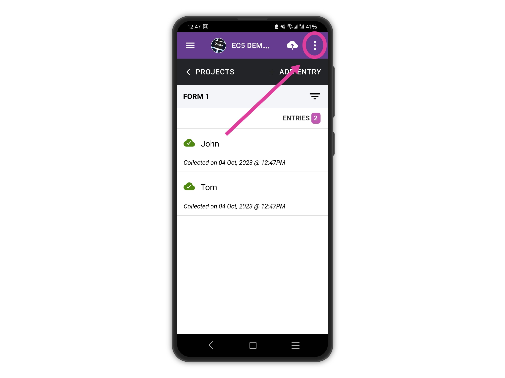
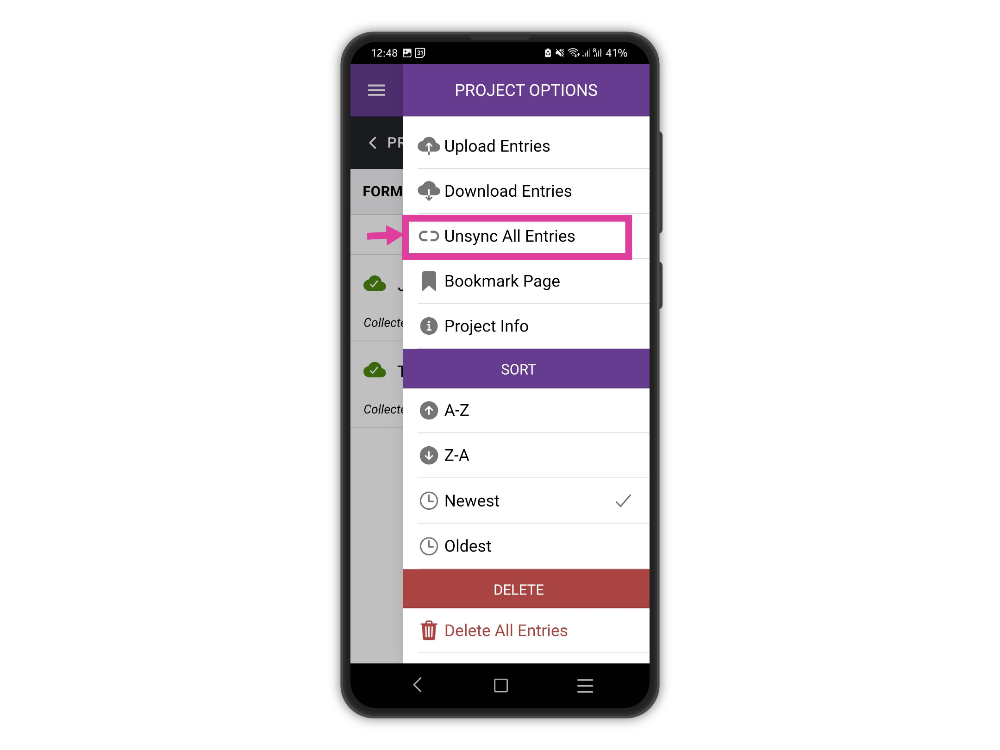

# Unsync entries

In cases where upload errors persist after updating a project, it is possible to efficiently resolve the issue by unsyncing all entries and re-uploading them in bulk. This proves particularly helpful when existing entries on the device are aligned with an outdated version of the project.

To unsync all entries currently stored on the device, kindly navigate to the entries list and access the right drawer menu.

<figure><figcaption></figcaption></figure>

Tap on **Unsync All Entries**

<figure><figcaption></figcaption></figure>

Now that all entries have been successfully unsynced, you have the opportunity to re-upload them from scratch. This ensures a clean and error-free submission of the entries to the updated version of the project.
