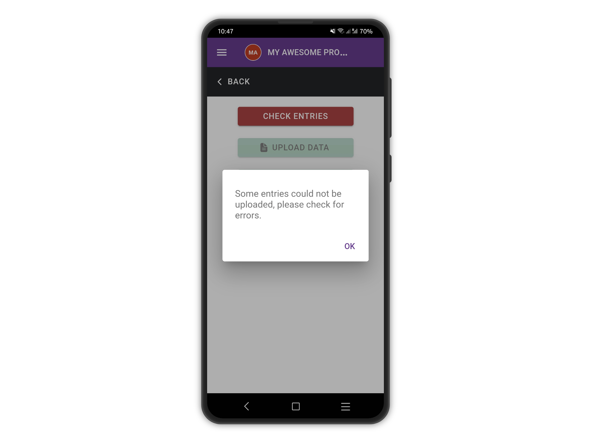
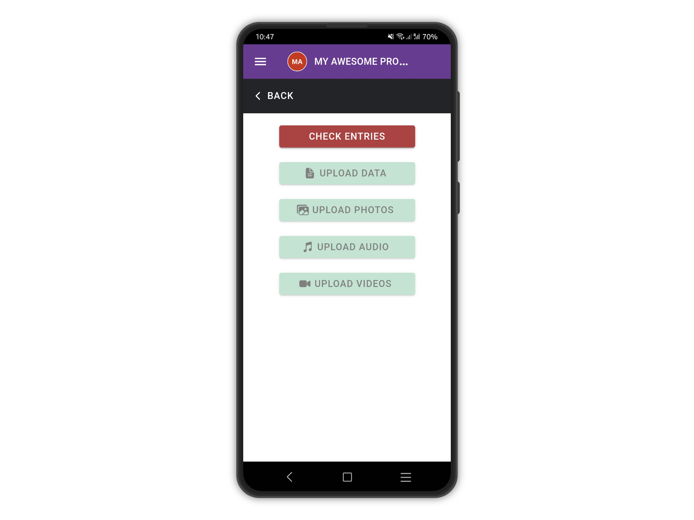

# Upload Errors

If for any reason, there has been an error, you will be notified.

<figure><figcaption></figcaption></figure>

Tap the red button **CHECK ENTRIES** if available, otherwise, go back to the list of entries

<figure><figcaption></figcaption></figure>

Entries with errors are flagged with a red cloud icon next to them.

<figure><figcaption></figcaption></figure>

Tap the entry with the error to view the error detailed message. For example, below there is an error about an answer not being unique.

<figure><figcaption></figcaption></figure>

Edit the answer to fix the error and try to upload again. (See [**Edit Entries**](../edit-entries.md))

<figure><figcaption></figcaption></figure>
