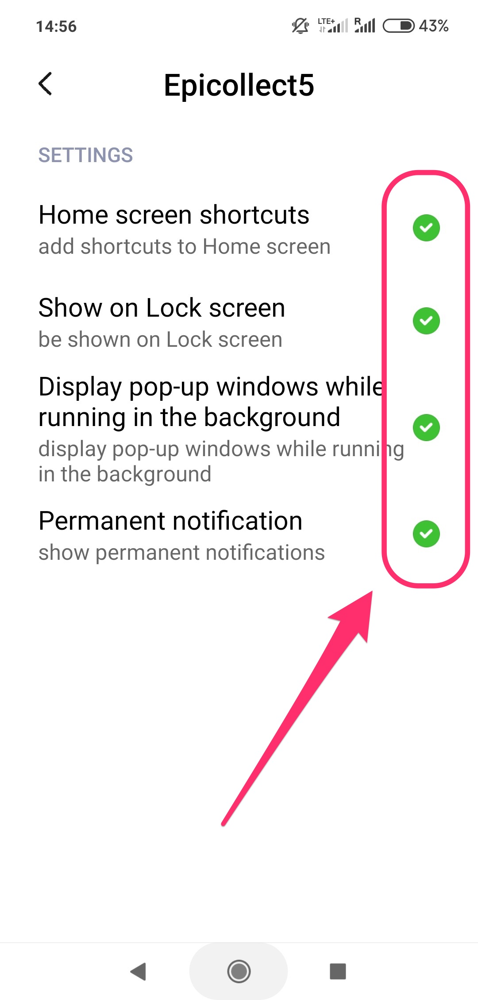

# Xiaomi Troubleshooting


Sometimes when the users take a photo, the Epicollect5 app restarts.


Apparently, [**MIUI**](https://en.miui.com/) (the Xiaomi customised version of Android powering almost all Xiaomi devices) has a very aggressive memory management implementation causing any app in the background to be killed when the system finds that is using too much memory.

The Epicollect5 app goes in the background when taking photos because the stock camera app installed on the users' device will be in the foreground. After taking the photo, if the Epicollect5 app was killed while being in the background, the users will experience an app restart.

**This is a known issue which is unfortunately outside of our control**. The following steps can be taken to mitigate the problem until we are able to implement a definitive fix.

### **MIUI 10:** follow[ **this guide**](https://dontkillmyapp.com/xiaomi) and apply it to Epicollect5.

### **MIUI 11**: follow the steps below.

### Install Open Camera

If Epicollect5 restarts despite having followed all the steps above, we would suggest installing the camera application called [**Open Camera**](https://play.google.com/store/apps/details?id=net.sourceforge.opencamera\&amp;hl=en\_GB) (by Mark Harman) to be used as the default camera app for Epicollect5.


After downloading Open Camera from the Play Store, the next time the users will try to take a photo using Epicollect5, the app chooser will appear.&#x20;

Selecting Open Camera with "Remember my choice" checked will replace the stock camera app with Open Camera each time Epicollect5 is used to take a photo.

