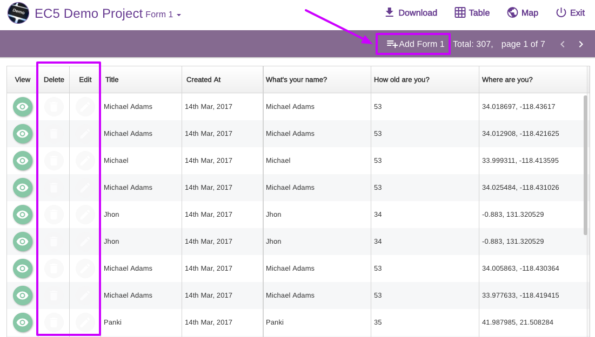
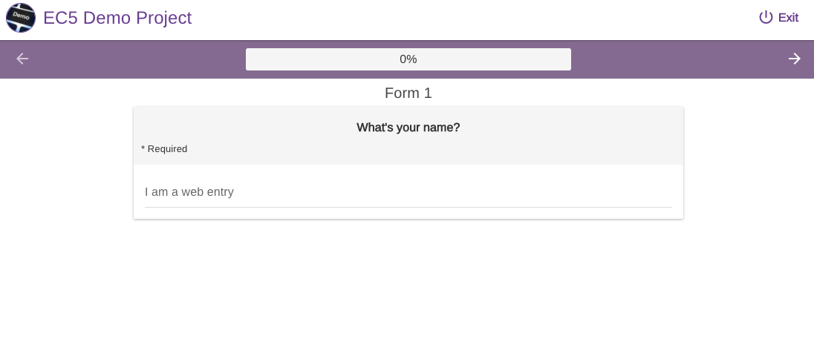
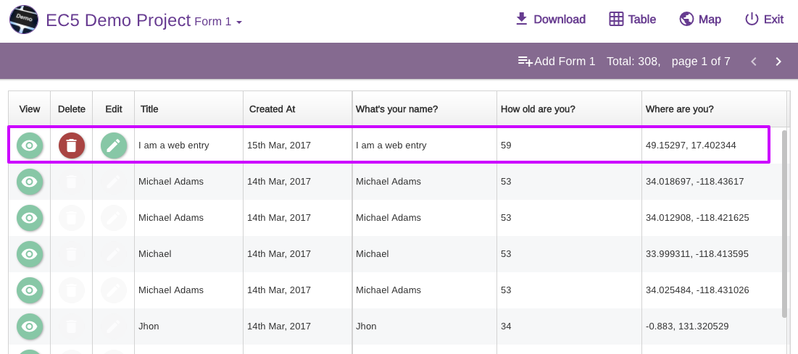
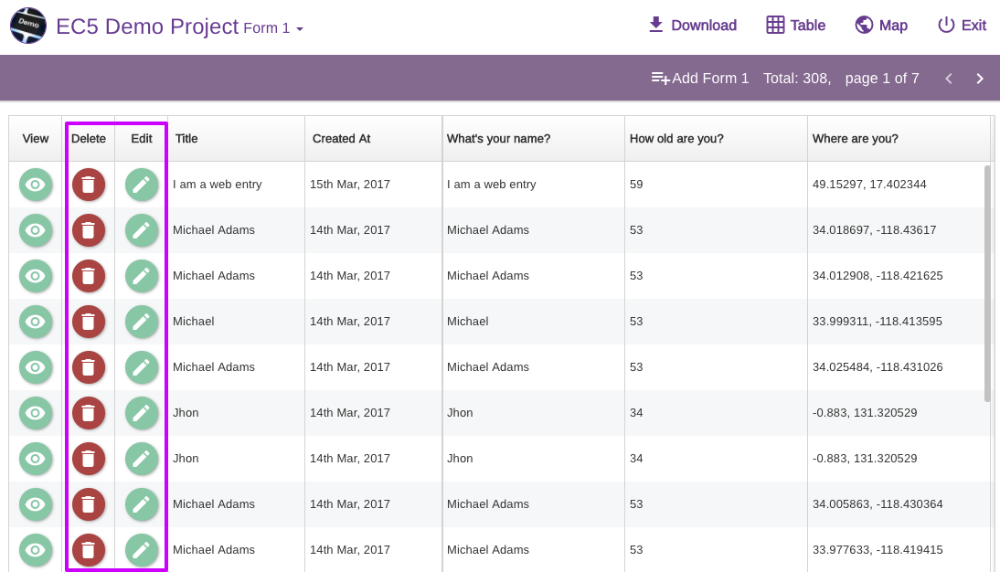
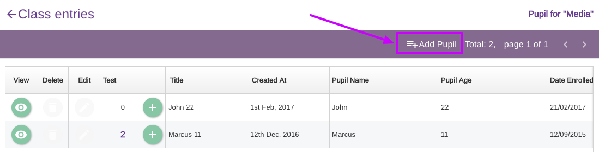
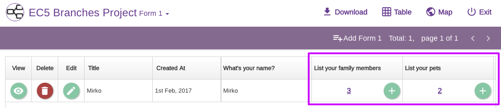
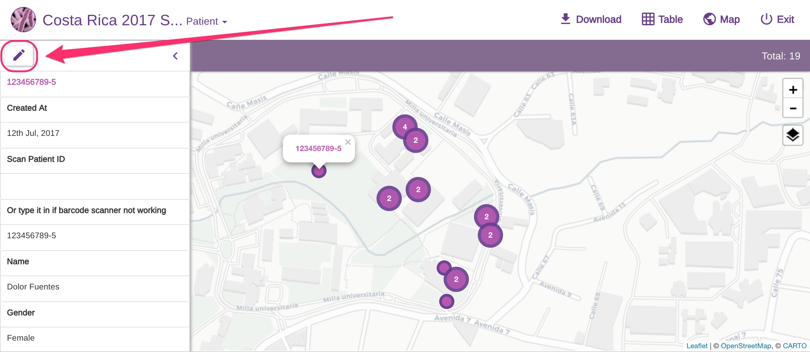

# Add & Edit Entries

### Add or edit entries for single-form projects

Let's have a look at our [**EC5 DEMO PROJECT**](https://five.epicollect.net/project/ec5-demo-project/data)**.** The project is **public**, so anyone can add entries via the web **as long as they are logged in**.


**Login Required**: Users must log in to add entries via the web. This requirement ensures accountability and security by verifying the identity of the person making the entry. It helps maintain data integrity by preventing anonymous or malicious entries.

**Reason for Login**: Authentication via the web is essential because it allows the system to track who is adding data, providing a layer of security and control over the entries. This is crucial for maintaining the reliability and accuracy of the collected data.


The project has a single form called **Form 1**.

**(**[**More on project roles**](set-project-details.md)**)**

A public project accepts entries from users who are not involved in the project closely i.e they do not have any **role** in the project:

Any public logged in user can add an entry using the "_Add Form 1_" button on the top right.

As the EC5 Demo Project is created by Oxford University staff, a public user CANNOT edit or delete other users' entries though.


Notice the delete and edit buttons are disabled.

If the user **OWNS** the entry though, those buttons will be enabled for that entry. More on this later.


Let's add an entry by clicking the "Add Form 1" button on the top right. It will open the Epicollect5 web app to add an entry:

Like the mobile app, you fill in the questions until you reach the end of the form. You then save the entry and click on either "Exit" or the project logo to go back to the data viewer:

Now you can see the entry just added. Notice the edit and delete buttons are now enabled: **the user owns the entry**, so he has the right to delete it or make amendments.

If you were either a creator, manager, or curator for a project, you would see this:

The edit and delete buttons are enabled for **ALL** the entries as you have permission to perform those actions.

For a **private** project, the same rules apply, but users who do not have access to the project will not be able to access it.

### Add or edit entries for multiple-forms projects

If your project consists of many linked forms, you can add entries to the first form exactly as above.

For child forms, things are a bit different. Epicollect5 links the forms in a hierarchy structure ([**how to link forms**](../formbuilder/multiple-forms.md)). This means when adding a child form you have to select a parent entry first.

On our EC5 Hierarchy project, we have a structure like CLASS > PUPIL > TEST.

Adding a CLASS entry is exactly as explained above for a single-form project. To add a PUPIL entry you have to select a CLASS entry first. Just find the CLASS entry you want to add a PUPIL for and click on the "+" button on that entry row. (Remember, you need to be logged in to see that button)

The data editor will open the PUPIL form to add an entry.

If you are viewing some PUPIL entries, you can add an entry via the "Add Pupil" button on the top right:

This is possible because the selected CLASS entry is "Media" so any PUPIL you add from this view will belong to that entry.

Using the same approach, you can add child entries further down the hierarchy. For example, TEST entries.

### Add or edit branch entries

Adding a branch entry is exactly like adding a child entry: find the row with the entry you want to add a branch for and on the branch column, click on the "+" button. Looking at our [EC5 BRANCHES PROJECT:](https://five.epicollect.net/project/ec5-branches-project/)

To edit the branch, you can either edit the entry the branch belongs to or when viewing the branch entries, click on the edit button on the table row.

### Edit entries from the map view

You can also edit an entry from the map view. Click on a marker to open the left sidebar and click on the edit button at the top left to edit the selected entry:

