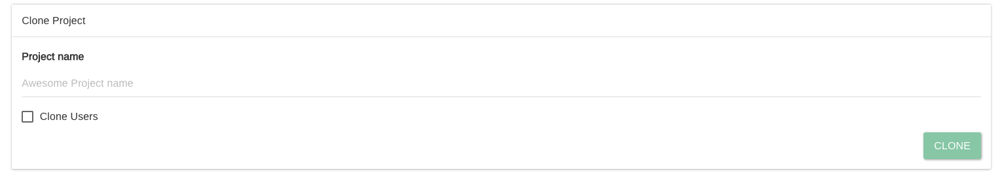

# Clone Project

Sometimes you have a project you would like to copy and just do some tweaking instead of creating a new one from scratch.


Cloning will perform a copy of the project definition, the mapping, and (optional) the users of a project.

**Data are not copied**.


On the project details page, just click on "Clone"

Type a name for the cloned project and click clone.

There is also the option to clone all the users of the original project.


Please be aware cloned projects are always assigned to the original CREATOR(s) of a project.&#x20;

If you would like to use someone else's project as a template please have a look at [**how to export and import projects.**](import-and-export-projects.md)

