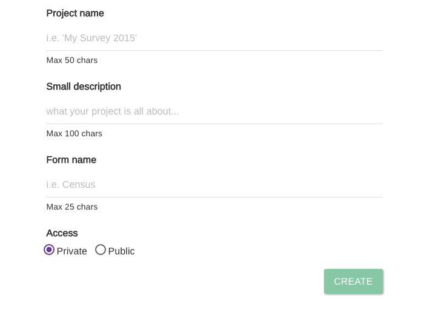

# Create a Project

In Epicollect5, a project refers to a structured and organized collection of data that revolves around a specific goal, task, or study. It’s a fundamental concept within the Epicollect5 platform, which is designed for data collection and management.

A project in Epicollect5 typically includes the following components:

1. **Form(s)**: A form defines the data fields and structure for collecting information. You design the form to capture specific types of data relevant to your project, such as text, numbers, dates, images, and more.
2. **Entries**: Entries are the individual records or instances of data collected using the form. Each time you gather data, it results in a new entry within the project.
3. **Project Settings**: These settings allow you to configure various aspects of the project, such as its name, description, access permissions, and more.
4. **Data Visualization**: Epicollect5 provides tools for visualizing and analyzing the collected data.
5. **Collaboration**: Users are able to collaborate with other users on the same project, enabling multiple people to contribute data.
6. **Data Export**: The ability to export the collected data for further analysis is a crucial feature. Epicollect5 projects usually allow you to export data in various formats, such as CSV or JSON.

Epicollect5 is often used for research, fieldwork, surveys, environmental monitoring, and other data collection tasks. The concept of a project helps you organize and manage the data you collect, making it easier to focus on your specific data collection objectives.

To start, click the Create Project button at the top (_Remember, you must log in to see that button!_)

You will presented with a form to fill in (No worries, it takes 1 minute!)

## Pick a name for your project

Once you have decided on the kind of project you wish to undertake, the first step is to give your project a name.

Your project name will be used within the web address assigned to your project so should be relatively short, with a maximum length of 50 chars.


Project names must be unique, so you cannot use a name if someone else already took it. Think of it like a domain or url you register to yourself.&#x20;

Project name can contain only letters, numbers, underscores (\_), dashes (-), and spaces. No special symbols. You can use both uppercase and lowercase. Maximum length is 50 chars, minimum length is 3 chars.&#x20;

We recommend a project name around 20 chars.


The project name will be use to create a friendly url to your project (called slug) using only lowercase and dashes

Have a look at the examples below:

| Project name       | Slug (friendly url) |
| ------------------ | ------------------- |
| My Awesome Project | my-awesome-project  |
| Survey 2016        | survey-2016         |
| ABC Analysis 1234  | abc-analysis-1234   |

## Type in a small description

This is a short description of what your project is all about. It is basically a summary.&#x20;

You will be able to add a longer full description later on if you wish.

## Enter your form name

A project must have at least one form to work with. It is the name you give to your questionnaire. You can add other nested forms later if you need.


A form name can contain only letters, numbers, underscores (\_), dashes (-) and spaces. No special symbols.&#x20;

You can use both uppercase or lowercase.&#x20;

The form name maximum length is 50 chars.


## Set the type of access

A project can be **private** (accessible only to users you specify) or **public** (accessible to everyone). You can fine tune the type of access control on your data and project settings later.

The private option is set as the default. That means you are the only one who can access the project (It requires login on both the server and the mobile app to be accessed).


We recommend you leave the project as **private** as long as you are building and testing it, and setting it to **public** later when your form(s) is finalised, if you wish, or keep it as private and [**add users to it**](manage-users.md)**.**


Once you have done, click the **Create** button to create a project.



