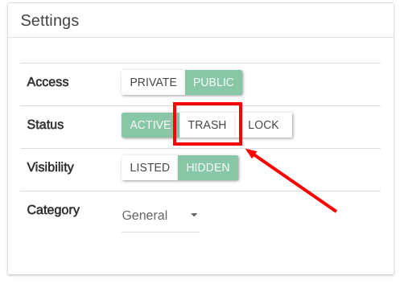
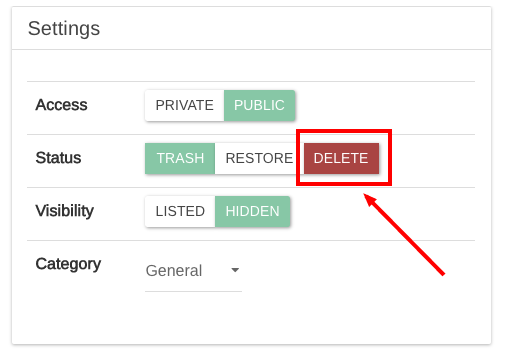
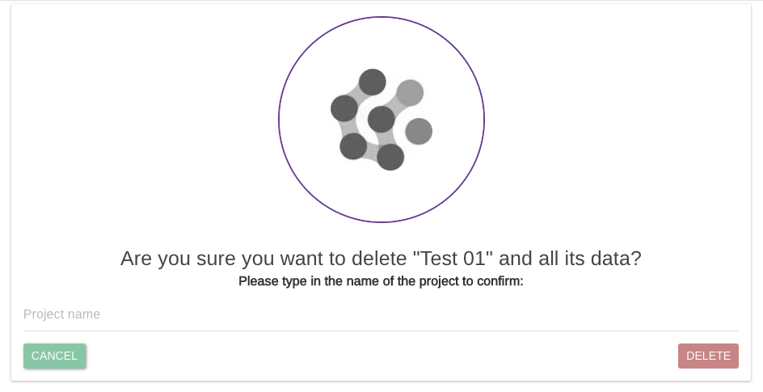
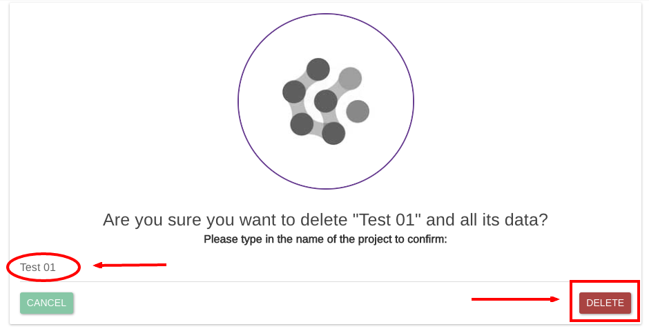

# Delete Projects

Deleting a project will delete the project from the system and all its data.


Be careful as this action cannot be undone! Be sure to backup your data first!


To delete a project, you first need to set its status as TRASH

Then just click on "DELETE".


Only the user with the role of **CREATOR** has the rights to perform that action


For confirmation, you will be asked to type in the project name

When the project name matches exactly, the delete button on the right will be enable and the project will be finally deleted.

