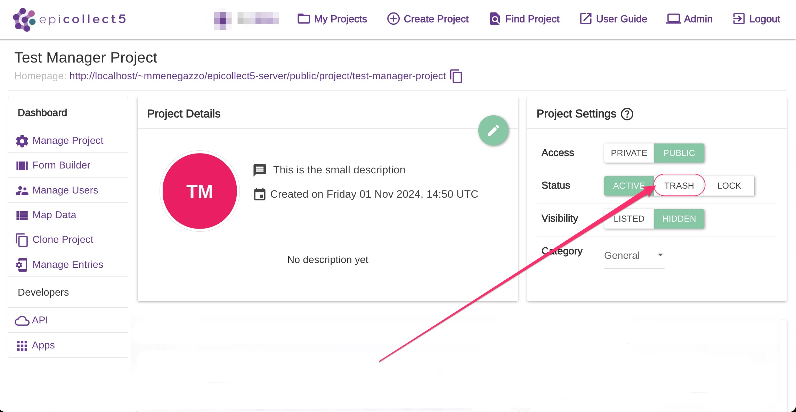
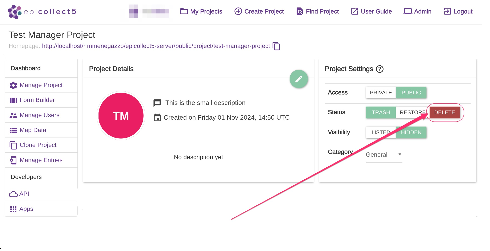
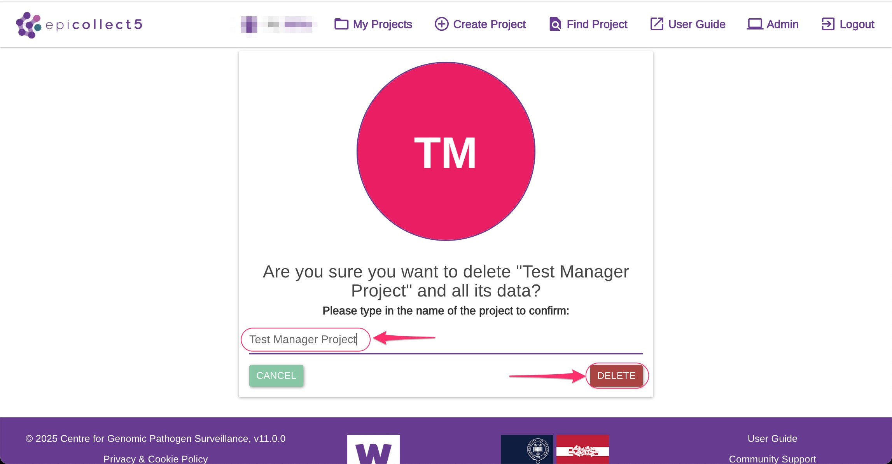

# Delete Projects (Web)

Deleting a project will permanently remove it from the system along with all its associated data. Please proceed with caution.&#x20;


Be careful as this action cannot be undone! Be sure to back up your data first!


To delete a project, you must first set its status as **TRASH**.

<figure><figcaption>
Set project status as TRASH
</figcaption></figure>

Then click on "**DELETE**".


Only the user with the role of **CREATOR** has the right to perform the delete action.


<figure><figcaption>
Click the DELETE button to proceed
</figcaption></figure>

To confirm the deletion, you will be asked to enter the project name.

Once the project name matches exactly, the delete button on the right will be enabled, allowing you to proceed with the final deletion.

<figure><figcaption>
Type the project name to enable the DELETE button
</figcaption></figure>
