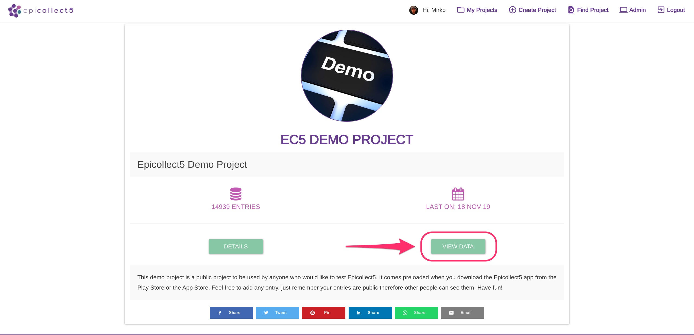
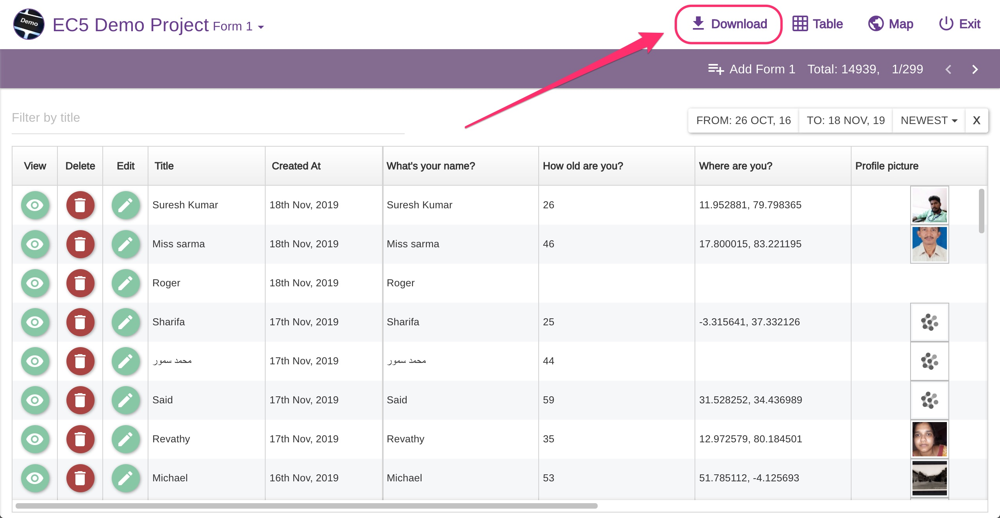
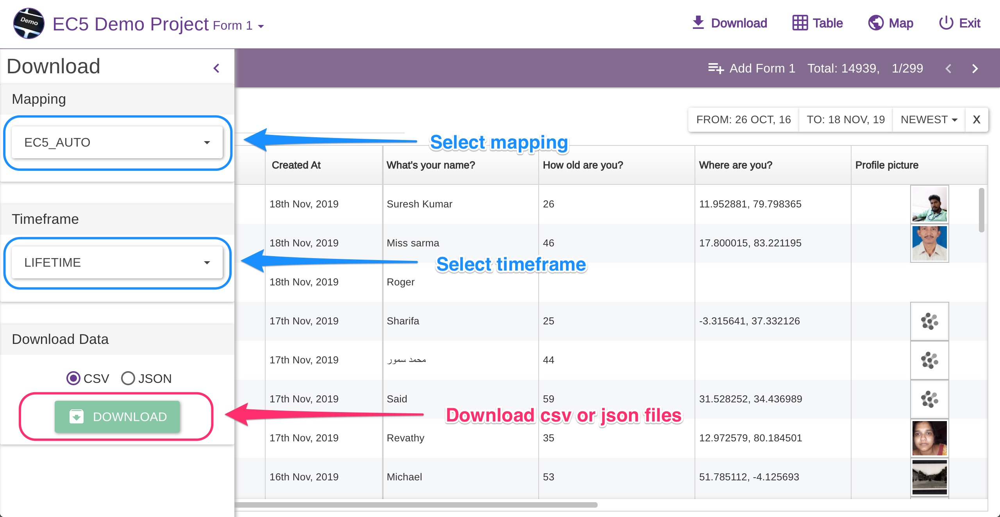
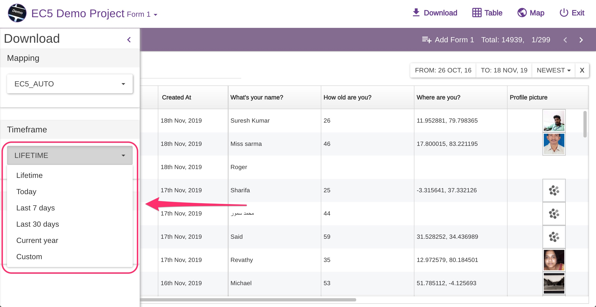
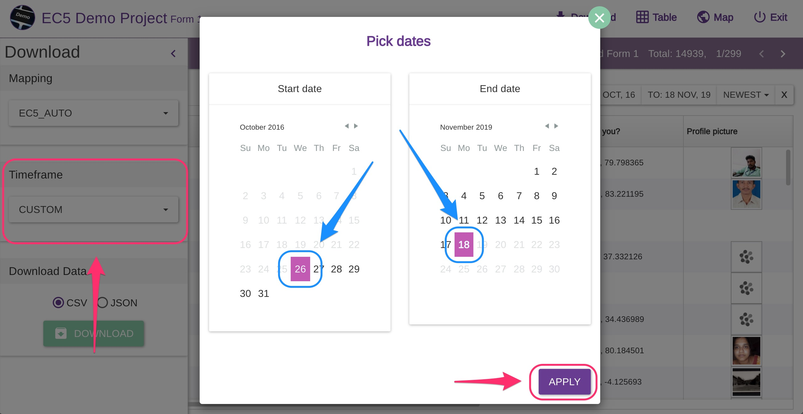

# Downloading Data


Users must be logged in to download data, even if the project is public.


To download data for a project, go to the project home page and click on "View Data":

On the navigation bar at the top, click on "download" to open a left side panel with the download settings:

A panel will slide in from the left:

### Select the mapping&#x20;

(The default mapping is always pre-selected). [**More on mapping data**](mapping-data.md)


if you do not know what mapping is, just ignore it.&#x20;


Pick `JSON` or `CSV` format.

### Select date range&#x20;

You can also select which timeframe you are interested in.The default is "LIFETIME" to get all the data since the project was created.

If you need a custom timeframe, select "CUSTOM" and pick the start and end date.

Click on the project zip file to download it.


If you have more than one single form and branches, you will get separate files: one file per each form and one file per each branch.&#x20;

How to merge the data (if needed) il left to the user. For example, using Excel, there are several ways to merge tables based on common columns (in Epicollect5, look at **ec5\_uuid**, **ec5\_parent\_uuid** for child forms and **ec5\_branch\_owner\_uuid** for branch forms), [**have a look at this link.** ](https://www.extendoffice.com/product/kutools-for-excel/excel-merge-tables-by-column.html)

An example using Google Sheet can be found [**here**](../common-use-cases/consolidate-data.md)**.**




### Split data into multiple columns

Checkbox questions can have multiple answers. Epicollect5 saves the answers to a question in a single column in`csv`format like "one, two, three". If you need a column per each answer, It can be easily done in Google Sheets ([**see how**](https://support.google.com/docs/answer/6325535?co=GENIE.Platform%3DDesktop\&hl=en)) or Excel ([**see how**](https://support.microsoft.com/en-us/office/split-text-into-different-columns-with-the-convert-text-to-columns-wizard-30b14928-5550-41f5-97ca-7a3e9c363ed7)).
