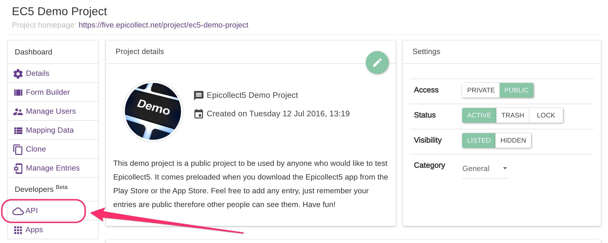
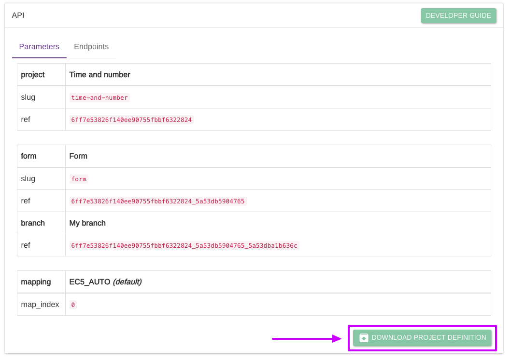
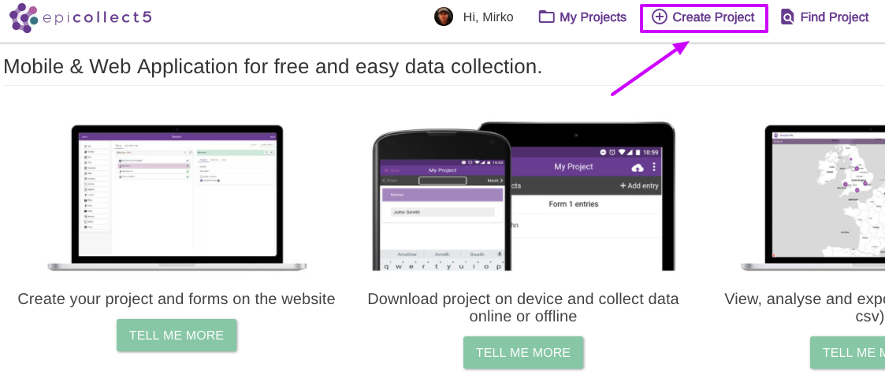
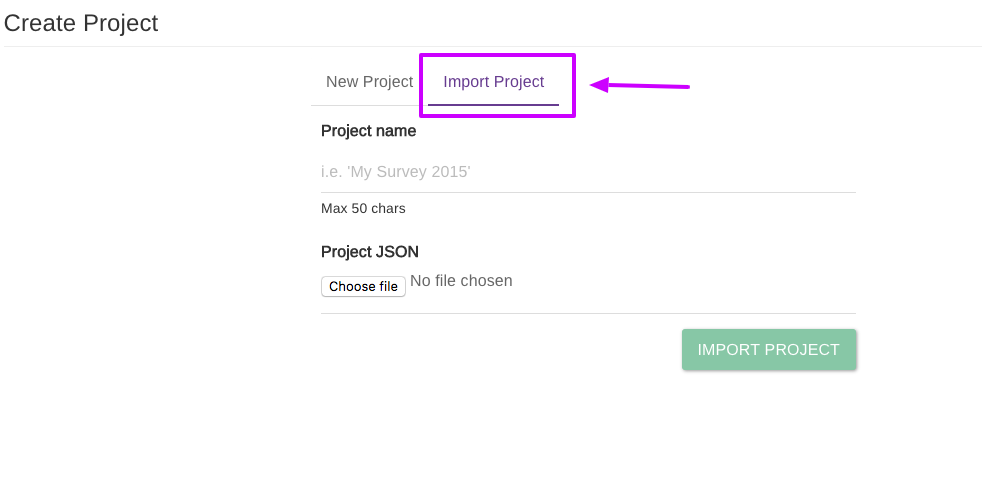

# Import & Export Projects

Sometimes you might want to share a project with someone not part of your organization, or just use a project as a template, and so on. In that case, [**cloning**](clone-project.md) is not an option since that will always assign it to the original **CREATOR** of the project.


**Exporting a project** does not export its [**mapping**](mapping-data.md) or its [**users**](manage-users.md). If you need that, look at project [**cloning**](clone-project.md) and at [**how to transfer project ownership**](transfer-ownership.md).


## Export a project

Go to your project details page and click on API:

Scroll at the bottom of the page and click on "Download Project Definition". Save the file in a handy location.

## Import a project

To import a project, log in to Epicollect5 and click on "Create Project":

Then click on the "Import Project" tab:

Give your imported project a name, pick your Epicollect5 project file and click on "Import Project".



