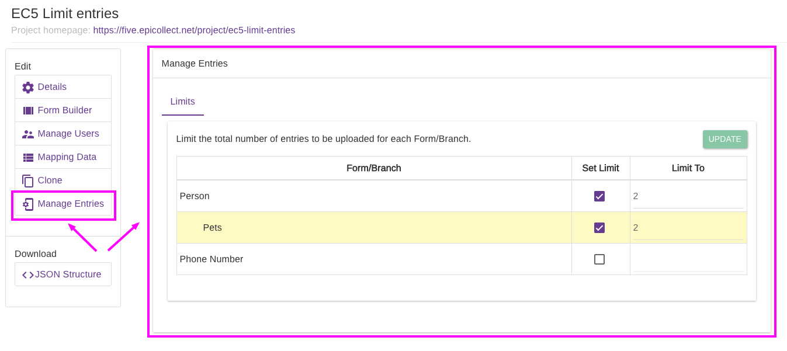
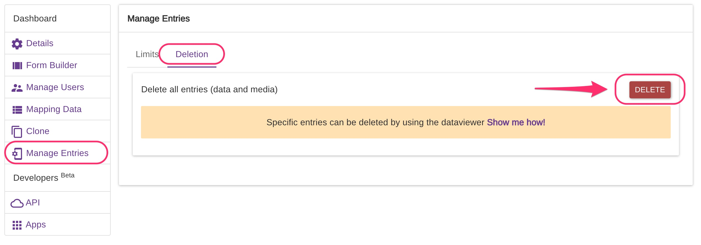

# Manage Entries

### Limits

Per each project is possible to set a fixed limit of entries per each form or branch. To access this feature, go to your project details page and click on "Manage Entries". [More on edit project](set-project-details.md).

We set up an example project called [EC5 limit entries](https://five.epicollect.net/project/ec5-limit-entries). The project has a two forms hierarchy, PERSON > PHONE NUMBER.

We added a branch called "Pets" to the PERSON form. As you can see from the screenshot above, we limit the total number of entries of PERSON to 2 ("Set Limit" checkbox **ticked** and "Limit To" set to **2**). We already uploaded those 2 entries to the server (have a look) so the system will not accept any more entries for the PERSON form.

We did not set any limits to the PHONE NUMBER form. To do that, just **DO NOT** tick the "Set Limit" checkbox

On the PERSON form, we set a limit to 2 branch entries. This means each PERSON entry can have a maximum of 2 "Pets" branch entries.

If we set a limit on the PHONE NUMBER form, let's say to 5, the system would accept 5 PHONE NUMBER entries per each PERSON, as **it validates the total against the hierarchy structure**, as usual on Epicollect5.

This is all you need to do. If you set a limit and you already have more entries than the limit set, you will get an error prompt. To see how many entries you have per each form, [view the data for that project](viewing-data.md).


If you set a limit, the maximum can be 50.000 entries. This is to force people to get the project organized by splitting it in smaller projects if needed. If you need more than 50.000 entries per project, do not set any limit. If you would like to stop the data collection when you reach for example 80.000 entries, you can lock a project **(**[**More info**](set-project-details.md)**)**


To see how the mobile app behaves when limits are reached, [have a read here](../mobile-application/entries-limits.md).

### Deletion

Entries for a project can be deleted at once.


This action cannot be undone so proceed carefully.

&#x20;Always do a backup of your data!


