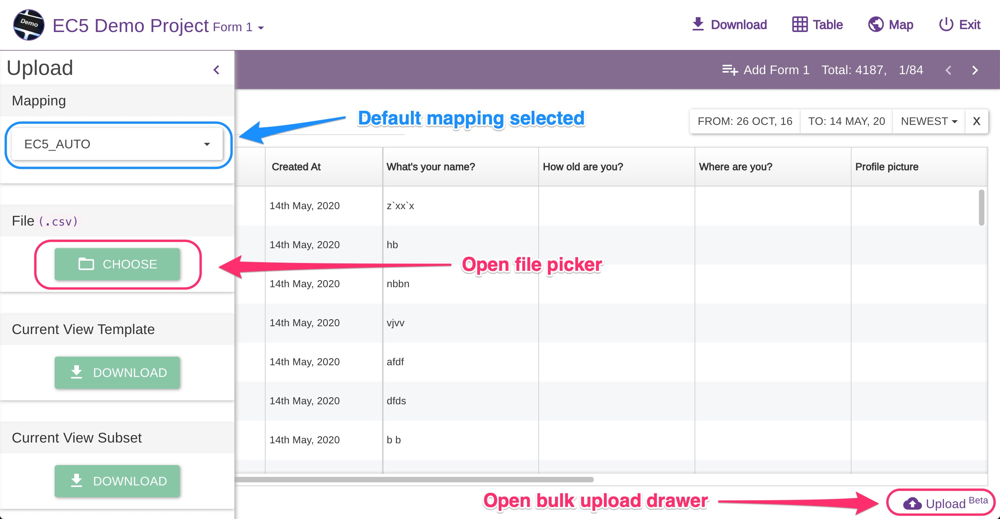
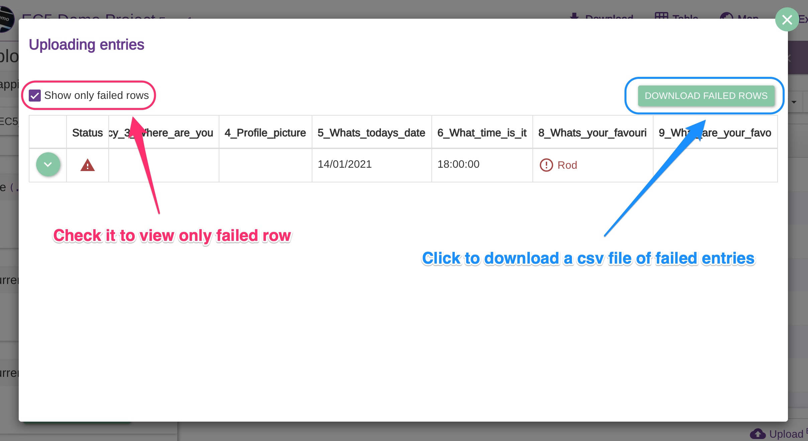
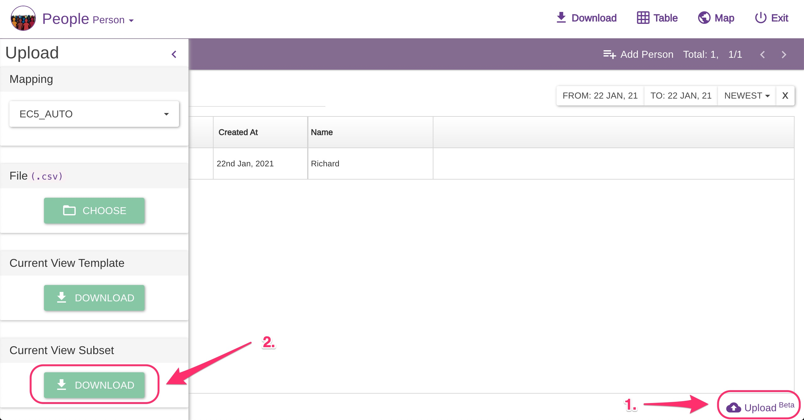
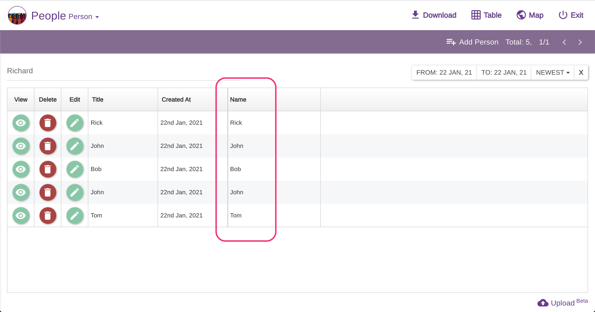
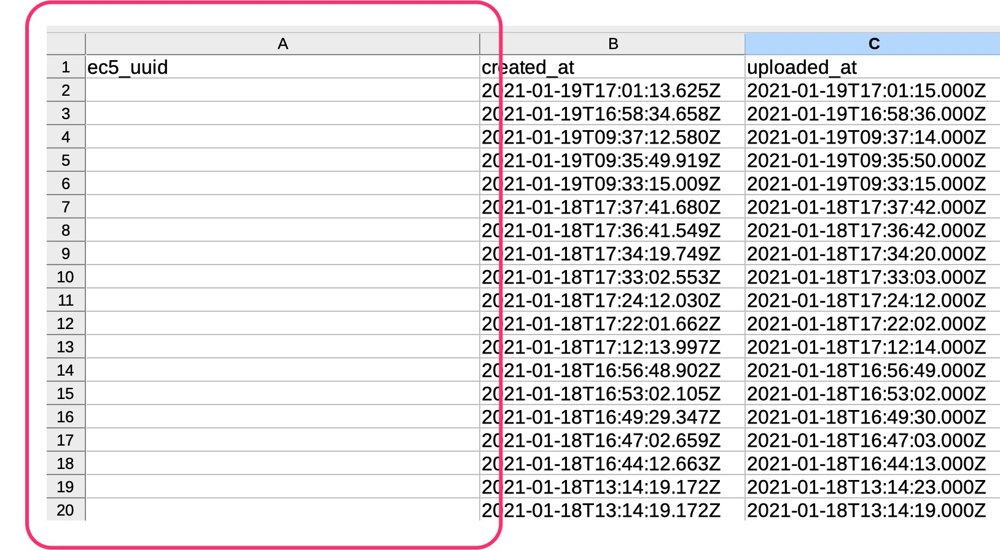

# Entries Bulk Uploads

### Intro

On Epicollect5 It is possible to add entries to a project by uploading a `csv` file where each row is a valid entry for that project. This is particularly handy for those projects where the collection of data could be done by filling in a spreadsheet, for example.

Other use cases might be performing a bulk edit of existing entries or copying some entries from a master project to a cloned one.


To avoid any abuse of the bulk upload feature, `csv` files are limited to **1MB** in size, and bulk uploads are cut to **150 rows per file**. This is done to avoid the creation of any redundant data on our systems.



Bulk uploads are available only for some question types, check the table below.



**Media files cannot be uploaded in bulk.**


### Question types compatibility

| Question Type | Bulk Uploads                                           |
| ------------- | ------------------------------------------------------ |
| Text          | Yes                                                    |
| Numeric       | Yes                                                    |
| Phone         | Yes                                                    |
| Date          | Yes                                                    |
| Time          | Yes                                                    |
| Dropdown      | Yes                                                    |
| Radio         | Yes                                                    |
| Checkbox      | Yes                                                    |
| Search        | Yes                                                    |
| TextBox       | Yes                                                    |
| Readme        | **No, since it does not require an answer.**           |
| Location      | Party, only signed decimal degrees format              |
| Photo         | **No, media files cannot be uploaded in bulk.**        |
| Audio         | **No, media files cannot be uploaded in bulk.**        |
| Video         | **No, media files cannot be uploaded in bulk.**        |
| Barcode       | Yes                                                    |
| Branch        | Yes (not directly but its nested compatible questions) |
| Group         | Yes (not directly but its nested compatible questions) |

### Enable bulk uploads

By default, the bulk upload feature is disabled for a project. To enable it, go to your project details page and from there, _Manage Entries > Bulk Uploads._

Three options are available:

* NOBODY: basically the bulk upload feature is disabled for all the users.
* MEMBERS: only project members (aside from VIEWER roles) can bulk upload entries.
* EVERYBODY: anyone logged in to Epicollect5.


For **private** projects, choosing either MEMBERS or EVERYBODY does not make any difference since only project members can access the project.

Moreover, VIEWER roles are **never** allowed to perform bulk uploads.


If bulk uploads are enabled and the user has permissions, a bulk upload button is shown at the bottom right when viewing the entries.


The bulk upload button **can be disabled**.

That means the user does not have the permissions to perform a bulk upload.

The button is also disabled when the currently selected view cannot accept bulk uploads directly, for example, a child form without any parent entry selected.

See _Child form bulk upload_ for more info.


### Parent forms bulk upload

A parent form is the first form of a project (often the only one) and therefore it sits at the top of the hierarchy structure (see [**linking forms**](../../formbuilder/multiple-forms.md)).

When viewing a parent form, press the upload button to open the bulk upload drawer.

The default mapping is automatically selected. The `csv` file headers must match the selected mapping (see [**mapping data**](../mapping-data.md) for more info).

Picking a valid file will trigger the upload, one row at a time. A valid`csv`file must have the proper columns to match the selected mapping. It is possible to download a blank template by clicking the download button of the "Current View Template" section in the upload drawer.


The csv file **MUST** have an extra\*\*`ec5_uuid`\*\*column, which is used as an internal control flag for entries.

For new entries, this column should remain empty, as only the header is necessary. However, for edits, please ensure that this column contains the UUID of the entry being edited.


Feedback is given on each row like so:

You can expand a row to see the details about any errors by clicking the down arrow on each row that contains errors.

It is possible to filter out uploaded entries to view only the failed one and download a `csv` file of only failed entries.

### Child forms bulk upload

Complex projects with more than one single form consist of a hierarchy structure with a parent > child relationship across forms.


To upload entries for a child form, a parent entry must be chosen first.


On the example project [**UK Education**](https://five.epicollect.net/project/uk-education) there is a hierarchy structure of three forms, UNIVERSITY > COURSE > STUDENT. To bulk upload COURSE entries, a UNIVERSITY entry **must** be selected first.

When viewing UNIVERSITY entries, click on one of the numbers of the COURSE column, (the total number of child entries acts as a button) to view all the child entries for that UNIVERSITY entry.

All the entries uploaded will be linked to the parent "UCL" University entry.

### Branches bulk upload

The procedure to upload entries to a branch is very similar to uploading entries to a child form. The user needs to select what entry the uploaded branch entries will be linked to.

On the example project [**Football Teams and Players**](https://five.epicollect.net/project/football-teams-and-players)**,** there is a single form TEAM and a branch PLAYER.


The csv file **MUST** have an extra\*\*`ec5_branch_uuid`\*\*column, which is used as an internal control flag for **branch** entries.


### Parent forms bulk edits

By using the bulk upload feature it is possible to perform bulk edits on the entries already uploaded. This can be done by downloading the entries which need to be amended, perform the edits with your favorite text editor (like Excel or Google Sheets), then re-upload the entries.

Each entry created on the Epicollect5 platform is given a universal identifier, a [**uuid**](https://en.wikipedia.org/wiki/Universally\_unique\_identifier), like `87dc71ea-1323-47ae-8acb-6002c66f08fd`. When entries are downloaded, all the identifiers are added to the exported dataset along with other metadata (See [**metadata**](../metadata.md)). When uploading entries in bulk, by providing these identifiers in the`csv`file, the system will look for a match. If a match is found and the user has the permissions to edit that entry, the existing entry will be updated.

For example, we have a project called People, with a single form PERSON asking just for the person's name. We have just a few entries and we would like to replace all the "Johnny" with "John".

We open the bulk upload drawer and we click on the "Current View Subset" download button to download all the entries in view.

The downloaded file will look like below. Please note the **ec5\_uuid** column has all system identifiers of those entries.

After the edits, it will look like below. **We have not touched any of the metadata columns.**

Uploading the edited file will update the existing entries. **Please note the double tick icon to indicate an edit**. (A new entry would get only a single tick).

Entries to be edited in bulk can be filtered beforehand by using the dataviewer filter controls. For example, we can filter entries by name, like "Richard".

If we get the "Current View Subset" `csv` file, it will contain only one entry, "Richard".

We can change "Richard" to "Rick" and upload the same file to perform the edit. We leave the metadata columns as they are.

### Child forms bulk edits

The procedure to bulk edit entries of a child form is almost identical to the one used to edit entries of a parent form. The only extra step is selecting the correct parent entry.

On the [**UK Education Project**](https://five.epicollect.net/project/uk-education)**,** we want to edit the COURSE child entries of "Kingston University" UNIVERSITY entry. (The hierarchy structure is UNIVERSITY > COURSE).


**Selecting the correct parent entry is crucial**.

If we try to upload the same file to another UNIVERSITY entry, like "Oxford University", an error will be shown because the child entries **are linked** to the "Kingston University" entry, see below.


### Branches bulk edits

The procedure to bulk edit entries of a branch is almost identical to the one used to edit entries of a parent or child form. The only extra step is selecting the correct entry which contains the branch entries that need to be amended.

On the example project [**Football Teams and Players**](https://five.epicollect.net/project/football-teams-and-players)**,** there is a single form TEAM and a branch PLAYER. We will change the PLAYER branch entries of "Juventus", the players need to be listed by surname.


**Selecting the correct entry is crucial**.

If we try to upload the same file to another TEAM entry, like "Barcelona", an error will be shown because the branch entries **are linked** to the "Juventus" entry, see below.


### Current View Template file

The Current View Template file is an empty csv file with the correct headers for the currently selected form or branch. Useful for collecting new entries from scratch.

### Current View Subset file

The Current View Subset file is a csv file that contains all the entries and their metadata (like`uuid`system identifiers) for the currently selected form, child form, or branch. Useful for editing entries in bulk.


It is possible to use the dataviewer to filter out entries by title and creation date. The downloaded subset file will contain only the matching entries.


### Location questions bulk upload

Answers to LOCATION questions can be uploaded in bulk only in **signed degrees format.** Epicollect5 splits answers to LOCATION question on both the mobile and the web app in three separate columns:

* altitude (prefixed `lat_`)
* longitude (prefixed `long_`)
* and accuracy (prefixed `accuracy_`)

The uploaded `csv`file must have valid data in each of those three columns, see below example taken from [**EC5 Demo Project**](https://five.epicollect.net/project/ec5-demo-project).


If location data are not available, those columns can be left empty. It will still be a valid entry as LOCATION questions **cannot be required.** [**More on LOCATION questions**](../../mobile-application/location-questions.md)**.**


### Copy entries across projects

Using the bulk upload feature it is possible to copy some entries from an original project to its clone.


It is not possible to copy media files, only text-based data

Moreover, entries can be copied up to **150 at a time** given the file limitations of bulk uploads. These limitations are in place to avoid any abuse of our systems and the creation of redundant data.


When entries get downloaded from Epicollect5, the `csv` file will contain the `uuid` identifiers of those entries,

* **`ec5_uuid`** for entries
* **`ec5_branch_uuid`** for branch entries

To upload those entries to a cloned project as new entries, the identifiers need to be cleared otherwise they will clash with the existing entries already in the system.

Once the identifiers are cleared the entries can be uploaded to the cloned project.


Trying to bulk upload entries with identifiers (`uuid`) already on the system will give an error.


### Import errors

Sometimes, depending on the mapping you are using, you might find issues when importing entries with valid values.

We highly recommend the use of a simple mapping for exporting and importing. Values that can cause troubles usually contains commas, double quotes or special symbols.
