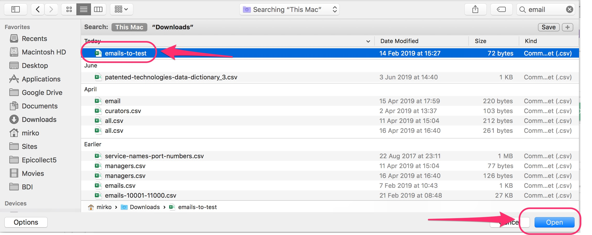
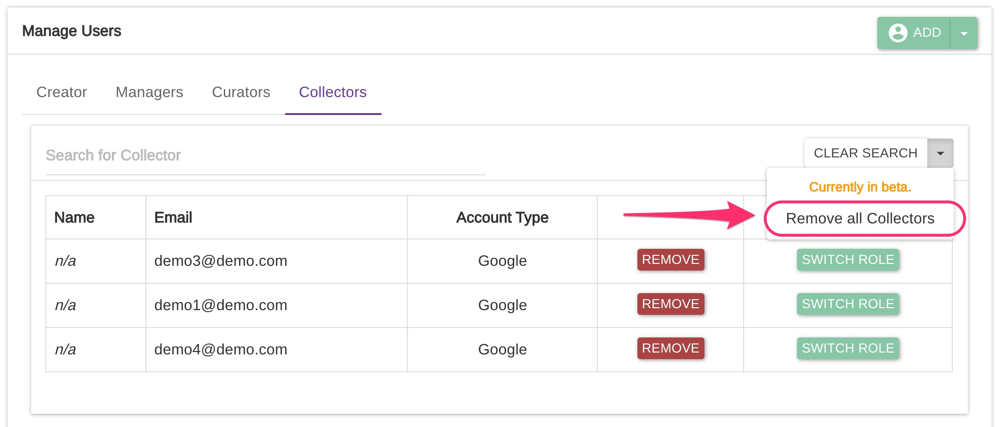

# Manage Users

The granular access control enables users' roles and responsibilities to be set so that individuals are given access only to relevant areas or functions of the system.

## Sign Up Options

### Google Account

We DO NOT store any users' credentials, only the name, email, and profile picture (if available) after a user is successfully authenticated with Google.&#x20;


A Google account accepts any type of email, not only Gmail. You can link an existing email to a Google Account. [**Here is how.**](https://support.google.com/accounts/answer/176347?co=GENIE.Platform%3DDesktop\&hl=en) **Unfortunately, with multiple emails, Google will always log you in with the Gmail one**. The best approach would be to create a new Google Account with your **non-Gmail** email,  add that account to your project as a MANAGER user, and then transfer the ownership to that account.&#x20;

**Please make sure you can log in with both accounts before transferring the ownership.**


### **Apple Account**&#x20;

On supported iOS devices (running iOS 13+) users have the option to sign in with Apple.


Available since version 4.0.0



Please be careful when signing in for the first time. The user email is the unique identifier within the Epicollect5 platform so it is usually recommended you share your personal email when logging in instead of using the one provided by Apple.


### Email

There is also the option to log in only by providing an email.&#x20;

When logging in to the web application, a magic link will be sent to the user inbox.

When logging in to the mobile app, a one-off six-digit code is sent instead.


Any email can be used, not only Google or Apple accounts



The one-off code **expires** **after 30 minutes** and can be **used only once.**&#x20;

Once authenticated, each session will last 72 hours. \
When the session expires,  a new one-off code must be requested.



To prevent abuse of our services, a rate limit is implemented.

A single IP address is restricted to sending a maximum of 5 authentication requests every 30 minutes when the email authentication flow is used.

This approach helps to control the load on the system, prevent denial of service (DoS) attacks, and ensure fair usage across all users.

This limit does not apply to the Google and Apple authentication flows.


## Account Verification

When using multiple providers with the same email, users will be asked to confirm their identity. A six-digit code will be sent to their inbox the first time they try to use the same email with a different provider. (e.g., first with an email-only login and then with Google).

## Profile Page

Users can view what email they are currently logged in with and what account providers they have verified on their profile page. To access the profile page the users need to click on their name on the top navigation bar.

## Project roles

There are 5 roles available:

| Role      | Description                                                                                                                                                                                                                                                                      |
| --------- | -------------------------------------------------------------------------------------------------------------------------------------------------------------------------------------------------------------------------------------------------------------------------------- |
| CREATOR   | A project creator originally created the project and has full access to the project, including viewing, editing, deleting and uploading data via the mobile client/web. A creator can add/remove any other type of users to the project, except for other creators.              |
| MANAGER   | A project manager has full access to the project, including viewing, editing, deleting and uploading data via the mobile client/web. A manager can add/remove curators and collectors to the project, but not managers. A manager can alter the project setting, even the forms. |
| CURATOR   | A project curator has high access to the project, including viewing, editing and uploading data via the mobile client/web. A curator CANNOT alter the project settings or the forms. A curator cannot add other users to the project.                                            |
| COLLECTOR | A project collector has basic access to the project, including viewing and uploading only their own data via the mobile client/web. This means COLLECTOR A cannot access entries uploaded by COLLECTOR B, and vice versa. A collector cannot make any changes to the project.    |
| VIEWER    | A project viewer gets _**READ ONLY**_ access to a project. Viewers can view all the data collected by any other user but they cannot make any changes to the data or access any of the project settings.                                                                         |

## Project Access

If a project has access type '**private**', user access will be based on their roles, as described above, provided they have been successfully authenticated by the server. Viewing, editing, deleting a project, and deleting entries on the server will be based on the above roles and require authentication.

If a project has access type '**public**', then any user can view and upload data to that project via the mobile client, without any authentication, but editing and deleting a project (or entries) on the server will be based on the above roles and still requires authentication.

## Adding Users to a Project

Users can be added to a project for collaboration.

Users can add other users (with different roles) to a project depending on their user role, see below table:

.png>)

To add a user to a project, on the project details page click on "Manage Users". Users are divided by roles, and to add one just click on "Add User" on the right.

Enter an email of an existing Epicollect5 user and select the role you would like to set the new user to:


When you add a user to a project, the system does not send any notification email to that user. However, once the user logs into Epicollect5, access to the project will be granted based on the role specified **if the email address matches.**


### Add users in bulk

It is possible to add users in bulk by uploading a `csv` file of user emails, like the one below.

Click on the arrow to show the context menu and click on "Import Users csv".

Pick your `csv` file

Pick the column which contains the email addresses, select the role to be applied to your new users, and then click on import.

Your users are now imported.

### Switch user roles

At any time you can upgrade or downgrade user roles and capabilities.

Find the user you would like to upgrade, for example from COLLECTOR to CURATOR and click the "Switch Role" button.

The user is now a CURATOR

### Remove users in bulk

Users can be removed in bulk by role.

For example, to remove all the COLLECTOR users go to the "Collectors" tab and open the context menu on the right.

### Export users

Users can be exported as a `zip` file containing the user emails as one `csv`file per each role and a global one with all the users regardless of the role.

