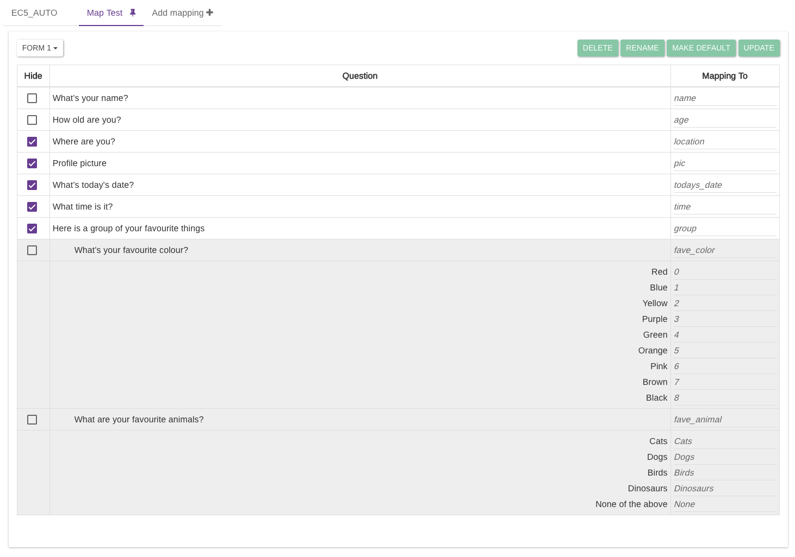
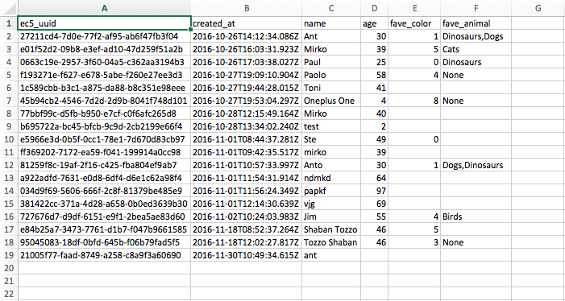
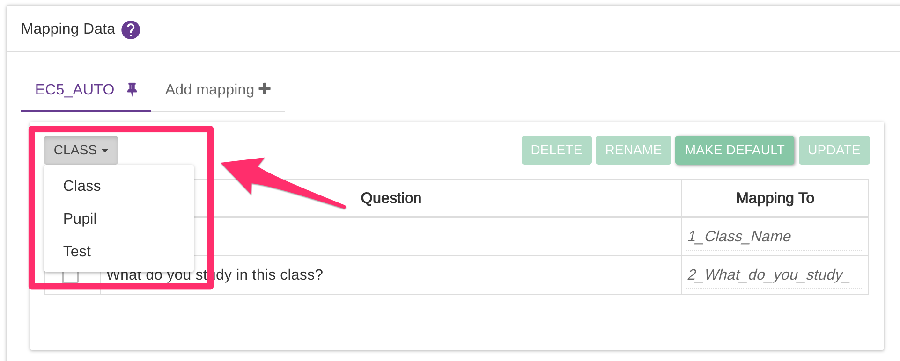

# Mapping Data

Mapping data is an exclusive Epicollect5 feature where you can assign a **short identifier** to each question or to each possible answer. You will have access to this functionality if your role is either **CREATOR** or **MANAGER**.

This is particularly useful when you want to download your data in CSV format and you need the column name to match an existing identifier, or some possible answer to be mapped against a number or a code. It is also possible to exclude (**hide**) some questions.

For example, a question like _"What is your name"_ can be mapped against just _"name"_

For possible answers, if the options are like "Red", "Blue" and "Green", they could be mapped against "R", "B", "G".


Each short identifier (the 'Mapping To" field) for **questions** must be from 1 to 20 chars in length and can contain only alphanumeric and underscores `"_"`&#x20;

For **possible answers**, up to 150 chars and any char is accepted aside from `'<'` and `'>'`


You can create up to **3 custom mappings** and set one as the default, the one that will be used when downloading or accessing data via the API for any user who has got access to your data.


The default mapping, called "**EC5\_AUTO**", is generated automatically by the system and cannot be modified.


See the following screenshot, showing a custom data mapping named "Map Test" we created for our [EC5 Demo Project](https://five.epicollect.net/project/ec5-demo-project)

The tabs at the top allow you to navigate across your mapping or create a new one.

Below the tabs on the right-hand side, there is a selection dropdown to select the form to make the edits to.

Below the tabs on the right-hand side there are four action buttons:

1. **Delete**: deletes the currently selected mapping
2. **Rename**: renames the currently selected mapping
3. **Make default**: set the currently selected mapping as the default one (it will be "pinned") so it is loaded by default when you reload the page, and it is selected by default when downloading the data
4. **Update**: saves all the changes you make to a mapping

Here is the downloaded data set `csv` selecting "Map Test":

## Mapping child forms

By default, the first form of your questionnaire is shown. To switch to a child form, click on the dropdown button at the top left and pick the form you want:

