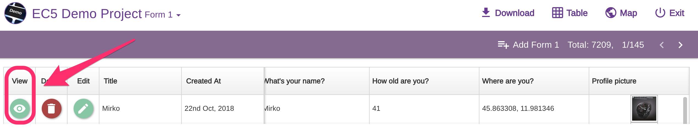
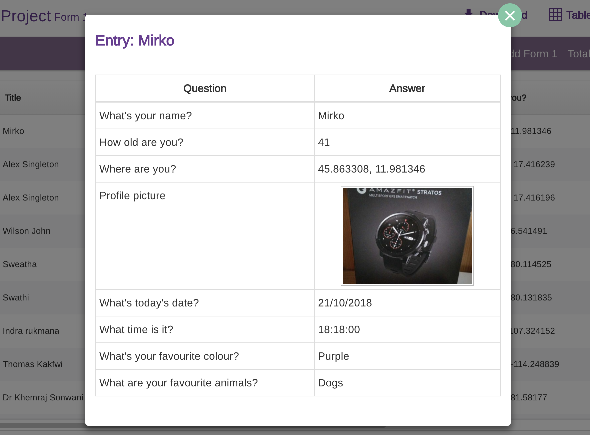
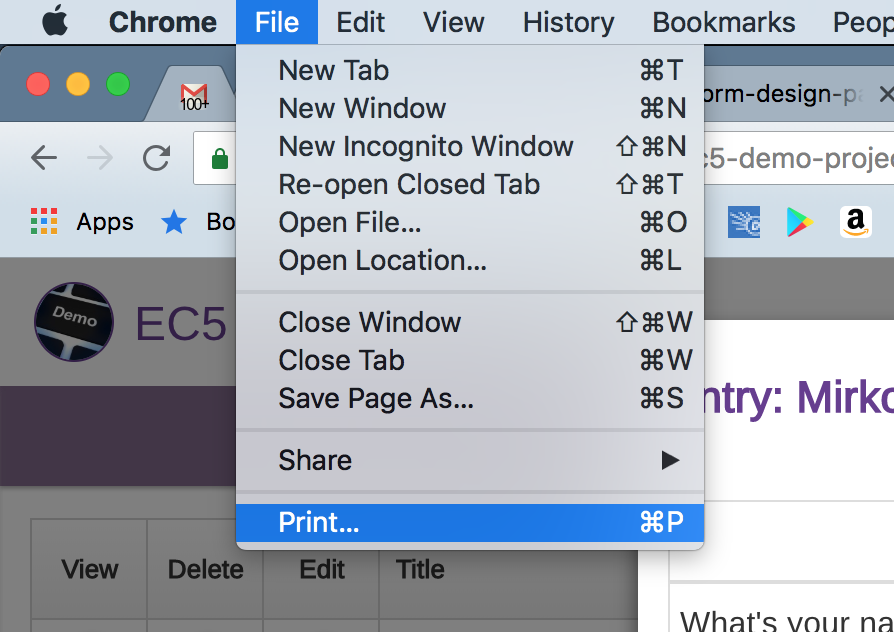
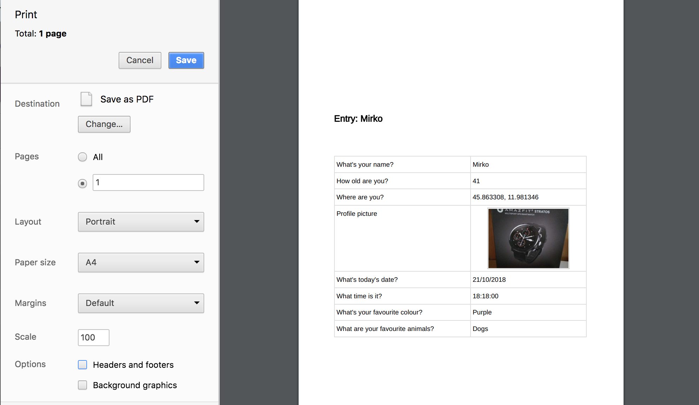

# Print Entries

Sometimes you might want to print some entries as a report. You can easily do that using the dataviewer "View" option and your browser print function (we recommend [Google Chrome](https://www.google.com/chrome/)).


You can print one entry at a time.


Find the row with entry you would like to print and press the "View" button:

A table view for that entry will appear:

We use Chrome for Mac; click on File > Print (if you are using a different browser just search for the print function)

Just adjust the print settings to your preferences:


When printing, line breaks can appear in the middle of a row.&#x20;

Due to the dynamic nature of Epicollect5 forms, the number of rows and each row length will often be different so what works for one form will break on another one.

We highly recommend to print as a PDF and tweak the printing settings to fit each use case. If that is not enough, a proper third party tool like Adobe Acrobat can be used for advanced editing in the exported PDF.

&#x20;

