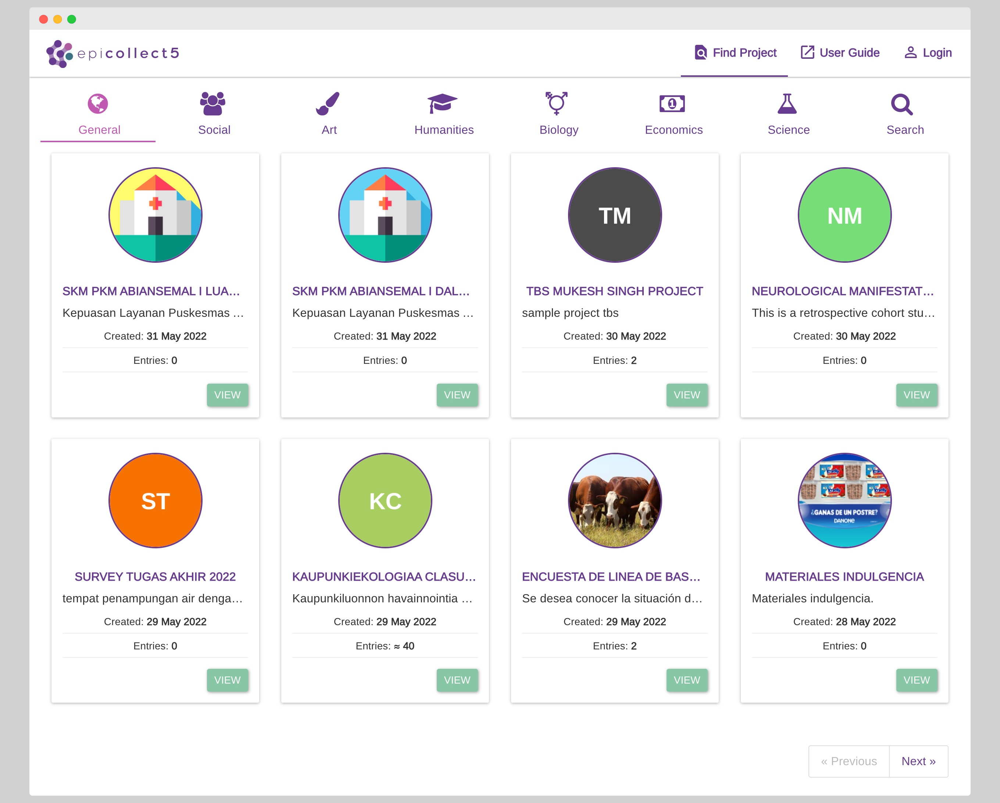
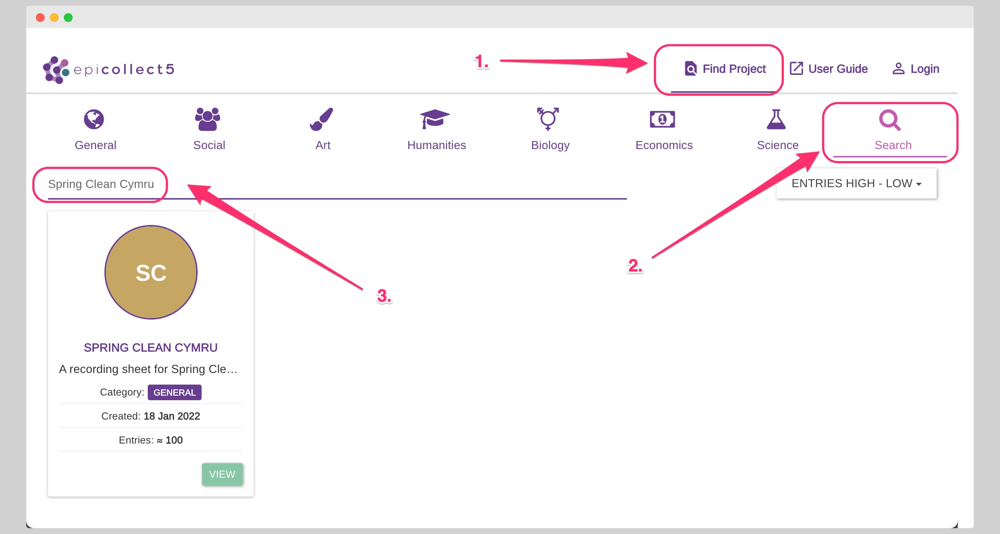
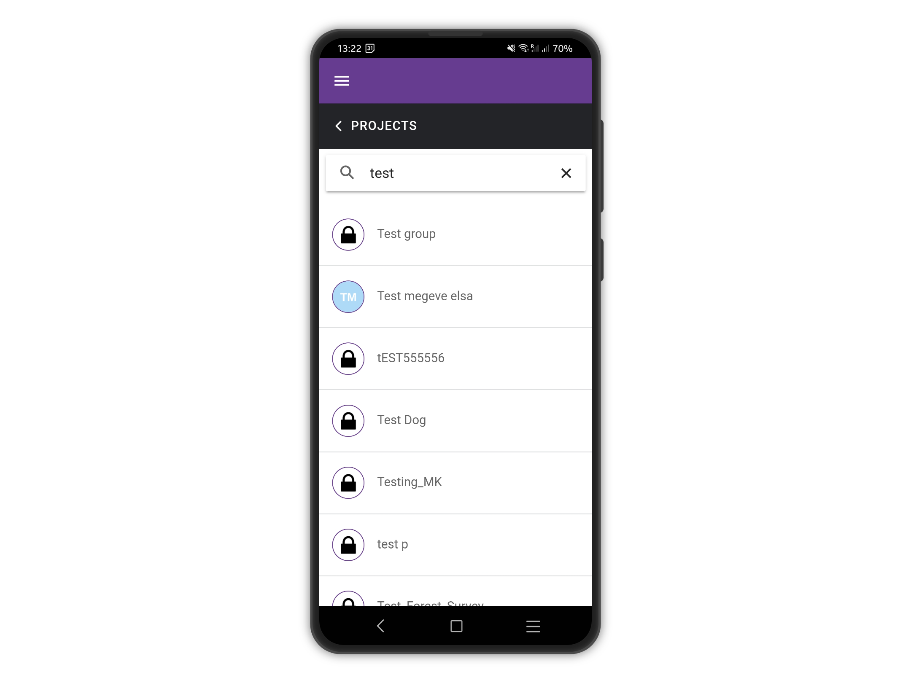

# Search Projects

### Search projects on the web

**PUBLIC** and **LISTED** projects are shown on the Epicollect5 projects page at [**https://five.epicollect.net/projects**](https://five.epicollect.net/projects) (Click on any "Find Project" button)**.**

Projects are split into categories, each category has its own tab.&#x20;

<figure><figcaption></figcaption></figure>

To find a particular project regardless of its category, the search tab will feature a search box to find projects by name and some controls to sort the list of projects according to personal preferences.

<figure><figcaption></figcaption></figure>


TRASHED projects do not get listed, regardless of access and visibility settings.


### Search projects on the mobile app

On the mobile app, all the projects are shown when searching (otherwise it would be impossible to download them) but **PRIVATE** projects show a lock instead of the logo and can be downloaded only after successful authentication by project members.


TRASHED projects do not get listed, regardless of access and visibility settings.


<figure><figcaption></figcaption></figure>
