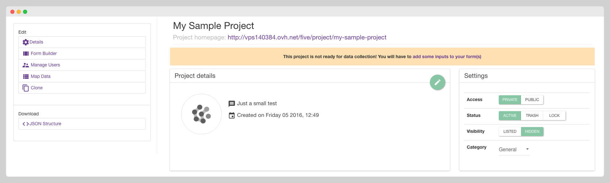
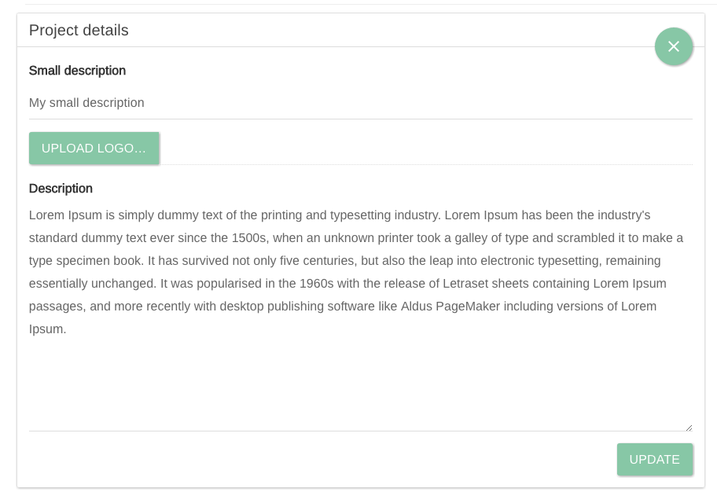
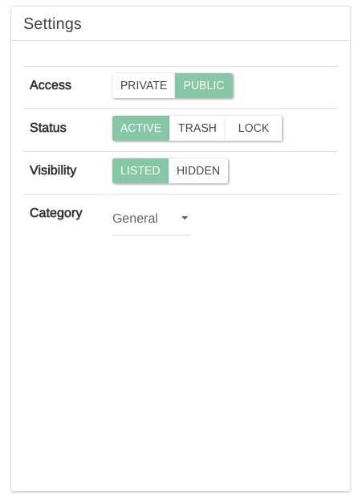
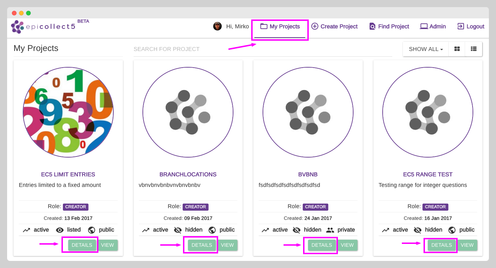

# Edit Project Details

After creating the project, you will be sent to the project details page. Here you can manage all the settings of your project.

<figure><figcaption></figcaption></figure>

### Project Logo and Description

Clicking the edit button (pen icon) will show the panel below, giving you the chance to edit the small description, write a full one, also upload a logo for your project.

If you make any changes, confirm them by clicking "update", otherwise close the edit panel with the X button.

### Project Settings

The "Settings panel" (see below image) gives you access to other project settings:

### Project Access

PRIVATE or PUBLIC, define whether the users need to be added to the project as members to view & collect entries.&#x20;

* **Public**: anyone will be able to view the collected entries, add new entries, or download all the entries. API endpoints are open.
* **Private**: only members of the project can access it. API endpoints require authentication


On PUBLIC projects, users still need to log in to add entries via the web. On the mobile app, authentication is not a requirement.

Moreover, users must log in to download entries as `csv` or `json` files.


### Project Status

* **ACTIVE**: The project can be viewed, and data can be collected and uploaded.&#x20;
* **TRASH**: The project cannot be viewed or receive data, but it can be restored. To delete it permanently, when a project is trashed a "delete" button appears.&#x20;
* **LOCK**: The project can be viewed, but it does not accept any new entries.

### Project Visibility

* **LISTED**: This setting makes your project publicly discoverable through the website's search feature.
* **HIDDEN**: When set to "HIDDEN," the project is accessible only to users who have the project's direct URL. This option provides increased privacy.


Visibility settings are primarily relevant to PUBLIC projects.

PRIVATE projects are already hidden from web searches on the Epicollect5 site.

On the mobile app, all projects are visible when searching. However, PRIVATE projects are marked with a "lock" icon, indicating that they require authentication for downloading. This ensures secure access to those projects.


### Project Category

A label is attached to projects to group them into categories.&#x20;

"**GENERAL**" is the default one. You can choose from:

* General
* Social
* Art
* Humanities
* Biology
* Economics
* Science

### My Projects Page

To access the project details page, click on "**My Projects**" and then the "**Details**" button for the project you wish to edit.&#x20;

<figure><figcaption></figcaption></figure>
