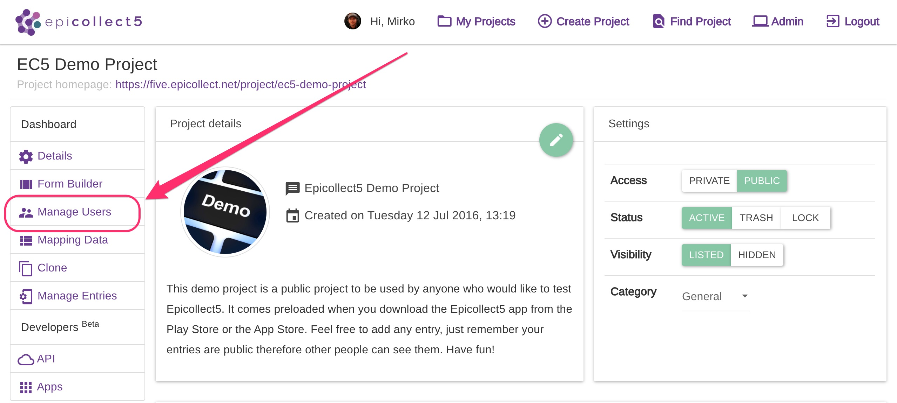
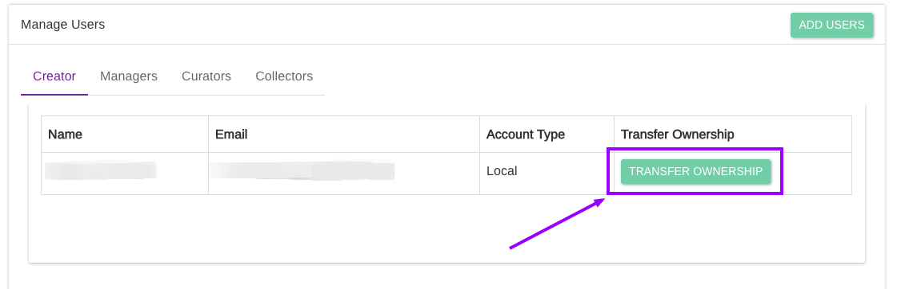
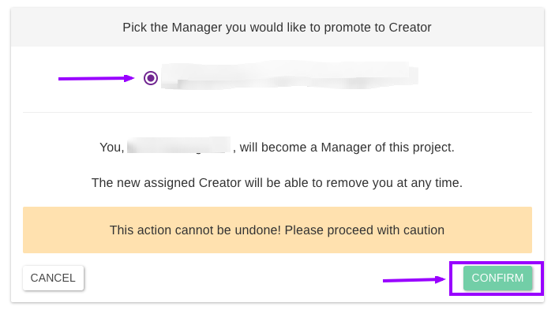

# Transfer Ownership

A project CREATOR **can transfer the ownership of a project** to one of its MANAGER(s) and become a MANAGER himself.

The newly assigned CREATOR can then remove the old one (now a MANAGER) at any time.

Go to the project details page and click on "Manage Users":

If you have a CREATOR role, click on the "TRANSFER OWNERSHIP" button:

Select a MANAGER from the list and click on "CONFIRM":


Remember you MUST have at least one MANAGER.


You are now a MANAGER.
