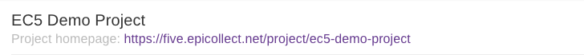
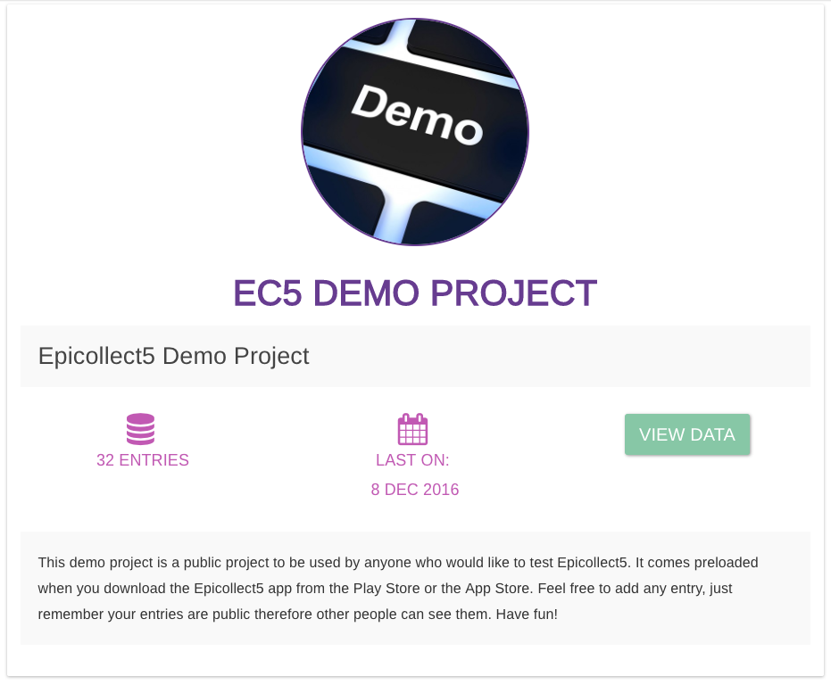

# View Projects

After you create a project, you are redirected to the project "details" page, containing all the information about your project.

Your project home page URL will be at the top:

It is usually like [https://five.epicollect.net/project/my-awesome-project](https://five.epicollect.net/project/my-awesome-project)

The last part `/my-awesome-project` **** is your project slug. A project slug is a web-friendly version of your project name, where all the spaces are converted to dashes (`-`) and the letters are all lowercase. This is a convention for URLs all over the web. Since each project gets its own URL, **your project name cannot be the same** as any other projects on Epicollect5.


Projects with the **EC5** prefix are projects created by the Epicollect5 Team only therefore the prefix **EC5** is reserved.


Going to your project homepage, this is how it would look like:

At a glance you can see:

* Your project logo
* Your project small description
* Total of entries collected
* Date of last entry uploaded
* Your project full description

To view your data, click on "View Data". [More on Viewing data.](viewing-data.md)
