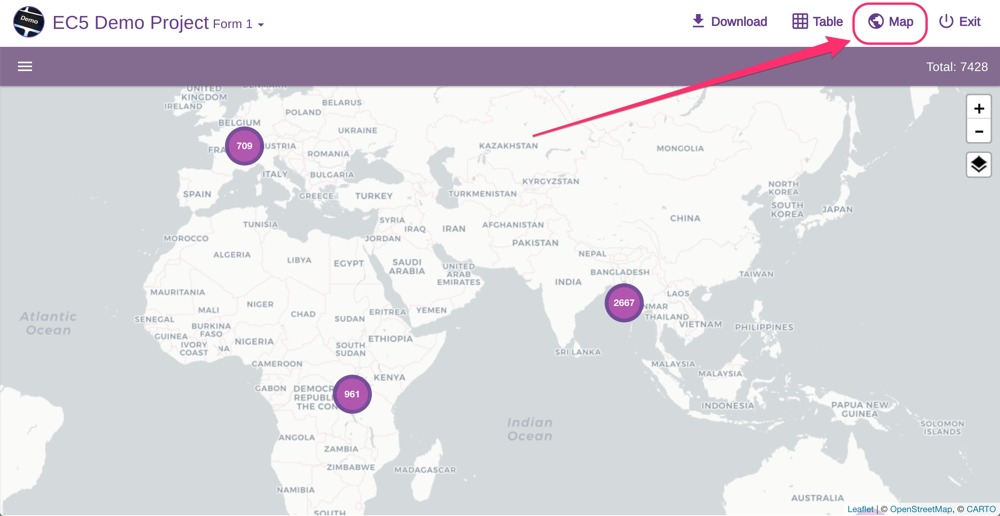

# Viewing Entries

## Viewing entries

Entries collected for a project can be view in tabular format or on a map (only if there are any locations for that form or branch).

From the project home page click on "View Data".

Data are visualized as a table or a map:

## Viewing entries with media files


For **PHOTO** questions, if there is a placeholder thumbnail that looks like the Epicollect5 logo in black and white colors, it means **PHOTO** files were not synced.&#x20;

Syncing data is a two steps process, please read [**how to upload entries.**](../mobile-application/upload-entries/)


Audio and Video questions will show a button to play the media, but if the media file is not synced, an error message will be displayed when trying to play the file.

&#x20;You can view **a single entry as a table** by clicking on the "eye" icon on the left of each data row:

If there are any locations for the selected form, view them on a map:

You can change map style according to your needs:

* Carto
* Contrast
* Terrain and&#x20;
* Satellite
* OpenStreetMap

Open the left panel to get some view options:

You can filter your data set by dates, select a different location **question** to view, and select a multiple choice question (like dropdown, radio. or checkbox) to trigger the pie chart distribution clusters.

For example, let's see the distribution for the question "_What is your favorite color?_" of the **EC5 Demo Project.**

To view a single entry on the map, zoom in and click on a single marker:

If the project contains **multiple forms**, use the dropdown at the top left to select the form you want:

## Viewing branch entries

If the project has got any branches, click on the branches total number (on the form entry row) on the table to list the branch entries per each single branch question:

Clicking on "List your family members":

## Viewing child entries

If your project has got more than one form, on the table view you will get an extra column with the immediate child form of the current form. For example, our [EC5 HIERARCHY PROJECT](https://five.epicollect.net/myprojects/ec5-hierarchy-project) has got a three forms hierarchy structure **CLASS > PUPIL > TEST**.

When viewing the entries for **CLASS**, you will get a column called **PUPIL** (which is the next form down the hierarchy, or the immediate child form):

To view the PUPIL for a CLASS entry, just click on the total number. In the example above, we have 2 PUPIL entries for the "Media" CLASS. Let's click on that number:

As you can see, we are one level down the hierarchy, so the TEST column is displayed. We can go back to the CLASS entries with the back button at the top left, or go down further. Let's click on the number "2" to view the TEST entries for "MARCUS 11" PUPIL:

As you can see, we are at the bottom of the hierarchy. There is not any more child form, so no extra column is shown.

We are currently viewing the **TEST** entries for "Marcus 11" **PUPIL** of the "Media" **CLASS**.

You can go back to the CLASS entries by clicking on the "CLASS entries" back button in the primary navbar (white background), or go back to the PUPIL entries for the "Media" CLASS by clicking on the "Pupil for Media" back button in the secondary navbar (purple background).

## Viewing location questions on the map

On Epicollect5 you can have multiple location questions.


By default, the Epicollect5 dataviewer will plot the locations for your **first form and first location** question found in that form, from top to bottom.&#x20;

You can choose to view whatever locations you like though.


Have a look at our example project [EC5 Locations Example](https://five.epicollect.net/project/ec5-locations-example)

Upon opening the dataviewer, the first form ("First Form") and first location question answers are shown by default:

Click on the dropdown menu next to the project name and select "Second Form" to view the locations for your second form:

Both forms contain a branch, each with a location question. To view the locations for the branch question, click on the drawer button at the top left:

On the panel, select "Second form branch location" from the "Location" dropdown menu:

The map will now show the "Second form branch location" locations:

As you can see above, the dataviewer is displaying the locations for a branch question nested within a child form.
